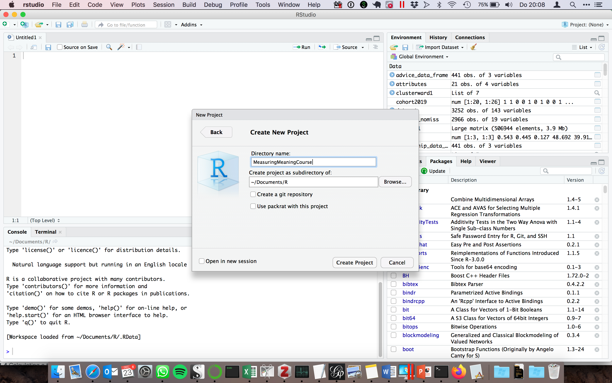
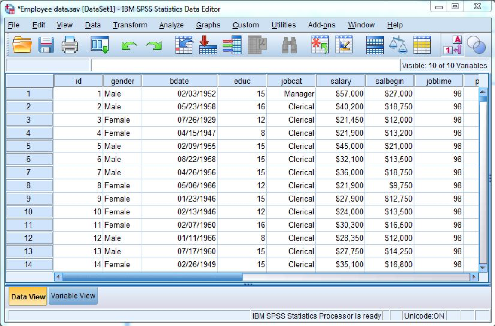
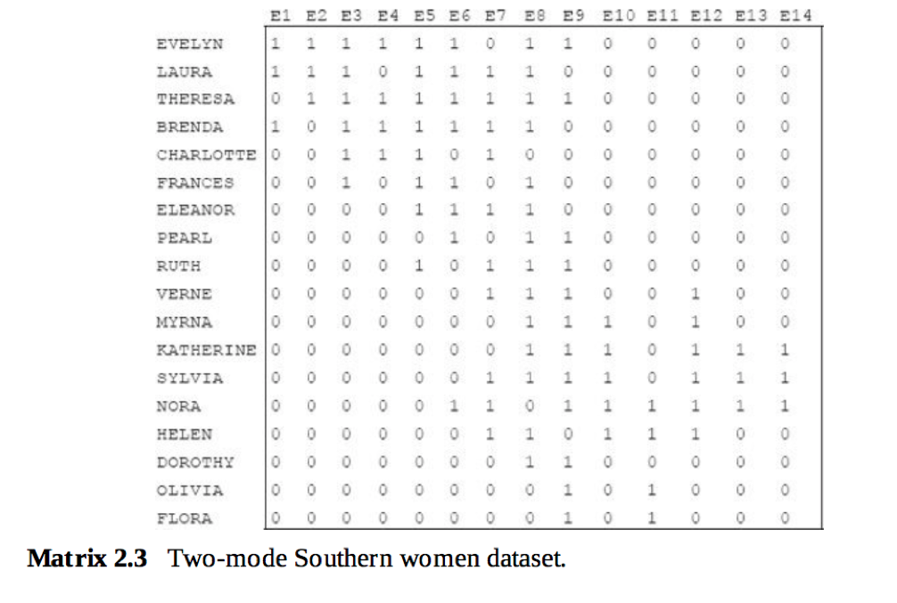

```{r setup, include=FALSE}
knitr::opts_chunk$set(echo = TRUE)
```
# Week 1 Session 2
Topics:  
- Setting up a project in R  
- Working with relational data in R  
- Creating and importing data  
- Basic matrix algebra  

(For background reading consult Chapter 2 of Analyzing Social Networks by Borgatti, Everett and Johnson.)

## Creating an R project

Before we get started with R, let's first create a new R project. RStudio projects allow you to keep your various data analysis projects separate from one another. Each project has its own working directory, workspace, history, and source documents. When you load a project, you will therefore see the work, history and files associated with that project, helping your organize your work. It greatly simplifies managing and keeping track of the different files and scripts. So I highly recommend following these steps. 

Go to the "File" menu at the top of the screen and click on "New Project..."

{width=100%}

Then start a new directory. Directories are folders where you keep your R Project and all of the data, files, code etc. that you create and use in the project. 

{width=100%}

Now start an empty project. Projects are created by RStudio and they maintain your R workspace for you, so that you can load it exactly as it was before you closed RStudio.  

{width=100%}

Finally name your project (I named mine "MeasuringMeaningCourse") and browse to find the location on your computer where you would like it to be saved. We will use this directory to store all of the files and information for the class, so make sure to choose a name you can remember. 

{width=100%}

Now if you navigate to the folder of your new R Project (mine is in My Documents folder, for example), you will see the R Project there, symbolized by a blue glass cube with an R in it. If you ever want to re-open this project, you can double click on the cube. Alternatively, in RStudio you can go "File -> Open Project", navigate to the project's directory and open it from there.

{width=100%}

This folder is where you should keep all of your data and R scripts for this project. Since we just created the project that we will use for the remainder of the tutorials, it is the best place for you to put all future class materials. 

## Data structure 
If you have done any kind of quantitative research, and have worked with SPSS, Stata or R, you are probably already familiar with the data structure depicted below. Each row represents a case (an individual, an organization, a country, etc.) and the columns are the variables (gender, job category, salary, etc.). The cells of the matrix then record the value of these variables for each case. This format is often called attribute data.

{width=50%}

In this course we will, however, work with *relational* data instead of *attribute* data.  

There are two important types of relational data structures: *one-mode* and *two-mode* data (also termed adjacency for one-mode and affiliation or incidence matrices for two-mode).

In a one-mode matrix, the row and columns refer to the same "entity": they could be persons, organizations, or words (as in semantic network analysis). In network analysis these are generally called 'nodes' or 'vertices' and the cells indicate whether a relation or a 'tie' or 'edge' (however that is defined) exists between two nodes. If we are only interested in whether there is a tie or not, then the cells contain either a 1 or a 0. In *valued* networks, the cells can also contain values that indicate, for example, the strength of a relationship. 

## Matrix representation
An example of a one-mode (adjaceny) matrix. Note that the matrix has the same number of rows as columns (14).

{width=50%}

A two-mode matrix refers to relations between different types of entities on rows and colums. So, for example, whether people have attended an event, relations between organisations and their members, but also, in (semantic) network analysis, words and documents. 

An example of a two-mode (affiliation or incidence) matrix.
Note that the number of rows (18) is different from the number of columns (14). The rows refer here to women and the columns to the events.

{width=50%}

## Graph representation
Relational data can also be represented as a network graph. The circles are the nodes, the lines connecting the nodes are the edges. In the example below, the network is directed, which is indicated by the arcs at the end of the edges. You can see that there is a link from B to C, but not from C to B. In the matrix representation of this network, there is a 1 in the cell value of row B/column C, but a zero in row C/column B. The adjacency matrix will therefore be asymmetric. 

{width=50%}

Next session, we will start with analysing these network structures. First, we want to practice working with relational data in R. 

## Data structures and basic operations in R

How do we get relational data into R?  Let's return to the basics of R first.

### Vectors and matrices 

Vectors are the most basic object in R. They contain ordered elements of the same type. We can use a vector to, for example, store the result of a calculation. We use the assignment operator “<-”.

```{r}
four <- 2+2
sixteen <- (2+2)^2
```

If we type the name of the vector, it will return its values.
```{r}
four
```

```{r}
sixteen
```

Vectors of size > 1 are created using the "c" function. 

```{r}
v <- c(0,1,2,3,4,5,6,7,8,9)
print(v)
```

Computations on vectors are performed element-wise.

```{r}
v <- v * 3
print(v)
```

We can use the matrix function to create matrices.  I specify what I want in each cell of the matrix and the dimensions of the matrix.  If the argument "byrow" is TRUE, the matrix will be filled row by row (horizontally). Otherwise, it will be filled by column (vertically). I would like to create a 5 by 5 matrix.  So I set the number of rows and columns to 5. 

```{r}
matrix_data <- matrix(c(0,0,0,0,0,1,1,1,1,1,0,0,0,0,0,1,1,1,1,1,0,0,0,0,0), nrow = 5, ncol = 5, byrow=TRUE)
matrix_data
```

It has split up the long vector into 5 rows. If we do "byrow" is FALSE we get:  
```{r}
matrix_data <- matrix(c(0,0,0,0,0,1,1,1,1,1,0,0,0,0,0,1,1,1,1,1,0,0,0,0,0), nrow = 5, ncol = 5, byrow=FALSE)
matrix_data
```

Check what the default is by investigating what happens when you do not add the "byrow" option. 

```{r}
matrix_data <- matrix(c(0,0,0,0,0,1,1,1,1,1,0,0,0,0,0,1,1,1,1,1,0,0,0,0,0), nrow = 5, ncol = 5)
matrix_data
```

Instead of "chopping up" one long vector into rows and columns, we can also list a number of vectors and add them together.

```{r}
#we define two vectors
zero <-c(0,0,0,0,0) 
one <- c(1,1,1,1,1)
#this could also be done more quickly with the rep function which replicates the values in x a given number of times 
#zero <- rep(0,5)
#one <- rep(1,5)
#we then refer to those vectors within a vector, and define the matrix
matrix_data <- matrix(c(zero,one,zero,one,zero), nrow = 5, ncol = 5, byrow = TRUE)
matrix_data
matrix_data <- matrix(c(zero,one,zero,one,zero), nrow = 5, ncol = 5, byrow = FALSE)
matrix_data
```

We can also name each dimension using "dimnames". In this case, let's assume we are working with a social network among persons, and give each row and column a name.

```{r}
matrix_data <- matrix(c(zero,one,zero,one,zero), nrow = 5, ncol = 5, byrow = TRUE, dimnames = list(c("Alex", "Olav", "Jeroen", "Olga", "Bo"), c("Alex", "Olav", "Jeroen", "Olga", "Bo")))
matrix_data
```

We have now defined an adjacency matrix with 5 nodes and their (binary) relations. Just to be clear, let's name the matrix "adjacency"

```{r}
adjacency <- matrix(c(zero,one,zero,one,zero), nrow = 5, ncol = 5, byrow = TRUE, dimnames = list(c("Alex", "Olav", "Jeroen", "Olga", "Bo"), c("Alex", "Olav", "Jeroen", "Olga", "Bo")))
print(adjacency)
```

To make an *affiliation matrix* we would follow the same steps. The rows and columns are, in that case, (often) not of similar length. And the names for rows and columns would be different.

```{r}
zero <-c(0,0,0) 
one <- c(1,1,1)
affiliation <- matrix(c(zero,one,zero,one,zero), nrow = 5, ncol = 3, byrow = TRUE, dimnames = list(c("Alex", "Olav", "Jeroen", "Olga", "Bo"), c("Course1", "Course2", "Course3")))
print(affiliation)
```

### Data frames

Data frames are another type of object in R. They are like SPSS or STATA files. We can transform a matrix into a data frame, and vice versa. The kinds of operations you can do on a data frame differ from matrices. So you need to check the kind of object you are working with. The class() function tells us what type of object we are working with.

```{r}
#define as dataframe
affiliation_dataframe <- as.data.frame(affiliation)
class(affiliation_dataframe)
#define as matrix
affiliation_matrix <- as.matrix(affiliation_dataframe)
class(affiliation_matrix)
```

### Indexing and counting rows and columns

When we are working with a matrix, we might want to access or manipulate a single row or column at a time. To do so, we need to index a row or column.  For both data frames and matrices we can use subscripting.  For example, matrix\_data1[,5] tells R to return the fifth column while matrix\_data1[1,] tells R to return the first row. Matrix_data1[1,2] is the cell located in the first row of the second column.

```{r}
adjacency
#get all data from row 1
adjacency[1,]
#get all data from column 5
adjacency[,5]
#get a specific value
adjacency[1,2]
```

If we are working with a data.frame, we can use the \$ operator. The name of the column we wish to access follows the dollar sign. affiliation_dataframe$Course1 will return the column values for Course1.

```{r}
affiliation_dataframe$Course1
```

If we need to check the number of rows or columns:

```{r}
#get the number of rows
nrow(adjacency)
#get the number of columns
ncol(adjacency)
#get the number of rows
nrow(affiliation)
#get the number of columns
ncol(affiliation)
```

## Matrix algebra
Now that we have covered the basics of working with R, we discuss some basic matrix algebra, as this will be useful when doing relational data analysis. 

### Matrix transpose
One important operation is taking the *transpose* of a matrix. Transposing a matrix simply means making columns into rows and rows into columns. In R we do this with the t() command.

Below we transpose a 6x4 matrix into a 4x6 matrix.

```{r}
T=matrix(c(0,3,1,5,0,1,4,0,0,4,1,6,0,0,0,5,0,0,0,1,1,3,0,1),nrow=6,ncol=4) 
print(T)
T_transpose <- t(T)
print(T_transpose)
```

### Matrix multiplication
Matrices can be multiplied by each other. If you have ever done any linear algebra this will probably be familiar to you. If not, the figure below shows how to multiply matrices. 

C[1,1] is the value of - what is called - the dot product of first row of A multiplied by the first column of B.
C[2,2] is the value of the dot product of the second row of A multiplied by the second column of B.

Matrix multiplication requires that the number of columns of the first matrix is the same as the number of rows of the second matrix. 

{width=50%}

### Compound relations
Matrix multiplication has many uses. In social network analysis, matrix multiplcation can be used to measure compound relations. If, for example, we have a friendship matrix, the Friendship x Friendship matrix gives us the friend of a friend relation. 

{width=50%}

```{r}
#In the matrix F, person A (row 1) has a friendship tie to B, C and D.
F=matrix(c(0,1,1,1,0,1,0,1,0,0,1,1,0,1,0,1,0,1,0,1,0,0,0,1,0),nrow=5,ncol=5) 
print(F)
FF=F%*%F
print(FF)
```
Another way to say this is that the FF matrix indicates the number of "walks" with length 2. Measuring compound relations with matrix multiplication will be important for understanding certain centrality measures. 


### Matrix multiplication: from two-mode to one-mode matrices
We can also use matrix multiplication to transform a two-mode matrix into a one-mode matrix. When we multiply a matrix A with its own transpose, we get a one-mode matrix. More particularly, A multiplied by transpose of A gives the row by row matrix. The transpose of A multiplied by A gives the column by column matrix.  

This quite simple transformation was the basis of a classic article by Ronald Breiger "The Duality of Persons and Groups". The notion of "duality" or "mutual constitution" captures the idea is that you can derive two networks from a two-mode network. So, for example, in the case of a person by event network, you can derive a person-by-person networks, and an event-by-event network. They form a duality in that the relations among persons are derived from their co-participation in the same events, while the relations among events is derived from their overlap in members. 

This notion of duality in two-mode networks has been shown to be able to operationalize various dualities in social science, such as between culture and practice. 

{width=50%}
```{r}
#We can replicate the calculations by Breiger of the fictituous data 
F=matrix(c(c(0,0,0,0,1),c(1,0,0,0,0),c(1,1,0,0,0),c(0,1,1,1,1),c(0,0,1,0,0),c(0,0,1,1,0)), nrow=6, ncol=5, byrow=TRUE,dimnames = list(c("A","B","C","D","E","F"),c("1","2","3","4","5"))) 
print(F)
#We take the transpose
print(t(F))
#We multiply the matrix by its tranpose so that we get the row-by-row network
P=F %*% t(F)
#We set the diagonal to 0 by hand
diag(P) <- 0
print(P)
#We multiple the transpose of the matrix by the original matrix to get the column-by-column network
G=t(F) %*% F
diag(G) <- 0
print(G)
```

## Importing data using Excel or csv files

### Edge lists
Constructing matrices directly in R can be quite cumbersome. Especially for larger matrices, it would entail writing out long vectors of (mostly) zero's and one's. Matrices can also get quite big, quite quickly, and it is therefore not very efficient to write them out in this manner.  For _storing_ network data, we therefore often use a different format: the edge list. For each edge, we  list who that edge is incident on. Edge lists are therefore two column matrices that directly tell the computer which actors are tied for each edge. In a directed graph, the actors in column "source"" are the sources of edges, and the actors in column "target" receive the tie. In an undirected graph, order doesn't matter.

To illustrate the idea of an edgelist, I create a short example directly in R. I specify each column of the edge list with vectors and then assign them as the columns of a matrix. We can use this to visualize what an edge list should look like. 

```{r}
source <- c("Mark", "Mark", "Peter", "Peter", "Bob", "Jill")
target <- c("Peter", "Jill", "Bob", "Aaron", "Jill", "Aaron")
edgelist <- matrix(c(source, target), nrow=6, ncol=2, byrow=FALSE,dimnames = list(c(), c("Source","Target")))
#another way to name the columns is to do that explictly in a separate statement
#colnames(edgelist) <- c("Source","Target")
print(edgelist)
```

In an edge list, the number of rows accords to the number of edges in the network since each row details the actors in a specific tie. It is therefore a really simple format for _recording_ network data in an excel file or csv file. Much network data comes in this format. (And some network analysis software, like Gephi, requires this format)

### Creating data in Excel 

The easiest and (memory-) efficient way to record network data in Excel is as an edge list. 

Below I have created the edge list containing the campnet data set, which is also discussed in Borgatti. 
For more information on the data, see: https://sites.google.com/site/ucinetsoftware/datasets/camp-data

You do not have to replicate this process. It is just to illustrate how to do it if you would want to create your own network data file. 

{width=50%}

### Saving Excel data as a .csv file

Now we need to save this data in a format that R can easily read. Most people generally save these files in the .csv format, which (generally) separates values by commas, because R has a default function for reading .csv files. 

To save an Excel sheet as a .csv file, in Excel go to "File -> Save As..." and select the csv format.

{width=50%}

### Loading data into R

To use read.csv, we just tell R the name of the .csv file that we want it to read. It will then look inside the (working) directory for that file. 

If it can't find the file - either because you typed the wrong name or you never dragged it to the (working) directory - it will return something like the following error: 

> Error in file(file, "rt") : cannot open the connection
    In addition: Warning message:
    In file(file, "rt") :
      cannot open file 'campnet.csv': No such file or directory

So be sure campnet.csv is in your working directory or project directory otherwise the following lines of code won't work! 

Another possible problem that might occur is that the delimiter is actually not a comma but a semicolon. If you open your csv file in the files pane below on the left you can check the raw file. 

If semicolons are used, your can read the data with read.csv2() or explicitly declare the delimiter with the sep= statement. Check your file after it has been read into R to check whether it looks the way it should look.

Also beware that on Windows computers the file path might have to be adjusted.

```{r}
#for delimiter = comma
#campnet <- read.csv("Data/campnet.csv")
#for delimiter = semicolon
campnet <- read.csv2("Data/campnet.csv")
#or explicitly set seperator
campnet <- read.csv("Data/campnet.csv", sep=";")
```

Now you should see your data file in your Environment pane under the "Data" heading. That means you successfully loaded the data into R. 

You can click on it to see its contents or else run View(your_data_here) in the console. What you'll see is that the first edge (between HOLLY and PAM) has been assigned as the name of the columns. We don't want that, so we'll again read the file but leave the column names blank.

```{r}
#for delimiter = comma
campnet <- read.csv("Data/campnet.csv", header=FALSE, sep = ";")
#for delimiter = semicolon
campnet <- read.csv2("Data/campnet.csv", header=FALSE)
```

It is always good practice to check what type of object we have loaded. 

```{r}
class(campnet)
```
If everything went well, it should say "data.frame". 

## The Igraph Package
To visualize and analyse networks, we make use of specific packages that have been written in R. The first one we'll use is "igraph". To install the package, uncomment the first line below, and then call the package. 

```{r}
#First we need to install the igraph package
#install.packages("igraph")
library(igraph)
```

We can now import the campnet data into igraph.

```{r}
#as this is a directed network we set directed to TRUE
g <- graph_from_data_frame(campnet, directed = TRUE)
#another option is graph_from_edgelist
#look at the file format
class(g)
#it has become an igraph format
#look at the first rows
head(g)
#if you print out the g object it lists the edges.
print(g)
#you can also access the matrix using
g[]
```

We can now plot the network. The layout option indicates that we use the Kamada-Kawai layout. Alternative, you can use the Fruchterman Reingold algorithm, but the plot is not as clear in this case. Cf. the figure 2.3 in Borgatti.

```{r}
#plot with Kamada-Kawai layout
plot(g,edge.arrow.size=.4,layout=layout_with_kk,main="campnet dataset - kk")
#plot with Fruchterman Reingold layout
plot(g,edge.arrow.size=.4,layout=layout_with_fr,main="campnet dataset - fr")
```

Nodes can also have attributes. In this case, for example, nodes have a gender variable as attribute. These attributes can be added to the network data. They are stored in the file "campattr.txt".  
We can also load this data and add them to the network. This replicates figure 9.3 in Borgatti. 

```{r}
#import the attribute file
campattr <- read.csv("Data/campattr.txt")
#to directly add the attributes, we can use graph_from_data_frame and the vertices= option
g <- graph_from_data_frame(campnet, directed = TRUE,vertices=campattr)
#plot the graph
plot(g,edge.arrow.size=.4,layout=layout_with_kk,main="campnet dataset with gender",vertex.color=vertex_attr(g)$Gender)
```

Let's also import and plot a two-mode network. 

As an example, we use the Davis dataset, which is one of the most (re-)analyzed two-mode datasets in network analysis. These data were collected by Davis et al. in the 1930s. They represent observed attendance at 14 social events by 18 Southern women. The result is a person-by-event matrix: cell (i,j) is 1 if person i attended social event j, and 0 otherwise. You can find the data set in the Github folder. It is called "davis.csv" and is also stored in an edgelist format.

```{r}
davis <- read.csv("Data/davis.csv", header=FALSE)
```

Unfortunately, if we read in this dataset as an edgelist, igraph does not understand it is a two mode network. So we need to first turn it into an incidence matrix.

```{r}
davis_table <- table(davis)
class(davis_table)
g <- graph_from_incidence_matrix(davis_table, directed = FALSE)
#if you look at the matrix object you see that it has turned it into a bipartite matrix. in this case, 14+18 x 14+18 matrix. 
```

Plot the network

```{r}
#we give rows and columns different shapes so that we can distinguish the two modes
V(g)$shape <- ifelse(V(g)$type == FALSE, "circle", "square")
plot(g,layout=layout_with_kk,main="davis dataset")
```

If we would want to return to the "raw" two-mode matrix, we can get it from an igraph object using the function "as_incidence_matrix"

```{r}
twomode_matrix <- as_incidence_matrix(g)
```


