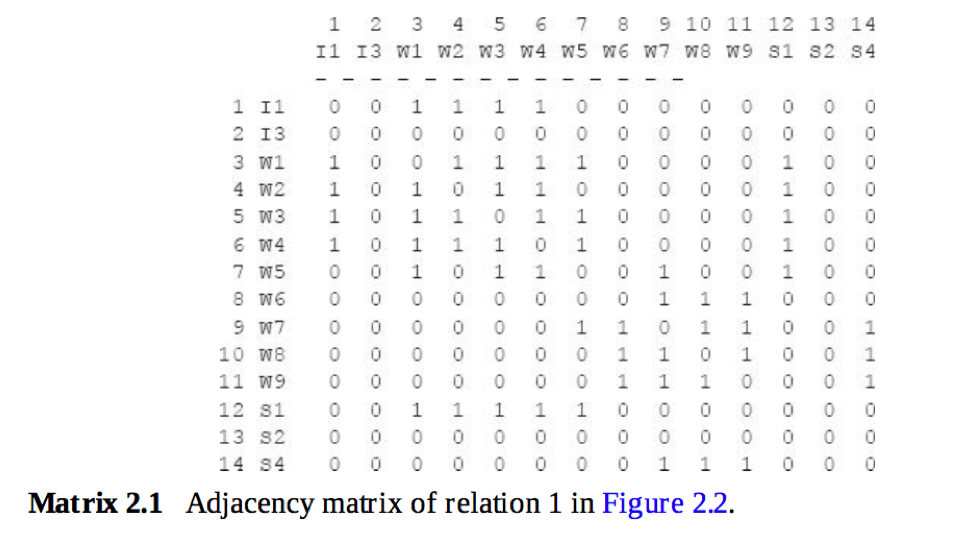
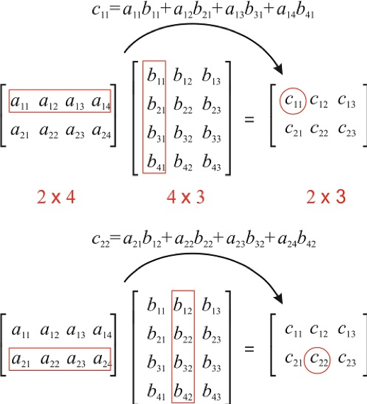
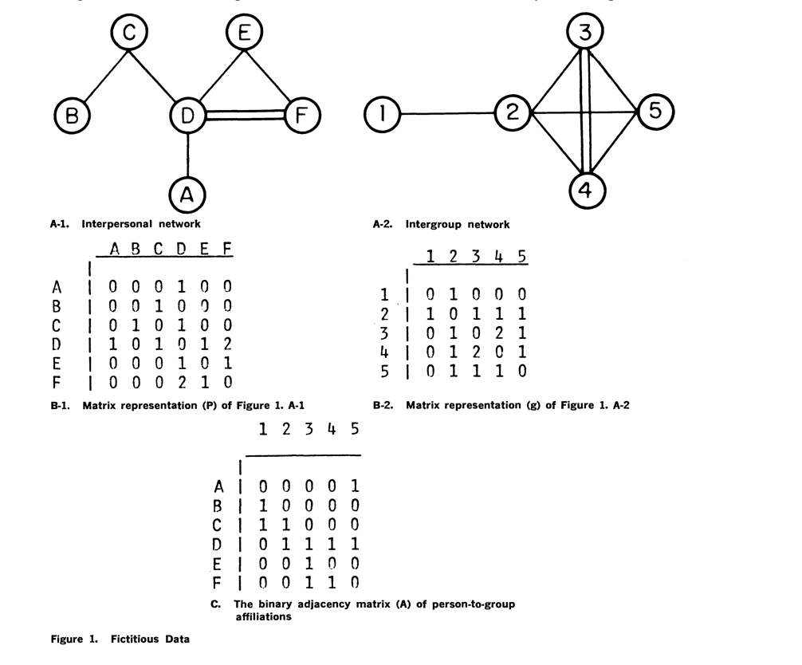
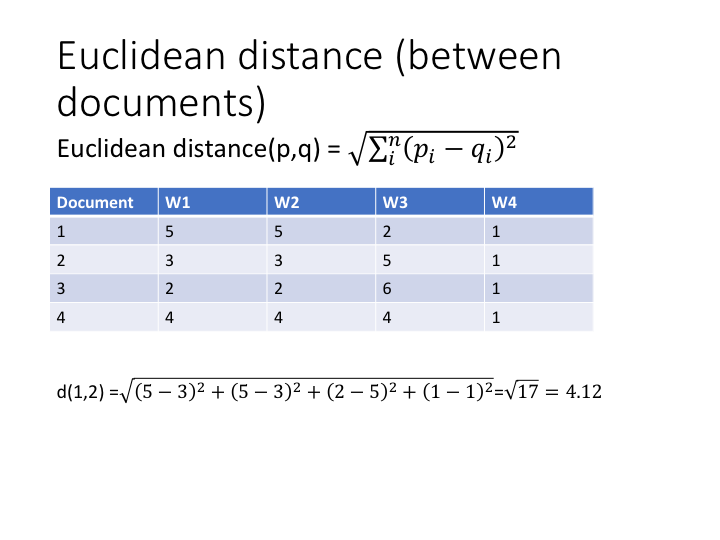
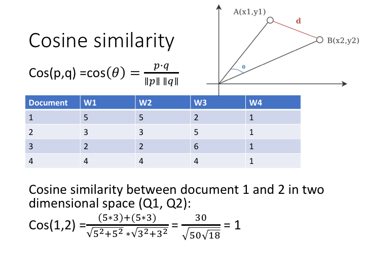
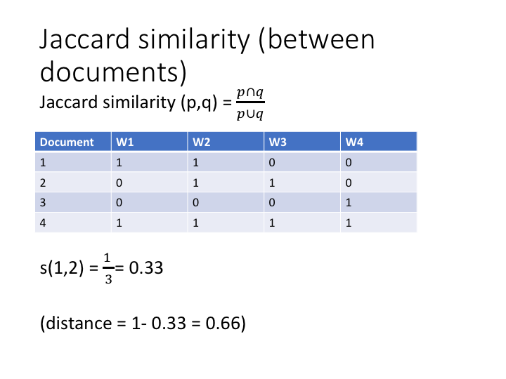

```{r setup, include=FALSE}
knitr::opts_chunk$set(echo = TRUE)
```
# LAB 1

## Foundations: Matrix algebra
We start with some basic matrix algebra. 
For background reading consult Chapter 2 of Analyzing Social Networks by Borgatti, Everett and Johnson. 

## Matrix representation
An example of a one-mode matrix. 
Note that the matrix has the same number of rows as columns (14)


An example of a two-mode matrix.
Note that the number of rows (18) is different from the number of columns (14)


## Graph representation


# Matrix algebra
Read 2.6 in Borgatti et al.
C[1,1] is the value of the dot product of first row of A multiplied by the first column of B
C[2,2] is the value of the dot product of the second row of A multiplied by the second column of B
Matrix multiplication requires that the number of columns of the first matrix is the same as the number of rows of the second matrix. 


We can compute products of matrices with themselves. In a friendship matrix, the FF matrix is the friend of a friend relation. 
If we multiply the matrix by itself we get the friends of friends relation.

```{r}
#In the matrix F, person A (row 1) has a friendship tie to B, C and D.
F=matrix(c(0,1,1,1,0,1,0,1,0,0,1,1,0,1,0,1,0,1,0,1,0,0,0,1,0),nrow=5,ncol=5) 
print(F)
FF=F%*%F
print(FF)
```
The cell values now refer to the length of the walks between two nodes. 
Look at the diagonal cells. What do think these mean?

# Matrix transpose
Transposing a matrix means making columns into rows and rows into columns
```{r}
#In the matrix F, person A (row 1) has a friendship tie to B, C and D.
T=matrix(c(0,3,1,5,0,1,4,0,0,4,1,6,0,0,0,5,0,0,0,1,1,3,0,1),nrow=6,ncol=4) 
print(T)
T_transpose <- t(T)
print(T_transpose)
```


# Matrix multiplication: from two-mode to one-mode matrices
We can use matrix multiplication to transform a two-mode matrix into a one-mode matrix
A multiplied by transpose of A gives a row by row matrix
transpose of A multiplied by A gives a column by column matrix
Example of Breiger: person (letters) by event (numbers) matrix


```{r}
#In the matrix F, person A (row 1) has a friendship tie to B, C and D.
A=rbind(c(0,0,0,0,1),c(1,0,0,0,0),c(1,1,0,0,0),c(0,1,1,1,1),c(0,0,1,0,0),c(0,0,1,1,0)) 
rownames(A) <- c("A","B","C","D","E","F")
colnames(A) <- c("1","2","3","4","5")
print(A)
print(t(A))
P=A %*% t(A)
diag(P) <- 0
print(P)
G=t(A) %*% A
diag(G) <- 0
print(G)
```

#Similarity and distance measures
Matrix multiplication is one way to transform a two-mode matrix into a one-mode matrix. 
More generally, we can think of this transformation as a way to measure the similarities (or distances) between rows (or columns: now that we know about transposing the matrix this distinction becomes trivial).
The example refers to a document-word matrix. In this matrix, the rows refer to documents (for example, newspaper articles) and the columns refer to words. The cell entries show the number of times each word occurs within that document.

Euclidian distance
For a quick refresher on high school geometry look here: https://towardsdatascience.com/the-euclidean-distance-is-just-the-pythagorean-theorem-2e672017d875 



Cosine similarity


Jaccard similarity 

Pearson correlation 

```{r}
install.packages("psych")
library(psych)

#distance and similarity measures
s1 <- c(5,5,2,1)
s2 <- c(3,3,5,1)
s3 <- c(2,2,6,1)
s4 <- c(4,4,4,1)
my_m <- rbind(c(5,5,2,1),c(3,3,5,1),c(2,2,6,1),c(4,4,4,1))
#default is euclidian distance
dist(my_m)

#cor calculates correlation among columns so transpose matrix first to get correlation among rows
cor(t(my_m))

#example for jaccard. dist measures distances so binary=1-jaccard
e <- c(1,1,0,0)
f <- c(0,1,1,0)
g <- c(0,0,0,1)
h <- c(1,1,1,1)
matrix_jaccard <- rbind(e,f,g,h)
dist(matrix_jaccard,method="binary")

#To use the Breiger example: We would like to incorporate the differences between the attendance pattern of person D, E and F. D visits 4 events while E visits only 1 and F 2. The overlap between E and D and F respectively should have different weights since the chance that E overlaps with D is greater since D is "just" a more frequent visitor of events. The overlap between E and F is higher since both are not frequent visitors but still have also an event in common. We can use the Jaccard measure to take these differences into account. 
1-dist(A,method="binary")
```

```{r}
#negative correlation becomes positive when adding zeros
author_a <- c(NA,4,2,3,9,10)
author_b <- c(4,NA,8,9,2,5)
author_matrix <- rbind(author_a,author_b)
cor(t(author_matrix),use="complete.obs")
cor(author_a,author_b,use="complete.obs")

author_a <- c(NA,4,2,3,9,10,0,0,0,0)
author_b <- c(4,NA,8,9,2,5,0,0,0,0)
author_matrix <- rbind(author_a,author_b)
cor(t(author_matrix),use="complete.obs")
cor(author_a,author_b,use="complete.obs")

#perfect correlation goes away when adding zeros
author_a <- c(NA,7,1,2,3,4)
author_b <- c(7,NA,10,11,12,13)
author_matrix <- rbind(author_a,author_b)
cor(t(author_matrix),use="complete.obs")
cor(author_a,author_b,use="complete.obs")

author_a <- c(NA,7,1,2,3,4,0,0,0,0)
author_b <- c(7,NA,10,11,12,13,0,0,0,0)
author_matrix <- rbind(author_a,author_b)
cor(t(author_matrix),use="complete.obs")
cor(author_a,author_b,use="complete.obs")

library(lsa)
author_a <- c(0,7,1,2,3,4,0,0,0,0)
author_b <- c(7,0,10,11,12,13,0,0,0,0)
cosine(author_a,author_b)
cosine(s1,s2)
cor(author_a,author_b,use="complete.obs")

my_example=matrix(c(0,0,1,0,0,0,1,0,1,1,0,0,0,1,1,1,1,1,0,1,1,0,1,0,0,0,0,1,0,0,1,0,0,0,1,1,0,0,0,0,0,1,1,1,1,0,0,0,1,0,0,0,1,0,0,0,1,1,1,0,0,0,1,1,1,1,0,0,0,1,0,1,0,0,0,0,1,0,1,1,1,0,0,1,0,1,0,0,0,0,1), ncol=7,nrow=13)
my_example
my_example_dist <- round(as.matrix(dist(my_example,method="binary",diag=TRUE)),digits=2)
```


# Importing data and installing the igraph package

We are going to use the igraph package in R to analyze the campnet dataset discussed in Borgatti. 
Dataset(campnet.txt) and attribute file (campattr.txt) are available from canvas.
For more information on the data, see: https://sites.google.com/site/ucinetsoftware/datasets/campdata

```{r}
#First we need to install the igraph package
#install.packages("igraph")
library(igraph)
#now import the campnet data. Be sure that the two files are in your R working directory 
#the format of the network data is called an edgelist.
#header = False because we don't have a name to the two columns
campnet <- read.csv("campnet.txt", header=FALSE)
#the attribute file contains information on the nodes such as their gender, their role. It also already includes a centrality measure (betweenness) but this will be calculated separately later on in the script. 
#import the attribute file
campattr <- read.csv("campattr.txt")
#look at the format. 
class(campnet)
#should be a dataframe
#look at the first rows of the file
head(campnet)
head(campattr)
```

We need to transform the data frame format into an igraph object to be able to use igraph's functions.

```{r}
#We need to transform the data frame format into an igraph object to be able to use igraph's functions.
#in this step we also already add the attributes to the vertices
#as this is a directed network we set directed to TRUE
g <- graph_from_data_frame(campnet, directed = TRUE, vertices = campattr)
#look at the file format
class(g)
#now has become an igraph format
#look at the first rows
head(g)
#if you print out the g object it lists the edges.
print(g)
#you can also access the matrix using
g[]
```

# Basic concepts
Nodes, vertices
Edges, arcs

```{r}
#we can  count the number of nodes
vcount(g)
#and count the number of edges
ecount(g)
```

The graph representation of the network

```{r}
#we can plot the network with the kamada-kawai layout. 
#We replicate the figure 2.3 in borgatti which shows the directed network in graph format
plot(g,edge.arrow.size=.4,layout=layout_with_kk,main="campnet dataset")
#replicate figure 9.3 with gender attribute
plot(g,edge.arrow.size=.4,layout=layout_with_kk,main="campnet dataset with gender",vertex.color=vertex_attr(g)$Gender)
```

This is a directed graph. 
We can also make an undirected graph. 

```{r}
#Change into an undirected network by collapsing
g_undirected <- as.undirected(g, mode = "collapse")
plot(g_undirected,edge.arrow.size=.4,layout=layout_with_kk,main="campnet dataset undirected")
#if you look at the matrix representation you see that it has become symmetric
g_undirected[]
```


## Paths, trails, walks

```{r}
#all_simple_paths(g, "HOLLY", to = V(g), mode = c("out"))

#get distances between nodes. matrix 2.2 in borgatti. we take the directed graph and therefore add mode=out and mode=in
distances(g,mode="out")
distances(g,mode="in")
```

## Components

```{r}
#find the number of strong components. strong components take direction into account
g.components <- components(g, mode = c("strong"))
print(g.components)

#the following line does the same thing but now just returns the number
count_components(g, mode = c("strong"))

#add attributes of component membership
V(g)$components <- g.components$membership

#examine attributes to check if it was added
vertex_attr(g)

#plot the graph with components
plot(g,edge.arrow.size=.4,layout=layout_with_kk,main="campnet dataset with components",vertex.color=vertex_attr(g)$components)

```


```{r}
#to illustrate the discussion of matrix multiplication in 2.6 of Borgatti et al., we need to transform the igraph
#object back to a matrix object
#this next line converts the igraph object to a regular matrix
g_matrix <- get.adjacency(g_undirected,sparse=FALSE)
class(g_matrix)
print(g_matrix)
#matrix multiplication by itself to get number of walks of length 2 between i and j
g_matrix%*%g_matrix
#matrix multiplication to third power to get number of walks of length 3 between i and j
g_matrix%*%g_matrix%*%g_matrix
g_matrix%*%g_matrix%*%g_matrix%*%g_matrix
```


# Whole Network Measures

## Density
```{r}
# Whole Network Measures

#measure the density. 
graph.density(g)
graph.density(g_undirected)
```

Find density in subgroups:

```{r}
#Find density in subgroups:
#extract the womens network
g.women <- induced_subgraph(g, V(g)$Gender == 1)
#we can also plot only the women in the network
plot(g.women,edge.arrow.size=.2,layout=layout_with_kk,main="campnet dataset women",vertex.color=vertex_attr(g.women)$Gender)
#density among women. should be 0.357.
graph.density(g.women)
#density among men. should be 0.278.
g.men <- induced_subgraph(g, V(g)$Gender == 2)
plot(g.men,edge.arrow.size=.2,layout=layout_with_kk,main="campnet dataset men",vertex.color=vertex_attr(g.men)$Gender)
graph.density(g.men)
```
## Compactness
Compactness is not available in igraph. 
But we can calculate it by defining a function:

```{r}
#Compactness
#Compactness is not available in igraph. 
#But we can calculate it by defining a function:
Compactness <- function(x) {
  gra.geo <- distances(x) ## get geodesics
  gra.rdist <- 1/gra.geo  ## get reciprocal of geodesics
  diag(gra.rdist) <- NA   ## assign NA to diagonal
  gra.rdist[gra.rdist == Inf] <- 0 ## replace infinity with 0
  # Compactness = mean of reciprocal distances
  comp.igph <- mean(gra.rdist, na.rm=TRUE) 
  return(comp.igph)
}
Compactness(g)
```
## Reciprocity
If we do not want to include 0/0 pairs as reciprocated then mode is ratio.
```{r}
#Reciprocity
reciprocity(g,ignore.loops = TRUE,mode="ratio")
```

## Transitivity. 
```{r}
#Transitivity 
#overall graph clustering coefficient
transitivity(g,type='average')
#this is the weighted overall clustering coefficient on the undirected network, which is the same as the 9.4 formula in Borgatti, but for undirected networks. 
transitivity(g)
```

## Centralization
```{r}
#Centralization
#Calculations for the example from figure 9.8 in Borgatti
C=matrix(c(0,1,1,0,0,1,0,1,0,0,1,1,0,1,1,0,0,1,0,1,0,0,1,1,0),nrow=5,ncol=5) 
print(C)
c <- graph_from_adjacency_matrix(C, mode="undirected")
plot(c)
degree(c)
centr_degree(c,mode="all",loops=FALSE,normalized=TRUE)
#applied to campnet data
centr_degree(g_undirected,loops=FALSE,normalized = TRUE)
```

## Diameter
```{r}
#Diameter
diameter(g)
```

# Centrality Measures
We do all the below calculations for the undirected network

## Degree centrality
```{r}
#Centrality Measures
#We do all the below calculations for the undirected network

# Degree centrality
deg <- degree(g_undirected)
print(deg)
#with the directed graph it would count up the in-degrees and outdegrees
deg_in <- degree(g,mode="in")
deg_out <- degree(g,mode="out")
deg_total <- degree(g,mode="total")
print(deg_in)
print(deg_out)
print(deg_total)

plot(g_undirected,edge.arrow.size=.4,layout=layout_with_kk,main="campnet dataset size=degree",vertex.size=deg*5)
```

## Eigenvector centrality
```{r}
#Eigenvector centrality
ev_g_un <- evcent(g_undirected)
print(ev_g_un)
ev_g_un$vector
plot(g_undirected,layout=layout_with_kk,main="campnet dataset size=eigenvector centrality",vertex.size=ev_g_un$vector*20)
```

## Beta centrality or Bonacich power centrality
When the beta factor is 0 then you get degree. However, the function in igraph normalizes by ssd=n. 
From the igraph manual: The coefficient alpha acts as a scaling parameter, and is set here (following Bonacich (1987)) such that the sum of squared scores is equal to the number of vertices. This allows 1 to be used as a reference value for the “middle” of the centrality range.)
So you do not get the degree values but normalized values where 1 is the norm. 

```{r}
#Beta centrality or Bonacich power centrality

#when b = 0 then this equals degree centrality
beta_centrality <- power_centrality(g_undirected, exponent=0)
print(beta_centrality)
plot(g_undirected,layout=layout_with_kk,main="campnet dataset size=beta centrality b=0",vertex.size=beta_centrality*20)

#we take a value of beta that approximates 1/largest eigenvalue. the largest eigenvalue is given by the eigenvector centrality function evcent
#you can also calculate it
e <- eigen(g_matrix)
e$values
max(e$values)
1/max(e$values)
#with beta at its highest, beta centrality should approximate eigenvector centrality
beta_centrality <- power_centrality(g_undirected, exponent=0.245)
print(beta_centrality)
plot(g_undirected,layout=layout_with_kk,main="campnet dataset size=beta centrality b=0.245",vertex.size=beta_centrality*10)
```

## Closeness centrality
Closeness centrality measures how many steps is required to access every other vertex from a given vertex

```{r}
#Closeness centrality
#Closeness centrality measures how many steps is required to access every other vertex from a given vertex
closeness_g_un <- closeness(g_undirected, normalized=TRUE)
print(closeness_g_un)
plot(g_undirected,layout=layout_with_kk,main="campnet dataset size=closeness centrality",vertex.size=closeness_g_un*50)
```

## Betweenness centrality 
Betweenness centrality measures the number of shortest paths going through a specific vertex
```{r}
#Betweenness centrality 
#Betweenness centrality measures the number of shortest paths going through a specific vertex
betweenness_g_un <- betweenness(g_undirected)
print(betweenness_g_un)
plot(g_undirected,layout=layout_with_kk,main="campnet dataset size=betweenness centrality",vertex.size=betweenness_g_un)
```


