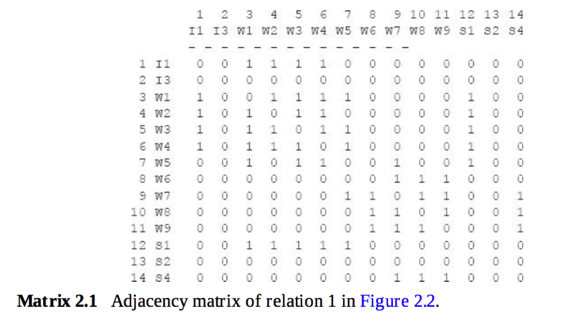
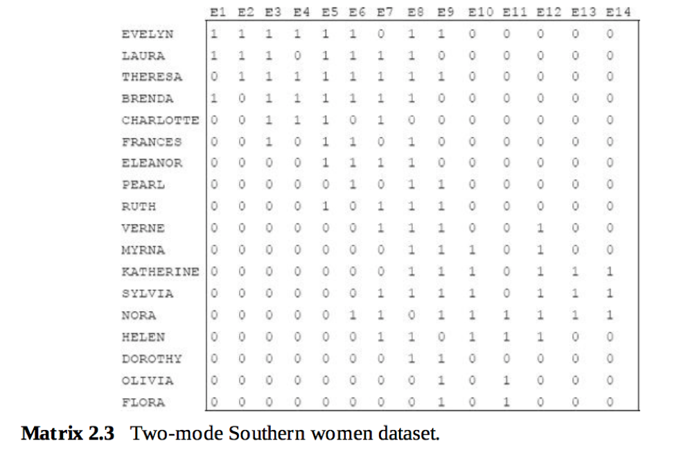
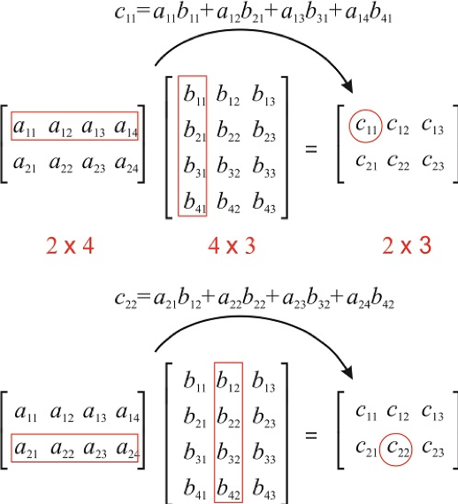
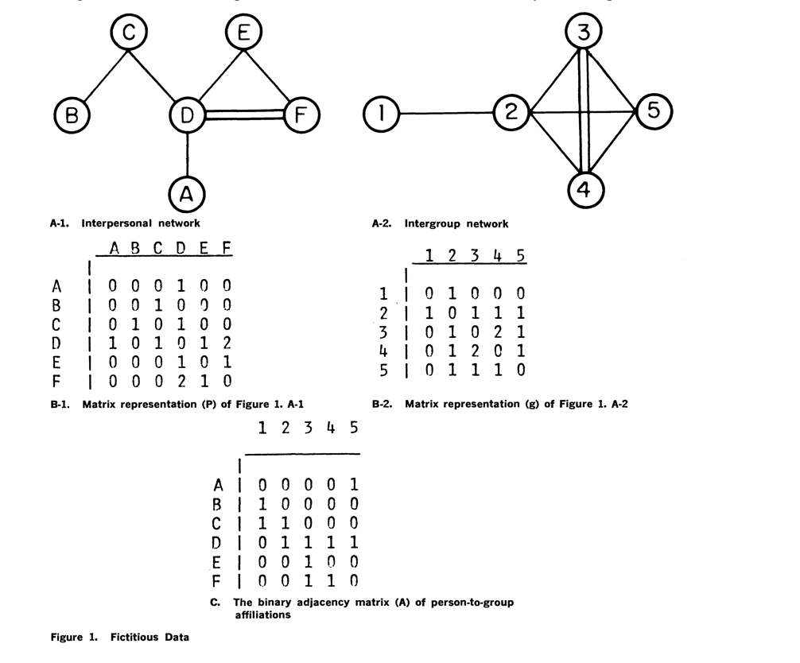

```{r setup, include=FALSE}
knitr::opts_chunk$set(echo = TRUE)
```
# LAB 1

## Foundations: Matrix algebra
We start with some basic matrix algebra. 
For background reading consult Chapter 2 of Analyzing Social Networks by Borgatti, Everett and Johnson. 

## Matrix representation
An example of a one-mode matrix. 
Note that the matrix has the same number of rows as columns (14)


An example of a two-mode matrix.
Note that the number of rows (18) is different from the number of columns (14)




## Graph representation


# Matrix algebra
Read 2.6 in Borgatti et al.
C[1,1] is the value of the dot product of first row of A multiplied by the first column of B
C[2,2] is the value of the dot product of the second row of A multiplied by the second column of B
Matrix multiplication requires that the number of columns of the first matrix is the same as the number of rows of the second matrix. 


We can compute products of matrices with themselves. In a friendship matrix, the FF matrix is the friend of a friend relation. 
If we multiply the matrix by itself we get the friends of friends relation.

```{r}
#In the matrix F, person A (row 1) has a friendship tie to B, C and D.
F=matrix(c(0,1,1,1,0,1,0,1,0,0,1,1,0,1,0,1,0,1,0,1,0,0,0,1,0),nrow=5,ncol=5) 
print(F)
FF=F%*%F
print(FF)
```
The cell values now refer to the length of the walks between two nodes. 
Look at the diagonal cells. What do think these mean?

# Matrix transpose
Transposing a matrix means making columns into rows and rows into columns
```{r}
#In the matrix F, person A (row 1) has a friendship tie to B, C and D.
T=matrix(c(0,3,1,5,0,1,4,0,0,4,1,6,0,0,0,5,0,0,0,1,1,3,0,1),nrow=6,ncol=4) 
print(T)
T_transpose <- t(T)
print(T_transpose)
```


# Matrix multiplication: from two-mode to one-mode matrices
We can use matrix multiplication to transform a two-mode matrix into a one-mode matrix
A multiplied by transpose of A gives a row by row matrix
transpose of A multiplied by A gives a column by column matrix
Example of Breiger: person (letters) by event (numbers) matrix


```{r}
#In the matrix F, person A (row 1) has a friendship tie to B, C and D.
A=rbind(c(0,0,0,0,1),c(1,0,0,0,0),c(1,1,0,0,0),c(0,1,1,1,1),c(0,0,1,0,0),c(0,0,1,1,0)) 
rownames(A) <- c("A","B","C","D","E","F")
colnames(A) <- c("1","2","3","4","5")
print(A)
print(t(A))
P=A %*% t(A)
diag(P) <- 0
print(P)
G=t(A) %*% A
diag(G) <- 0
print(G)
```

#Similarity and distance measures
Matrix multiplication is one way to transform a two-mode matrix into a one-mode matrix. 
More generally, we can think of this transformation as a way to measure the similarities (or distances) between rows (or columns: now that we know about transposing the matrix this distinction becomes trivial).
The example refers to a document-word matrix. In this matrix, the rows refer to documents (for example, newspaper articles) and the columns refer to words. The cell entries show the number of times each word occurs within that document.

##Euclidian distance
For a quick refresher on high school geometry look here: https://towardsdatascience.com/the-euclidean-distance-is-just-the-pythagorean-theorem-2e672017d875 


##Cosine similarity


##Jaccard similarity 

##Pearson correlation 

```{r}
#distance and similarity measures
s1 <- c(5,5,2,1)
s2 <- c(3,3,5,1)
s3 <- c(2,2,6,1)
s4 <- c(4,4,4,1)
my_m <- rbind(c(5,5,2,1),c(3,3,5,1),c(2,2,6,1),c(4,4,4,1))
#default is euclidian distance
dist(my_m)

#cor calculates correlation among columns so transpose matrix first to get correlation among rows
cor(t(my_m))

#example for jaccard. dist measures distances so binary=1-jaccard
e <- c(1,1,0,0)
f <- c(0,1,1,0)
g <- c(0,0,0,1)
h <- c(1,1,1,1)
matrix_jaccard <- rbind(e,f,g,h)
dist(matrix_jaccard,method="binary")

#To use the Breiger example: We would like to incorporate the differences between the attendance pattern of person D, E and F. D visits 4 events while E visits only 1 and F 2. The overlap between E and D and F respectively should have different weights since the chance that E overlaps with D is greater since D is "just" a more frequent visitor of events. The overlap between E and F is higher since both are not frequent visitors but still have also an event in common. We can use the Jaccard measure to take these differences into account. 
1-dist(A,method="binary")
```

```{r}
#negative correlation becomes positive when adding zeros
author_a <- c(NA,4,2,3,9,10)
author_b <- c(4,NA,8,9,2,5)
author_matrix <- rbind(author_a,author_b)
cor(t(author_matrix),use="complete.obs")
cor(author_a,author_b,use="complete.obs")

author_a <- c(NA,4,2,3,9,10,0,0,0,0)
author_b <- c(4,NA,8,9,2,5,0,0,0,0)
author_matrix <- rbind(author_a,author_b)
cor(t(author_matrix),use="complete.obs")
cor(author_a,author_b,use="complete.obs")

#perfect correlation goes away when adding zeros
author_a <- c(NA,7,1,2,3,4)
author_b <- c(7,NA,10,11,12,13)
author_matrix <- rbind(author_a,author_b)
cor(t(author_matrix),use="complete.obs")
cor(author_a,author_b,use="complete.obs")

author_a <- c(NA,7,1,2,3,4,0,0,0,0)
author_b <- c(7,NA,10,11,12,13,0,0,0,0)
author_matrix <- rbind(author_a,author_b)
cor(t(author_matrix),use="complete.obs")
cor(author_a,author_b,use="complete.obs")

library(lsa)
author_a <- c(0,7,1,2,3,4,0,0,0,0)
author_b <- c(7,0,10,11,12,13,0,0,0,0)
cosine(author_a,author_b)
cosine(s1,s2)
cor(author_a,author_b,use="complete.obs")

my_example=matrix(c(0,0,1,0,0,0,1,0,1,1,0,0,0,1,1,1,1,1,0,1,1,0,1,0,0,0,0,1,0,0,1,0,0,0,1,1,0,0,0,0,0,1,1,1,1,0,0,0,1,0,0,0,1,0,0,0,1,1,1,0,0,0,1,1,1,1,0,0,0,1,0,1,0,0,0,0,1,0,1,1,1,0,0,1,0,1,0,0,0,0,1), ncol=7,nrow=13)
my_example
my_example_dist <- round(as.matrix(dist(my_example,method="binary",diag=TRUE)),digits=2)
```


