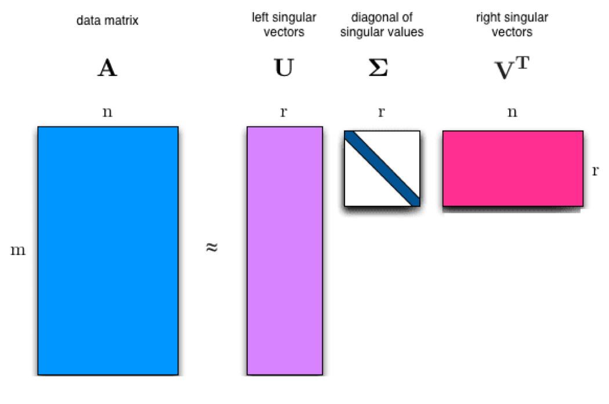

```{r setup, include=FALSE}
knitr::opts_chunk$set(echo = TRUE)
```
# WEEK 1
Topics:  
- Data structures and matrices  
- Matrix algebra  
- Similarity and distance measures  
- Matrix decomposition  

(For background reading consult Chapter 2 of Analyzing Social Networks by Borgatti, Everett and Johnson.)

## Foundations: Data structures and matrix algebra
At the heart of the techniques that we will discuss in this course stands the data structure of the matrix.  
Matrices come in different shapes and sizes and can represent different information. If you have done any kind of quantitative research, and have worked with SPSS, Stata or R, you are already familiar with the data structure that is used to do 'variable'-based research, the case/variable data structure. Each row represents a case (an individual, an organization, a country, etc.) and the columns are the variables (gender, job category, salary, or whatever). The cells of the matrix then indicate the value of a case on a certain variable. This is also sometimes called 'attribute data'.


Matrices can also capture 'relational data'. This is the type of data analyzed in (social or semantic) network analysis.

In a one-mode matrix, the row and columns refer to the same "entity": they could be persons, organizations, or even ideas or codes (as in semantic network analysis). In network analysis these are often called 'nodes' or 'vertices' and the cells indicate whether a relation or a 'tie' or 'edge' (however that is defined) exists between two nodes. In social network analysis, these ties can refer to relations such as friendship ties, or exchange relations, etc.

## Matrix representation
An example of a one-mode matrix. Note that the matrix has the same number of rows as columns (14). A one-mode network is sometimes also called an 'adjacency' matrix. 


A two-mode matrix refers to relations between different types of entities on rows and colums. So, for example, the relation between people and events that they participate in, organisations and its members, but also, in (semantic) network analysis, words and documents. 

An example of a two-mode matrix.
Note that the number of rows (18) is different from the number of columns (14). The rows refer here to women and the columns to the events.


## Graph representation
Relational data can also be visually represented as a network graph. The circles are the nodes, the lines connecting the nodes are the edges. If a matrix is non-symmetric, this means that the network is directed, which is indicated by the arcs at the end of the edges. In the example below, there is a link between B->C, but not from C->B. In the matrix this would be seen in that there is a 1 in the cell value of row B/column C, but a zero in row C/column B. 


# Matrix algebra
Now that we have covered the very basics, we need to familiarize ourselves with some basic matrix algebra. 

## Matrix transpose
Transposing a matrix means making columns into rows and rows into columns. In R we do this with the t() command.
```{r}
T=matrix(c(0,3,1,5,0,1,4,0,0,4,1,6,0,0,0,5,0,0,0,1,1,3,0,1),nrow=6,ncol=4) 
print(T)
T_transpose <- t(T)
print(T_transpose)
```


## Matrix multiplication
Matrices can be multiplied by each other using the 'dot product'. 
Matrix multiplication requires that the number of columns of the first matrix is the same as the number of rows of the second matrix. 
C[1,1] is the value of the dot product of first row of A multiplied by the first column of B
C[2,2] is the value of the dot product of the second row of A multiplied by the second column of B


Matrix multiplication can have many uses. In social network analysis, matrix multiplcation can be used to measure compound relations. If we, for example, have a friendship matrix, the Friendship x Friendship matrix gives us the friend of a friend relation. 

```{r}
#In the matrix F, person A (row 1) has a friendship tie to B, C and D.
F=matrix(c(0,1,1,1,0,1,0,1,0,0,1,1,0,1,0,1,0,1,0,1,0,0,0,1,0),nrow=5,ncol=5) 
print(F)
FF=F%*%F
print(FF)
```
Another way to say this is that the FF matrix indicates the number of ties (or 'walks') with length 2. 
Look at the diagonal cells. What do think these mean?


## Matrix multiplication: from two-mode to one-mode matrices
We can use matrix multiplication to transform a two-mode matrix into a one-mode matrix. Let's say we have a two-mode matrix A. When we multiply this matrix with its own transpose, we get a one-mode matrix. More particularly, A multiplied by transpose of A gives the row by row matrix. The transpose of A multiplied by A gives the column by column matrix. 
Example of Breiger: person (letters) by event (numbers) matrix


```{r}
#In the matrix F, person A (row 1) has a friendship tie to B, C and D.
A=rbind(c(0,0,0,0,1),c(1,0,0,0,0),c(1,1,0,0,0),c(0,1,1,1,1),c(0,0,1,0,0),c(0,0,1,1,0)) 
rownames(A) <- c("A","B","C","D","E","F")
colnames(A) <- c("1","2","3","4","5")
print(A)
print(t(A))
P=A %*% t(A)
diag(P) <- 0
print(P)
G=t(A) %*% A
diag(G) <- 0
print(G)
```

# Similarity and distance measures
Matrix multiplication is one way to transform a two-mode matrix into a one-mode matrix. 
More generally, we can think of this transformation as a way to measure the similarities (or distances) between rows (or columns: now that we know about transposing the matrix this distinction becomes trivial).
The example refers to a document-word matrix. In this matrix, the rows refer to documents (for example, newspaper articles) and the columns refer to words. The cell entries show the number of times each word occurs within that document.

## Euclidian distance
For a quick refresher on high school geometry look here: https://towardsdatascience.com/the-euclidean-distance-is-just-the-pythagorean-theorem-2e672017d875 


## Cosine similarity


## Jaccard similarity 


## Pearson correlation 

```{r}
#distance and similarity measures
s1 <- c(5,5,2,1)
s2 <- c(3,3,5,1)
s3 <- c(2,2,6,1)
s4 <- c(4,4,4,1)
my_m <- rbind(c(5,5,2,1),c(3,3,5,1),c(2,2,6,1),c(4,4,4,1))
#default is euclidian distance
dist(my_m)

#cor calculates correlation among columns so transpose matrix first to get correlation among rows
cor(t(my_m))

#example for jaccard. dist measures distances so binary=1-jaccard
e <- c(1,1,0,0)
f <- c(0,1,1,0)
g <- c(0,0,0,1)
h <- c(1,1,1,1)
matrix_jaccard <- rbind(e,f,g,h)
dist(matrix_jaccard,method="binary")

#To use the Breiger example: We would like to incorporate the differences between the attendance pattern of person D, E and F. D visits 4 events while E visits only 1 and F 2. The overlap between E and D and F respectively should have different weights since the chance that E overlaps with D is greater since D is "just" a more frequent visitor of events. The overlap between E and F is higher since both are not frequent visitors but still have also an event in common. We can use the Jaccard measure to take these differences into account. 
1-dist(A,method="binary")
```

```{r}
#negative correlation becomes positive when adding zeros
author_a <- c(NA,4,2,3,9,10)
author_b <- c(4,NA,8,9,2,5)
author_matrix <- rbind(author_a,author_b)
cor(t(author_matrix),use="complete.obs")
cor(author_a,author_b,use="complete.obs")

author_a <- c(NA,4,2,3,9,10,0,0,0,0)
author_b <- c(4,NA,8,9,2,5,0,0,0,0)
author_matrix <- rbind(author_a,author_b)
cor(t(author_matrix),use="complete.obs")
cor(author_a,author_b,use="complete.obs")

#perfect correlation goes away when adding zeros
author_a <- c(NA,7,1,2,3,4)
author_b <- c(7,NA,10,11,12,13)
author_matrix <- rbind(author_a,author_b)
cor(t(author_matrix),use="complete.obs")
cor(author_a,author_b,use="complete.obs")

author_a <- c(NA,7,1,2,3,4,0,0,0,0)
author_b <- c(7,NA,10,11,12,13,0,0,0,0)
author_matrix <- rbind(author_a,author_b)
cor(t(author_matrix),use="complete.obs")
cor(author_a,author_b,use="complete.obs")

library(lsa)
author_a <- c(0,7,1,2,3,4,0,0,0,0)
author_b <- c(7,0,10,11,12,13,0,0,0,0)
cosine(author_a,author_b)
cosine(s1,s2)
cor(author_a,author_b,use="complete.obs")

my_example=matrix(c(0,0,1,0,0,0,1,0,1,1,0,0,0,1,1,1,1,1,0,1,1,0,1,0,0,0,0,1,0,0,1,0,0,0,1,1,0,0,0,0,0,1,1,1,1,0,0,0,1,0,0,0,1,0,0,0,1,1,1,0,0,0,1,1,1,1,0,0,0,1,0,1,0,0,0,0,1,0,1,1,1,0,0,1,0,1,0,0,0,0,1), ncol=7,nrow=13)
my_example
my_example_dist <- round(as.matrix(dist(my_example,method="binary",diag=TRUE)),digits=2)
```

# Advanced topic: Matrix Decomposition
Matrices can not only be multiplied. They can also be 'decomposed'. There are multiple ways to decompose a matrix. For square matrices the most well-known method is by using the eigenvectors and eigenvalues. For non-square matrices we can use the singular value decomposition. 

## Eigendecomposition

## Singular value decomposition

Singular value decomposition is one of the most useful mathematical findings from matrix algebra. See if you can follow along: 




