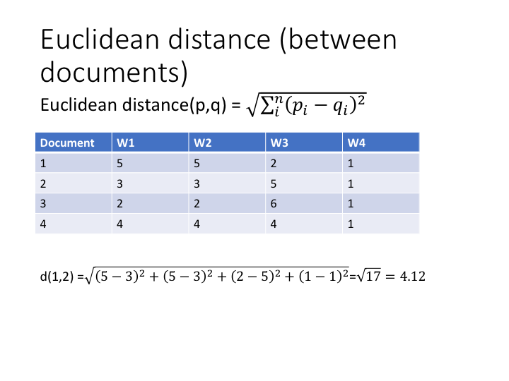

```{r setup, include=FALSE}
knitr::opts_chunk$set(echo = TRUE)
library(igraph)
```

# Week 2 Session 2

## Structural equivalence
As discussed by Mohr (1998: 358) there is a debate within network analysis between those who focus on methods emphasizing "connectivity" (as in finding cohesive subgroups) and those who emphasize "structural equivalence". In this section, we'll discuss the idea behind structural equivalence and two ways of finding structurally equivalent nodes: measuring profile similarity (Borgatti 12.3) and using the Concor algorithm (not discussed in Borgatti but used in Mohr 1994). There are other techniques, such as direct optimization (12.5) and REGE for regular equivalence. We will not discuss those in any detail. 

Structural equivalence suggests that nodes are not similar because they are connected to each other (as in cohesive subgroups) but because they have similar relations _to others_. Nodes are similar (or "equivalent") because they have the same "position" or "role" within the network. A teacher, for example, occupies the role of a teacher because she has a characteristic relation to her students, and students occupy the role of students because of their relation to their teacher. The dominant class, in Marxist theory, is a class because of its relation to the dominated class, and vice versa, not necessarily because of their internal cohesiveness. Their relation vis-a-vis each other, in other words, is what makes them occupy a certain role in the social structure. Network analysts have developed various ways to find structurally equivalent roles in social networks. And these also prove useful for measuring "discursive roles" (cf. Mohr 1994).

In an undirected network without self-reflexive ties, the definition of structural equivalence is that actor i and j are structurally equivalent if, excepting each other, they are connected to exactly the same other actors. 

This definition is an ideal mathematical model and does not often occur in real data. So we need ways to find structurally equivalent nodes that approximate this model. 

## Profile similarity
In a one-mode, adjacency matrix, two nodes are structurally equivalent when they have exactly the same relation to all others in the network. In matrix terms this means that their row (or column) _profiles_ are exactly the same. 

To see this, look at the matrix of the fictitious data of the first relationship in Figure 12.1. The following steps create the matrix, the plot and output the adjacency matrix. 

```{r}
g <-  graph.formula(1-1,1-2,1-3,1-4,1-5,2-2,2-3,2-4,2-5,simplify = FALSE)
l <- layout.kamada.kawai(g) 
l[,1] <- c(2,4,1,3,5)
l[,2] <- c(3,3,1,1,1)
plot(g,layout=l)
adj <- as_adjacency_matrix(g,sparse=FALSE)
adj
```
What you see is that the row profiles (i.e. the complete row of each node) are exactly the same for the structurally equivalent nodes (1,2 and 3,4,5). This is also what the definition of structural equivalence implies. Node 1 and 2 have exactly the same relations with nodes 3,4 and 5. Nodes 3,4 and 5 have the exact same relation to nodes 1 and 2. 

To measure whether we have structurally equivalent nodes, we can therefore measure the _profile similarity_ between rows (and columns if the network is directed) and thereby assess whether two rows have similar relations to others in the network. 

To measure profile similarity we can use various similarity or distance measures. Below we briefly review a few commonly used measures. 

## Measuring profile similarity using similarity or distance measures in R

To illustrate the measures for row profiles, I am using an example from a fictious two-mode matrix, a document-word matrix. The principle is the same for measuring the row profiles of nodes in a one-mode matrix. 

### Euclidian distance
Euclidian distance measures the distances between rows using the Pythagoran theorem. For a quick refresher on high school geometry look here: https://towardsdatascience.com/the-euclidean-distance-is-just-the-pythagorean-theorem-2e672017d875 Measuring the distance between rows gives a row by row distance matrix. If the Euclidian distance is zero, then two row profiles are the same. 

{width=50%}

We measure the Euclidian distance with the dist function:

```{r}
#distance and similarity measures
s1 <- c(5,5,2,1)
s2 <- c(3,3,5,1)
s3 <- c(2,2,6,1)
s4 <- c(4,4,4,1)
my_m <- rbind(s1,s2,s3,s4)
#we can use the function dist which is standard in R. The default is euclidian distance
dist(my_m)
```

### Correlation 
We can also measure the correlation between rows as an indication of their similarity. It varies between -1 and 1 and the more similar two row profiles, the closer to 1. 

A useful feature of the correlation coefficient is that it normalizes the frequency of occurrence. To see what that means, let's change the example somewhat and change the difference between document 2 and 3 so that document 3 has 10 more of each word, but the overall pattern is the same. If we then calculate the Euclidian distances, this will be large between document 2 and 3. But correlation will be perfect.

Another similarity measure which has this feature is cosine similarity (which is therefore often used in text analysis). I'll discuss that later in the course. 

```{r}
#distance and similarity measures
s1 <- c(5,5,2,1)
s2 <- c(3,3,5,1)
s3 <- c(13,13,15,11)
s4 <- c(4,4,4,1)
my_m <- rbind(s1,s2,s3,s4)
#euclidian distance
dist(my_m)
#cor calculates correlation among columns so transpose matrix first to get correlation among rows
cor(t(my_m))
```

### Jaccard similarity 
The Jaccard measure of similarity is used for binary values. The special characteristic of the Jaccard measure is that it does not take into account values where both rows are zero. If two documents both do not have some word, then this does not add to the similarity of the documents. Dissimilarity only increases when one document has a word that the other one does not have. This is different from a correlation measure which would take these "mutual absences", or 0/0 cases into account. The Jaccard measure of similarity is measured as follows. Document 1 and 2, for example, shared one word (W2) out of the three words that both documents have (W1,W2,W3). Both do not have W4 so we do not include that one in the denominator. The dist function in R gives us 1-this value (so it transforms it into a distance measure rather than a similarity measure. So the smaller the Jaccard similarity, the larger the distance).

{width=50%}

```{r}
#example for jaccard. dist measures distances so to get the similarity score  you would subtract it from 1. binary=1-jaccard
e <- c(1,1,0,0)
f <- c(0,1,1,0)
g <- c(0,0,0,1)
h <- c(1,1,1,1)
matrix_jaccard <- rbind(e,f,g,h)
dist(matrix_jaccard,method="binary")
```

When you have measured the distance (or similarity) between row profiles, you can use this information to group together structurally equivalent nodes, i.e. nodes that score low on distance (or high on similarity). Next week, we'll discuss how to do this using cluster analysis and/or MDS. For now it is enough to understand that by measuring profile similarity you have measured (approximately) structurally equivalent nodes. 

## Blockmodeling

Once we have identified groups of structurally equivalent nodes, we can produce a simplified or reduced matrix. We rearrange the matrix so that structurally equivalent nodes (so the rows and columns of the adjacency matrix) are grouped together. In the ideal case, all blocks are either zeros or ones, and we can therefore replace each block with a zero or one without losing information. The result is a new and smaller adjacency matrix which we call the _image matrix_. This process of simplifying the matrix based on groups of structurally equivalent nodes is called blockmodeling. 

We will illustrate this process using the Sampson dataset as used by Borgatti in 12.4.

We are going to use two other R-packages, sna and statnet, because the capabilities for structural equivalence are somewhat limited in igraph. Because of some additional options in Ucinet (the program used by Borgatti) which are not straightforwardly implemented in R, the replication will not be exact, but we can approximate their results. We'll try to replicate figure 12.4 which gives the blockmodel based on dichotomized data and using correlation as a measure of profile similarity.

```{r,message=FALSE}
#install.packages("sna")
#install.packages("statnet")
detach("package:igraph", unload=TRUE)#this detaches the igraph package as it might interfere with the other packages.
library(sna)
library(statnet)
```

We load in the Sampson data. It has two relations and is split in esteem and disesteem relations. 

```{r}
#import the sampson esteem data
sampe <- read.csv("Data/sampson_esteem.csv", header=TRUE,row.names = 1)
sampd <- read.csv("Data/sampson_desteem.csv", header=TRUE,row.names = 1)
```

We dichotomize both esteem and disesteem relationships. 
```{r}
sampe_dichot <- sampe
sampe_dichot[sampe_dichot>0] <- 1
#same for disesteem
sampd_dichot <- sampd
sampd_dichot[sampd_dichot>0] <- 1
```

We use correlation as our similarity measure. The equiv.cluster function in sna does the similarity calculation and clustering in one function. 

We cluster the nodes using the average hierarchical cluster algorithm (which we will discuss next week). 

The measure of profile similarity is based on the two relations at the same time. So we list both the esteem and disesteem matrix. 

```{r}
eq <- equiv.clust(list(sampe_dichot,sampd_dichot), diag=TRUE, mode="digraph", method="correlation",cluster.method = "average")
class(eq)
plot(eq)
```

The cluster dendogram gives you the groupings of the nodes based on their profile similarity. Nodes that have high similarity are grouped together more quickly (such as nodes 17 and 18).

The blockmodel function calculates the image matrix and gives a plot of the clustered nodes. The blockmodel does not exactly replicate Borgatti's analysis, as block 2 also contains node 5 (Peter). But it comes fairly close. In any case, the blockmodel now shows a simplified structure, where, for example, none of the groups show any esteem for block 4. 

```{r}
blk_mod <- sna::blockmodel(sampe_dichot, eq, k=4, eq$cluster, mode="digraph") 
blk_mod
blk_mod$glabels <- "Esteem"
blk_mod$plabels <- blk_mod$order.vector
plot(blk_mod)
```
```{r}
blk_mod <- sna::blockmodel(sampd_dichot, eq, k=4, eq$cluster, mode="digraph") 
blk_mod$glabels <- "Disesteem"
blk_mod$plabels <- blk_mod$order.vector
plot(blk_mod)
blk_mod
```
## CONCOR

The most prominent examples of the use of blockmodeling (at least in sociology) make use of the CONCOR algorithm (as first developed by Harrison White and Ron Breiger). The name CONCOR refers to the CONvergence of iterated CORrelations. As the name suggests, it uses a simple trick to find structurally equivalent groups. Above we measured the similarity between rows using correlation. The result is a similarity matrix with the correlation coefficients. Now what CONCOR does is to take the correlations of those correlations, and repeating that process a number of times. If you repeat it long enough, it will (in most cases) converge and have only 1s and -1s in the matrix. The cells with 1s are then one group, and the cells with -1 another. This process can be repeated for the two blocks, which will split it into 4 blocks, and so on. CONCOR has therefore many similarities with the steps that we took above when first measuring similarities among row profiles with correlations, and then using a hierarchical cluster analysis to select the number of blocks. CONCOR has some limitations, though, as it can only work with correlations as a measure of similarity. It also always splits up the blocks into divisions of 2, which is an artifact of the algorithm, and does not necessarily have to be descriptive of the network structure. That said, a basic understanding of the algorithm is necessary for following the Mohr 1994 article. 

## John Mohr's Soldiers, Mothers, Tramps and Others

The 1994 article is the first of several within his project on the cultural logic of the field of welfare organizations around the turn of the century. 

It coded the directory descriptions for the occurrence of status identities (soldiers, strangers, the blind, etc.) and the categories of relief and social welfare practices. Table 1 and 2 list both of them and provide examples from the actual textual material. Table 3 is the raw two-mode data matrix of practices by identities. 

The next step is measuring the profile similarities among the status identities using the correlation coefficient. This thus gives a status x status matrix of similarities. 

Then he measures how similar those status identities are in relation to other status identities. Again by taking the correlation we find which status identities are similar in their relation vis-a-vis other status identities. 

Mohr gives the example of seamen and widows. These have, for example, relatively low correlation in terms of their practice profiles. But they have quite similar positions in relation to _other_ status identities. In other words, in the overall relations among status identities, these two identities seemed to have held a quite similar position. 

The Concor algorithm executes this logic of correlations of correlations of correlations, etc. so it is useful to find the overall block structure of how status identities occupied similar discursive role positions.

Here we will replicate the analysis done by John Mohr in Soldiers, Mothers, Tramps and Others.  

We first import the matrix of table 3. 

```{r}
#we import the mohr soldiers data
soldiers <- read.csv2("Data/mohr_matrix_soldiers.txt", header=TRUE,row.names = 1)
```

We take the correlation among the columns. This will measure the column similarity of status identies in how they are treated.

```{r}
soldiers_cor <- cor(soldiers)
```

Just by looking at the raw matrix (Table 3), we can already see that, for example, the two identities TRAMP_F and TRAMP_M have quite unique and similar treatment profiles. Both are characterized by GIVEWOR_S and JAIL_S and TRAMP_F is given JOBTRAN_S. So they will correlate strongly with each other. 

```{r}
cor(soldiers$TRAMP_F,soldiers$TRAMP_M)
```

The correlation is indeed 0.81. You can also see that they are quite unique in their treatment profile, as the three treatments are not present for any other category. We can check by looking at the full correlation profiles. Correlations with other status identities are indeed all negative. 

```{r}
soldiers_cor["TRAMP_F",]
soldiers_cor["TRAMP_M",]
```

Two status identities do not have to have high pairwise correlation to be structurally equivalent. The example is given of SEAMEN and WIDOWS. 

```{r}
cor(soldiers$SEAMEN,soldiers$WIDOWS)
```

The correlation is relatively low with 0.21. But as we'll see, they will be classified as similar based on having similar patterns of correlation with _other_ status identities. 

We can check by correlating their correlations. The correlation of their correlation profiles is already higher at 0.32. And after a few iterations, the correlation becomes almost 1. 

```{r}
seamen <- soldiers_cor[,"SEAMEN"]
widows <- soldiers_cor[,"WIDOWS"]
cor(seamen,widows)
#and only after a few iterations it is already 0.91
cor(cor(cor(cor(soldiers_cor))))["SEAMEN",]
```

The Concor algorithm implements this logic of correlations of correlations. 

```{r}
#Adam Slez has rewritten the Concor program in R. This is not available through CRAN but we can download it directly from github. We need the devtools package to do this. You need to uncomment the following two lines to install the package. 
#library(devtools)
#devtools::install_github("aslez/concoR") 
library(concoR)
#p=3 means that we look at a 3-level split, so 8 blocks. Which is what Mohr reports in his figure 1.
blks3 <- concor_hca(list(soldiers_cor),p=3) 
#the blocks were reverse coded so we their index numbers to match the article for easier interpretation
blks3$block <- 9-blks3$block
blks3
```

SEAMEN and WIDOWS are now grouped together in block 4 (together with BLIND_NG IMMIGN_NG SOLDIERS). This means that these status identities are structurally equivalent, i.e. have similar positions vis-a-vis other status identities. In other words, both relate in similar manners to other status identities. So even if they do not strongly correlate with each other, they do have a similar position in the overall discourse structure. 

To further investigate the blockmodel solution we can also look at the groupings at lower splits. This should show the same divisions as in figure 1. 

```{r}
blks2 <- concor_hca(list(soldiers_cor),p=2) 
blks2
blks1 <- concor_hca(list(soldiers_cor),p=1) 
blks1
```

We can also show the block structure in figure 2.

```{r}
library(sna)
blk_mod <- blockmodel(soldiers_cor, blks3$block, diag=TRUE,
                      glabels = names(soldiers_cor),
                      plabels = rownames(soldiers_cor[[1]]))
blk_mod
densitymatrix <- blk_mod[["block.model"]]
```


```{r}
#we cut off the density within each block at the average which is 0.1375
densitymatrix[densitymatrix>0.1375] <- 1
densitymatrix[densitymatrix<0.1375] <- 0
diag(densitymatrix) <- 0
densitymatrix
```

We now have a network of relations between the blocks. And we can use Igraph to plot this network. 

```{r}
library(igraph)
mohrnetwork <- graph_from_adjacency_matrix(densitymatrix)
plot(mohrnetwork,edge.arrow.size=.2,layout=layout_with_kk)
```

We now get an overall sense of the structure of relations among status identities. Block 4, which contains SOLDIERS, occupies the core position and links to 4 other blocks. Block 1 and Block 8 are isolates. Block 1 contain the two unique TRAMP categories. Block 7 contains MOTHERS. 

