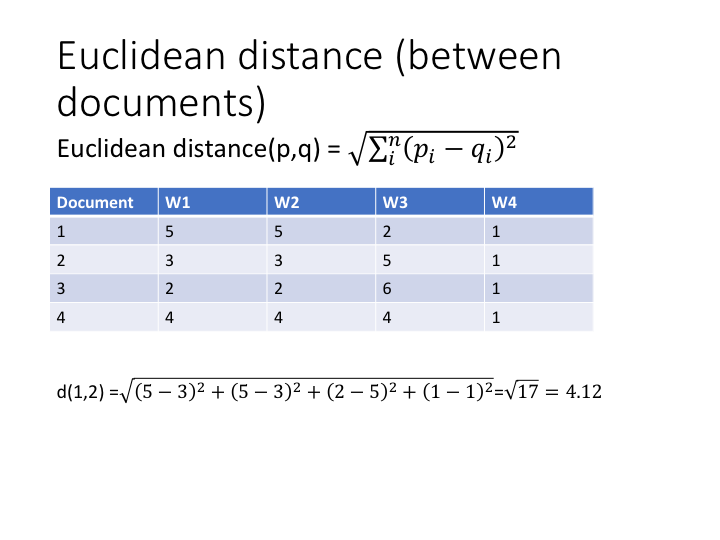
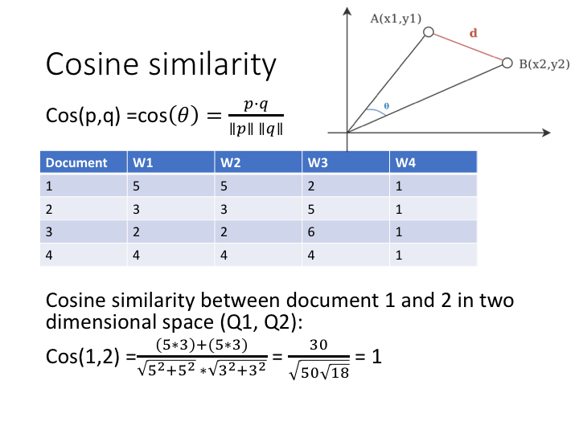
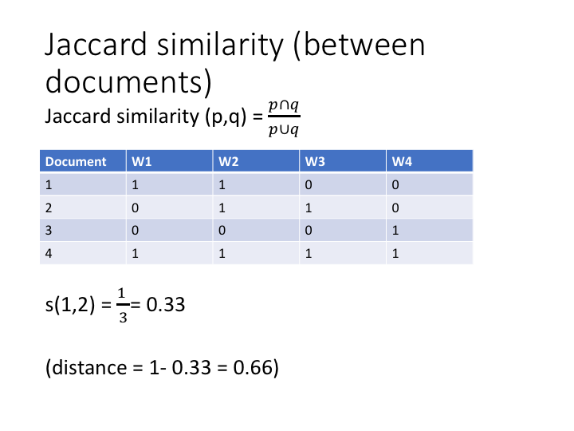

```{r setup, include=FALSE}
knitr::opts_chunk$set(echo = TRUE)
```

# Week 2 Network analysis
Topics: 
- whole network measures  
- centrality measures  
- finding subgroups (TBA)  
- structural equivalence and blockmodeling

## Importing data

We are going to use the igraph package in R to analyze the campnet dataset discussed in Borgatti. 
The dataset (campnet.csv) and attribute file (campattr.txt) are available from Github
For more information on the data, see: https://sites.google.com/site/ucinetsoftware/datasets/campdata

```{r}
#last session we installed igraph so no need to do that again
#install.packages("igraph")
library(igraph)
#be sure that the two files are in your R working directory and in the Data folder 
#header = False because we don't have a name to the two columns
campnet <- read.csv2("Data/campnet.csv", header=FALSE)
#the attribute file contains information on the nodes such as their gender, their role. It also already includes a centrality measure (betweenness) but this will be calculated separately later on in the script. 
#import the attribute file
campattr <- read.csv("Data/campattr.txt")
```

We need to transform the data frame format into an igraph object to be able to use igraph's functions. We also add the attributes.  

```{r}
#as this is a directed network we set directed to TRUE
g <- graph_from_data_frame(campnet, directed = TRUE, vertices = campattr)
#look at the file format
class(g)
#now has become an igraph format
```

## Basic operations

The graph representation of the network

```{r}
#we can plot the network with the kamada-kawai layout. 
#We replicate the figure 2.3 in borgatti which shows the directed network in graph format
plot(g,edge.arrow.size=.4,layout=layout_with_kk,main="campnet dataset")
#replicate figure 9.3 with gender attribute
plot(g,edge.arrow.size=.4,layout=layout_with_kk,main="campnet dataset with gender",vertex.color=vertex_attr(g)$Gender)
```

Count the number of nodes and edges
```{r}
#we can  count the number of nodes
vcount(g)
#and count the number of edges
ecount(g)
```

We can also make an undirected graph by "collapsing" the matrix and making it symmetric. 

```{r}
#Change into an undirected network by collapsing
g_undirected <- as.undirected(g, mode = "collapse")
plot(g_undirected,edge.arrow.size=.4,layout=layout_with_kk,main="campnet dataset undirected")
#if you look at the matrix representation you see that it has become symmetric
g_undirected[]
```

## Paths, trails, walks
A key concept in graph theory is the notion of a path. This refers to the "route" that connects two nodes in a network. A path is a particular route, namely one that does not revisit the same node or edge twice. Paths are therefore different from "walks" and "trails". In "walks" bot nodes and edges can be repeated. 

In the network below, 1->2->3->4->2->1->3 is a walk. 

{width=50%}

Trails can revisit the same node, but not the same edge. So here, 1->3->8->6->3->2 is a trail. 

{width=50%}

As said, a path never revisits the same nodes or edges. So 6->8->3->1->2->4 is a path. 

{width=50%}

The shortest path between nodes is called a "geodesic". 

To get the paths from Holly to the other nodes in the campnet network, we can list all paths from this node to all others. You can verify that, as mentioned by Borgatti (p.16), there is no path in the network from Holly to Brazey.

```{r}
all_simple_paths(g, "HOLLY", to = V(g), mode = c("out"))
```

We can get the geodesic distances between pairs of nodes (cf. matrix 2.2 in Borgatti). We take the directed graph and therefore add mode=out and mode=in
```{r}
distances(g,mode="out")
distances(g,mode="in")
```

## Components

The concept of paths is important for defining another key concept in describing networks: components. A component is defined as the maximal set of nodes in which every node can reach every other node by some path. A strong component takes the directionality into account. Weak components ignore directionality.

```{r}
#find the number of strong components.
g.components <- components(g, mode = "strong")
print(g.components)

#the following line does the same thing but now just returns the number
count_components(g, mode = c("strong"))

#add attributes of component membership
V(g)$components <- g.components$membership

#examine attributes to check if it was added
vertex_attr(g)

#plot the graph with components
plot(g,edge.arrow.size=.4,layout=layout_with_kk,main="campnet dataset with components",vertex.color=vertex_attr(g)$components)
```

Check what happens when you choose "weak" components. How many components do you get?  

# Whole Network Measures

Whole network measures give one number that measures a property of a whole network. 

## Density
Density is a measure for the "cohesion" of the network. It is simply the number of ties divided by the number of possible ties.
```{r}
#measure the density. 
graph.density(g)
graph.density(g_undirected)
```

Find density in subgroups:

```{r}
#Find density in subgroups:
#extract the womens network
g.women <- induced_subgraph(g, V(g)$Gender == 1)
#we can also plot only the women in the network
plot(g.women,edge.arrow.size=.2,layout=layout_with_kk,main="campnet dataset women",vertex.color=vertex_attr(g.women)$Gender)
#density among women. should be 0.357. cf. Table 9.1
graph.density(g.women)
#density among men. should be 0.278. cf. Table 9.1
g.men <- induced_subgraph(g, V(g)$Gender == 2)
plot(g.men,edge.arrow.size=.2,layout=layout_with_kk,main="campnet dataset men",vertex.color=vertex_attr(g.men)$Gender)
graph.density(g.men)
```

## Component ratio
The number of components in a network is also a measure of the whole network structure. If there are many components then this indicates that the network is "disconnected". Just taking the number of components, however, makes it hard to compare different networks on this measure. Therefore we normalize this measure by dividing it by the number of nodes in the network, or more accurately: C-1 / n-1 (where C is the number of components, and n is the number of nodes). It is 1 when all nodes are isolates and 0 when there is just one component. 

```{r}
component_ratio <- (count_components(g,mode="strong")-1)/(vcount(g)-1)
component_ratio
```

## Connectedness
This measures the proportion of the pair of nodes that are located in the same component. So, for a network of size n, there are n*n-1 pairs. Connectedness then sums up the number of (non-reflexive) pairs and divides it by the number of pairs. 

```{r}
#Connectedness is not available in igraph. 
csize <- g.components[[2]]
class(csize)
sum((csize-1)*csize)/(vcount(g)*(vcount(g)-1))
```

## Compactness
Compactness is not available in igraph. 
But we can calculate it by defining a function:

```{r}
#Compactness
#Compactness is not available in igraph. 
#But we can calculate it by defining a function:
Compactness <- function(x) {
  gra.geo <- distances(x) ## get geodesics
  gra.rdist <- 1/gra.geo  ## get reciprocal of geodesics
  diag(gra.rdist) <- NA   ## assign NA to diagonal
  gra.rdist[gra.rdist == Inf] <- 0 ## replace infinity with 0
  # Compactness = mean of reciprocal distances
  comp.igph <- mean(gra.rdist, na.rm=TRUE) 
  return(comp.igph)
}
Compactness(g)
```

## Reciprocity
In directed networks, we can measure whether ties are reciprocated (or "symmetric"). Note that 0/0 pairs are also reciprocal ties (both nodes not having a tie with each other). If we do not want to include 0/0 pairs as reciprocated then mode is ratio.
```{r}
#Reciprocity
reciprocity(g,ignore.loops = TRUE,mode="ratio")
```

## Transitivity. 
```{r}
#Transitivity 
#overall graph clustering coefficient
transitivity(g,type='average')
#weighted overall clustering coefficient on the undirected network, which is the same as the 9.4 formula in Borgatti, but for undirected networks. 
transitivity(g)
```

## Centralization
```{r}
#Centralization
#Calculations for the example from figure 9.8 in Borgatti
C=matrix(c(0,1,1,0,0,1,0,1,0,0,1,1,0,1,1,0,0,1,0,1,0,0,1,1,0),nrow=5,ncol=5) 
print(C)
c <- graph_from_adjacency_matrix(C, mode="undirected")
plot(c)
degree(c)
centr_degree(c,mode="all",loops=FALSE,normalized=TRUE)
#applied to campnet data
centr_degree(g_undirected,loops=FALSE,normalized = TRUE)
```

## Diameter
```{r}
#Diameter
diameter(g)
```

# Centrality Measures
We do all the below calculations for the undirected network

## Degree centrality
```{r}
# Degree centrality
deg <- degree(g_undirected)
print(deg)
#with the directed graph it would count up the in-degrees and outdegrees
deg_in <- degree(g,mode="in")
deg_out <- degree(g,mode="out")
deg_total <- degree(g,mode="total")
print(deg_in)
print(deg_out)
print(deg_total)

plot(g_undirected,edge.arrow.size=.4,layout=layout_with_kk,main="campnet dataset size=degree",vertex.size=deg*5)
```

## Eigenvector centrality
```{r}
#Eigenvector centrality
ev_g_un <- evcent(g_undirected)
print(ev_g_un)
ev_g_un$vector
plot(g_undirected,layout=layout_with_kk,main="campnet dataset size=eigenvector centrality",vertex.size=ev_g_un$vector*20)
```

## Beta centrality or Bonacich power centrality
When the beta factor is 0 then you get degree. However, the function in igraph normalizes by ssd=n. 
From the igraph manual: The coefficient alpha acts as a scaling parameter, and is set here (following Bonacich (1987)) such that the sum of squared scores is equal to the number of vertices. This allows 1 to be used as a reference value for the “middle” of the centrality range.)
So you do not get the degree values but normalized values where 1 is the norm. 

```{r}
#Beta centrality or Bonacich power centrality

#when b = 0 then this equals degree centrality
beta_centrality <- power_centrality(g_undirected, exponent=0)
print(beta_centrality)
plot(g_undirected,layout=layout_with_kk,main="campnet dataset size=beta centrality b=0",vertex.size=beta_centrality*20)

#we take a value of beta that approximates 1/largest eigenvalue. the largest eigenvalue is given by the eigenvector centrality function evcent
#you can also calculate it
e <- eigen(g_matrix)
e$values
max(e$values)
1/max(e$values)
#with beta at its highest, beta centrality should approximate eigenvector centrality
beta_centrality <- power_centrality(g_undirected, exponent=0.245)
print(beta_centrality)
plot(g_undirected,layout=layout_with_kk,main="campnet dataset size=beta centrality b=0.245",vertex.size=beta_centrality*10)
```

## Closeness centrality
Closeness centrality measures how many steps is required to access every other vertex from a given vertex

```{r}
closeness_g_un <- closeness(g_undirected, normalized=TRUE)
print(closeness_g_un)
plot(g_undirected,layout=layout_with_kk,main="campnet dataset size=closeness centrality",vertex.size=closeness_g_un*50)
```

## Betweenness centrality 
Betweenness centrality measures the number of shortest paths going through a specific vertex
```{r}
#Betweenness centrality 
#Betweenness centrality measures the number of shortest paths going through a specific vertex
betweenness_g_un <- betweenness(g_undirected)
print(betweenness_g_un)
plot(g_undirected,layout=layout_with_kk,main="campnet dataset size=betweenness centrality",vertex.size=betweenness_g_un)
```

# Finding subgroups
Show different algorithms...


# Week 2 Session 2

# Structural equivalence and blockmodeling
Find subgroups not because of overlapping relations but by their structurally equivalent position. The igraph package has only limited functionality for structural equivalence so we'll use SNA and 

# Replication of John Mohr's Soldiers, Mothers, Tramps and Others
Here we will replicate the analysis done by John Mohr in Soldiers, Mothers, Tramps and Others.  
He uses the Concor algorithm to do the blockmodeling. This is not available in igraph.  
Adam Slez has rewritten the program in R. This is not available through CRAN but we can download it directly from github. We need the devtools package to do this.

```{r}
library(devtools)
devtools::install_github("aslez/concoR")
library(concoR)
#we import the mohr soldiers data
soldiers <- read.csv2("Data/mohr_matrix_soldiers.txt", header=TRUE,row.names = 1)
#soldiers <- read.csv2("Data/mohr_matrix_soldiers.csv", header=TRUE,row.names = 1)
soldiers[]
str(soldiers1)
#we take the correlation among the columns
soldiers_cor <- cor(soldiers1)
soldiers_cor
#to follow along with the discussion of the correlation between seamen and widows select the correlation between these two identities
cor(soldiers1$SEAMEN,soldiers1$WIDOWS)
#the correlation is relatively low with 0.21. but as we'll see, they will be classified as similar based on having similar patterns of correlation with *other* status identities
#to see this, we apply the concor algorithm. 
#p=3 means that we look at a 3-level split. which is what Mohr reports in his figure 1.
blks3 <- concor_hca(list(soldiers_cor),p=3) 
blks3
#SEAMEN and WIDOWS are now grouped together in block 5 (together with BLIND_NG IMMIGN_NG SOLDIERS)
#This means that these status identities are structurally equivalent, i.e. have similar positions vis-a-vis other status identities
#In other words, both relate in similar manners to other status identities
#So even if they do not strongly correlate with each other, they do have a similar position in the overall discourse structure
#To further investigate the blockmodel solution we can also look at the groupings at lower splits.
#This should show the same divisions as in figure 1
blks2 <- concor_hca(list(soldiers_cor),p=2) 
blks2
blks1 <- concor_hca(list(soldiers_cor),p=1) 
blks1
#########################################################################

library(sna)
blk_mod <- blockmodel(soldiers_cor, blks3$block, diag=TRUE,
                      glabels = names(soldiers_cor),
                      plabels = rownames(soldiers_cor[[1]]))
blk_mod
densitymatrix <- blk_mod[["block.model"]]
class(densitymatrix)
densitymatrix[densitymatrix>0.1375] <- 1
densitymatrix[densitymatrix<0.1375] <- 0
densitymatrix
mohrnetwork <- graph_from_adjacency_matrix(densitymatrix)
plot(mohrnetwork,edge.arrow.size=.2,layout=layout_with_kk)
class(blk_mod)
plot(blk_mod)
```

# Similarity and distance measures
Matrix multiplication is one way to transform a two-mode matrix into a one-mode matrix. 
More generally, we can think of this transformation as a way to measure the similarities (or distances) between rows (or columns: now that we know about transposing the matrix this distinction becomes trivial).
The example refers to a document-word matrix. In this matrix, the rows refer to documents (for example, newspaper articles) and the columns refer to words. The cell entries show the number of times each word occurs within that document.

## Euclidian distance
For a quick refresher on high school geometry look here: https://towardsdatascience.com/the-euclidean-distance-is-just-the-pythagorean-theorem-2e672017d875 

{width=50%}

## Cosine similarity
{width=50%}

## Jaccard similarity 
{width=50%}

## Pearson correlation 

```{r}
#distance and similarity measures
s1 <- c(5,5,2,1)
s2 <- c(3,3,5,1)
s3 <- c(2,2,6,1)
s4 <- c(4,4,4,1)
my_m <- rbind(c(5,5,2,1),c(3,3,5,1),c(2,2,6,1),c(4,4,4,1))
#default is euclidian distance
dist(my_m)

#cor calculates correlation among columns so transpose matrix first to get correlation among rows
cor(t(my_m))

#example for jaccard. dist measures distances so binary=1-jaccard
e <- c(1,1,0,0)
f <- c(0,1,1,0)
g <- c(0,0,0,1)
h <- c(1,1,1,1)
matrix_jaccard <- rbind(e,f,g,h)
dist(matrix_jaccard,method="binary")

#To use the Breiger example: We would like to incorporate the differences between the attendance pattern of person D, E and F. D visits 4 events while E visits only 1 and F 2. The overlap between E and D and F respectively should have different weights since the chance that E overlaps with D is greater since D is "just" a more frequent visitor of events. The overlap between E and F is higher since both are not frequent visitors but still have also an event in common. We can use the Jaccard measure to take these differences into account. 
1-dist(F,method="binary")
```

```{r}
#negative correlation becomes positive when adding zeros
author_a <- c(NA,4,2,3,9,10)
author_b <- c(4,NA,8,9,2,5)
author_matrix <- rbind(author_a,author_b)
cor(t(author_matrix),use="complete.obs")
cor(author_a,author_b,use="complete.obs")

author_a <- c(NA,4,2,3,9,10,0,0,0,0)
author_b <- c(4,NA,8,9,2,5,0,0,0,0)
author_matrix <- rbind(author_a,author_b)
cor(t(author_matrix),use="complete.obs")
cor(author_a,author_b,use="complete.obs")

#perfect correlation goes away when adding zeros
author_a <- c(NA,7,1,2,3,4)
author_b <- c(7,NA,10,11,12,13)
author_matrix <- rbind(author_a,author_b)
cor(t(author_matrix),use="complete.obs")
cor(author_a,author_b,use="complete.obs")

author_a <- c(NA,7,1,2,3,4,0,0,0,0)
author_b <- c(7,NA,10,11,12,13,0,0,0,0)
author_matrix <- rbind(author_a,author_b)
cor(t(author_matrix),use="complete.obs")
cor(author_a,author_b,use="complete.obs")

library(lsa)
author_a <- c(0,7,1,2,3,4,0,0,0,0)
author_b <- c(7,0,10,11,12,13,0,0,0,0)
cosine(author_a,author_b)
cosine(s1,s2)
cor(author_a,author_b,use="complete.obs")

my_example=matrix(c(0,0,1,0,0,0,1,0,1,1,0,0,0,1,1,1,1,1,0,1,1,0,1,0,0,0,0,1,0,0,1,0,0,0,1,1,0,0,0,0,0,1,1,1,1,0,0,0,1,0,0,0,1,0,0,0,1,1,1,0,0,0,1,1,1,1,0,0,0,1,0,1,0,0,0,0,1,0,1,1,1,0,0,1,0,1,0,0,0,0,1), ncol=7,nrow=13)
my_example
my_example_dist <- round(as.matrix(dist(my_example,method="binary",diag=TRUE)),digits=2)
```


