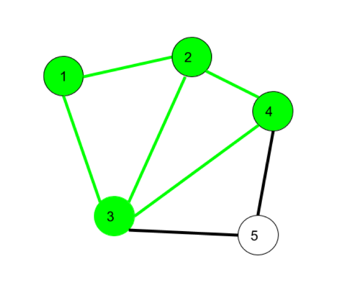

```{r setup, include=FALSE}
knitr::opts_chunk$set(echo = TRUE)
```

# Week 2 Network analysis Session 1
Topics:  
- whole network measures  
- centrality measures  
- finding subgroups  

## Importing data

The following 3 steps are the same as last session. Just to be sure, we do them here again. 

We are going to use the igraph package in R to analyze the campnet dataset discussed in Borgatti. 
The dataset (campnet.csv) and attribute file (campattr.txt) can be downloaded from last week's Canvas module.
For more information on the data, see: https://sites.google.com/site/ucinetsoftware/datasets/campdata

```{r}
#last session we installed igraph so no need to do that again
#install.packages("igraph")
library(igraph)
#be sure that the two files are in your R working directory and in the Data folder 
#header = False because we don't have a name to the two columns
campnet <- read.csv2("Data/campnet.csv", header=FALSE)
#the attribute file contains information on the nodes such as their gender, their role. It also already includes a centrality measure (betweenness) but this will be calculated separately later on in the script. 
#import the attribute file
campattr <- read.csv("Data/campattr.txt")
```

We need to transform the data frame format into an igraph object to be able to use igraph's functions. We also add the attributes.  

```{r}
#as this is a directed network we set directed to TRUE
g <- graph_from_data_frame(campnet, directed = TRUE, vertices = campattr)
#look at the file format
class(g)
#now has become an igraph format
```

## Basic network analysis

The graph representation of the network.

```{r}
#we can plot the network with the kamada-kawai layout. 
#We replicate the figure 2.3 in borgatti which shows the directed network in graph format
plot(g,edge.arrow.size=.4,layout=layout_with_kk,main="campnet dataset")
#replicate figure 9.3 with gender attribute
plot(g,edge.arrow.size=.4,layout=layout_with_kk,main="campnet dataset with gender",vertex.color=vertex_attr(g)$Gender)
```

We count the number of nodes and edges.

```{r}
#we can  count the number of nodes
vcount(g)
#and count the number of edges
ecount(g)
```

We also make an undirected version of the network  by "collapsing" the matrix and making it symmetric. 

```{r}
#Change into an undirected network by collapsing
g_undirected <- as.undirected(g, mode = "collapse")
plot(g_undirected,edge.arrow.size=.4,layout=layout_with_kk,main="campnet dataset undirected")
#if you look at the matrix representation you see that it has become symmetric
g_undirected[]
```

## Paths, trails, walks
A key concept in graph theory is the notion of a path. This refers to the "route" that connects two nodes in a network. A path is a particular route, namely one that does not revisit the same node or edge twice. Paths are therefore different from "walks" and "trails". In "walks" both nodes and edges can be repeated. 

In the network below, 1->2->3->4->2->1->3 is a walk. 

{width=50%}

Trails can revisit the same node, but not the same edge. So here, 1->3->8->6->3->2 is a trail. 

{width=50%}

As said, a path never revisits the same nodes or edges. So 6->8->3->1->2->4 is a path. 

{width=50%}

The shortest path between nodes is called a "geodesic". 

To get the paths from Holly to the other nodes in the campnet network, we can list all paths from this node to all others. You can verify that, as mentioned by Borgatti (p.16), there is no path in the network from Holly to Brazey.

```{r,results=FALSE}
all_simple_paths(g, "HOLLY", to = V(g), mode = c("out"))
```

We can get the geodesic distances between pairs of nodes (cf. matrix 2.2 in Borgatti). We take the directed graph and therefore add mode=out and mode=in.

```{r}
distances(g,mode="out")
distances(g,mode="in")
#if you do not define the directionality for a directed graph then it automatically assumes that the graph is undirected.
distances(g)
```

## Components

The concept of paths is important for defining another key concept in describing networks: components.  

A component is defined as the maximal set of nodes in which every node can reach every other node by some path. 

A strong component takes the directionality into account. Weak components ignore directionality.

```{r}
#find the number of strong components.
g.components <- components(g, mode = "strong")
print(g.components)

#the following line does the same thing but now just returns the number
count_components(g, mode = c("strong"))

#add attributes of component membership
V(g)$components <- g.components$membership

#examine attributes to check if it was added
vertex_attr(g)

#plot the graph with components
plot(g,edge.arrow.size=.4,layout=layout_with_kk,main="campnet dataset with components",vertex.color=vertex_attr(g)$components)
```

Check what happens when you choose "weak" components. How many components do you get?  

# Whole Network Measures

Whole network measures measure a property of the whole network. Whole network measures thus give one number that characterizes the whole network. 

Two basic classes of whole-networks are _cohesion_ measures and _shape_ measures. Cohesion measures assess the general connectivity of the network. Shape measures see whether the network approximates a certain shape, for example, exhibits "clumpiness", resembles a "star" or "core-periphery" network.

## Density
Density is a measure for the "cohesion" of the network. It is simply the number of ties divided by the number of possible ties. 

In an undirected graph with no self-loops (i.e. unreflexive) the number of possible ties is n*(n-1)/2. (So only one side of the matrix, excluding the diagonal). 

For a directed network, we would divide the number of ties by n*(n-1)

```{r, results=FALSE}
#measure the density. 
graph.density(g_undirected)
#verify:
ecount(g_undirected)/((vcount(g_undirected)*(vcount(g_undirected)-1))/2)

graph.density(g)
#verify:
ecount(g)/(vcount(g)*(vcount(g)-1))
```

Which values for density do you find for the directed and undirected network.

Density can vary across subgroups. To measure the density among men and women in the campnet data, we extract both networks based on this attribute and calculate the density. 

```{r,results=FALSE}
#first extract the womens network
g.women <- induced_subgraph(g, V(g)$Gender == 1)
#we can also plot only the women in the network
plot(g.women,edge.arrow.size=.2,layout=layout_with_kk,main="campnet dataset women",vertex.color=vertex_attr(g.women)$Gender)
#density among women. cf. Table 9.1
graph.density(g.women)
#density among men. cf. Table 9.1
g.men <- induced_subgraph(g, V(g)$Gender == 2)
plot(g.men,edge.arrow.size=.2,layout=layout_with_kk,main="campnet dataset men",vertex.color=vertex_attr(g.men)$Gender)
graph.density(g.men)
```

Which density values do you find for the male and female subgraph? Compare them with table 9.1 

## Component ratio

The number of components in a network is also a measure of the whole network structure. If there are many components then this indicates that the network is "disconnected". Just taking the number of components, however, makes it hard to compare different networks on this measure. Therefore we normalize this measure by dividing it by the number of nodes in the network, or more accurately: C-1 / n-1 (where C is the number of components, and n is the number of nodes). It is 1 when all nodes are isolates and 0 when there is just one component. 

```{r,results=FALSE}
component_ratio <- (count_components(g,mode="strong")-1)/(vcount(g)-1)
component_ratio
```

What value do you find?

## Connectedness

This measures the proportion of the pairs of nodes that are located in the same component. So, for a network of size n, connectedness sums up the number of (non-reflexive) pairs that can reach each other, so are within the same component, and divides it by the total number of possible pairs, which is n*n-1. 

```{r,results=FALSE}
#Connectedness is not available in igraph. But we can calculate it "by hand".
#We assign the size of the different components to a vector csize
csize <- g.components[[2]]
#We then calculate the number of pairs within each component. In this case, we have four components of size 1, 1, 6 and 10. So there are zero pairs in the first two components, 5*6=30 pairs the third component, and 9*10=90 pairs in the fourth component. 
connectedness_value <- sum((csize-1)*csize)/(vcount(g)*(vcount(g)-1))
connectedness_value
```

What value do you find?

## Compactness

Compactness measures the number of paths that exist within a network, weighs them by their path length, and then takes the average by dividing by the number of possible pairs in the network. 

```{r,results=FALSE}
#Compactness
#Compactness is not available in igraph. 
#But we can calculate it by defining a function:
Compactness <- function(x) {
  gra.geo <- distances(x,mode="out") ## get geodesics. for a directed network we have to set the mode. 
  gra.rdist <- 1/gra.geo  ## get reciprocal of geodesics
  diag(gra.rdist) <- NA   ## assign NA to diagonal
  gra.rdist[gra.rdist == Inf] <- 0 ## replace infinity with 0
  # Compactness = mean of reciprocal distances
  comp.igph <- mean(gra.rdist, na.rm=TRUE) 
  return(comp.igph)
}
Compactness(g)
```

What value do you find?

## Reciprocity

In directed networks, we can measure whether ties are reciprocated (or "symmetric"). Note that 0/0 pairs are also reciprocal ties (both nodes not having a tie with each other). If we do not want to include 0/0 pairs as reciprocated then mode is ratio.

```{r,results=FALSE}
#Reciprocity
reciprocity(g,ignore.loops = TRUE, mode="ratio")
```

What value do you find?

## Diameter

A final measure of the cohesiveness of a network is the diameter of the network. This gives the longest shortest path. This thus indicates the "breadth" of the network or how long it takes to get from the two most distant points in the network to each other. You can also find this by looking at the maximal value in the distance matrix. 
```{r,results=FALSE}
#Diameter
diameter(g)
```

What value do you find? And can you find a path that has the largest shortest path in this network? 

## Transitivity

In mathematics, we call a relation "transitive" when A->B and B->C implies A->C. A "greater then" relation is for example transitive. If B is bigger than A, and C is bigger than B, then logically C is also bigger than A. 

In network relations, transitivity refers to the existence of closed triads. If A is friends with B, and B is friends with C, then this relation is transitive when A also is friends with C. 

By counting the number of closed triads in a network we can get a sense of how "clumpy" the network is. Duncan Watts and Steven Strogatz have proposed a measure for this "clumpiness" in a network. This measure is for undirected networks. 

It starts by measuring the density of ties in each node's ego network (the density of ties among nodes connected to a given node). This is called the individual clustering coefficient. 

Below we plot the ego network of Holly. She is connected to 5 nodes. 

```{r}
ego.holly <- induced.subgraph(g_undirected, neighborhood(g_undirected, 1, 1)[[1]])
plot(ego.holly)
```

To calculate the individual clustering coefficient, we take the number of existing ties among those 5 nodes (in this case 3) and divide it by the number of possible ties between those 5 nodes (5x4/2=10). So the density is 3/10. 

For Brazey, we can see that all her "alters" (the nodes she is connected to) are also connected to each other, so her individual clustering coefficient would be 1. 

```{r}
ego.brazey <- induced.subgraph(g_undirected, neighborhood(g_undirected, 1, 2)[[1]])
plot(ego.brazey)
```

The overall clustering coefficient then just does this for all nodes and takes the average individual clustering coefficient. The overall _weighted_ clustering coefficient weighs the individual clustering coefficient by the number of pairs in each node's ego network (so instead of just taking the average across the individual clustering coefficients, we, for example, weigh the value of Holly by 10 and that of Brazey by 3 when calculating the average across all nodes).

In Igraph we can calculate this using the function "transitivity".

```{r,results=FALSE}
#Transitivity 
#overall clustering coefficient
transitivity(g_undirected,type='average')
#weighted overall clustering coefficient 
transitivity(g_undirected)
```

What values do you find for the overall clustering coefficient and the weighted overall clustering coefficient?

## Centralization

Centralization refers to the extent that a network is dominated by a single node. A maximally centralized network looks like a star: a node in the center has ties to all other nodes, and no other ties exist. (See figure 9.7 in Borgatti). 

```{r}
#Centralization
#Calculations for the example from figure 9.8 in Borgatti
C=matrix(c(0,1,1,0,0,1,0,1,0,0,1,1,0,1,1,0,0,1,0,1,0,0,1,1,0),nrow=5,ncol=5) 
print(C)
c <- graph_from_adjacency_matrix(C, mode="undirected")
plot(c)
degree(c)
centr_degree(c,mode="all",loops=FALSE,normalized=TRUE)
#applied to campnet data
centr_degree(g_undirected,loops=FALSE,normalized = TRUE)
```


# Centrality Measures

Whereas whole network measures capture a property of the whole network, centrality measures are a variable at the level of the nodes. 

We include here centrality measures for undirected, non-valued networks (cf. 10.3 in Borgatti).

## Degree centrality

Degree centrality takes the number of ties of each node. Nodes with many ties are considered more central to the network. 

```{r}
# Degree centrality
deg <- degree(g_undirected)
print(deg)
plot(g_undirected,edge.arrow.size=.4,layout=layout_with_kk,main="campnet dataset size=degree",vertex.size=deg*5)
```


## Eigenvector centrality

Eigenvector centrality has the special quality that it not only takes into account the degree of the node in question, but also the degree of the nodes that that node is connected to, and the degree of the nodes that those nodes are connected to, etc. It thus takes the _global_ structure of the whole network into account when calculating the centrality of each node. A node that has relatively low degree could therefore still be highly central globally when that node _is connected_ to central nodes. 

```{r,results=FALSE}
#Eigenvector centrality
ev_g_un <- evcent(g_undirected)
#print the vector with eigenvector centrality measure
ev_g_un$vector
#print the largest eigenvalue
ev_g_un$value
#plot
plot(g_undirected,layout=layout_with_kk,main="campnet dataset size=eigenvector centrality",vertex.size=ev_g_un$vector*20)
```

Which node has the largest eigenvector centrality?

We will not discuss the mathematics of this operation now. For an explanation of the intuition behind eigenvector centrality, see http://djjr-courses.wikidot.com/soc180:eigenvector-centrality It suffices to say that it is called _eigenvector_ centrality because finding centrality scores for nodes based on the centrality scores of the nodes that that node is connected to, is the same problem as finding the eigenvector and eigenvalues of a square matrix. This is illustrated by the code below which manually calculates the eigenvector centrality score by doing an eigenanalysis on the matrix. 

```{r}
g_matrix <- as_adjacency_matrix(g_undirected)
#get the eigenvectors and eigenvalues of this adjacency matrix
e <- eigen(g_matrix)
#print the eigenvalues
e$values
#we take the largest eigenvalue
max(e$values)
#we take the eigenvectors that correspond to the largest eigenvalue.
eigenvectors <- e$vectors
#these are in the first column. they are all negative so we multiply by -1 to make them positive. that makes no difference to the results. 
eigenvector <- eigenvectors[,1]*-1
#to get the same output above we scale the values to the largest value (in this case for the first node)
eigenvector/max(eigenvector)
```

## Beta centrality or Bonacich power centrality

Beta centrality encompasses both degree and eigenvector centrality. Using a parameter Beta, we can make the measure closer to degree centrality or eigenvector centrality. 

When the beta factor is 0 then you get degree. When it gets close to 1/largest eigenvector then it becomes eigenvector centrality. 

The function in igraph normalizes the scores on this measure so that the sum of squared scores equals the number of nodes of the network. 

This should be taken into account when comparing the results with the output of degree centrality and eigenvector centrality. 

```{r}
#Beta centrality or Bonacich power centrality

#when b = 0 then this equals degree centrality
beta_centrality <- power_centrality(g_undirected, exponent=0)
print(beta_centrality)
#check that it has indeed been scaled to the number of nodes
sum(beta_centrality^2)
plot(g_undirected,layout=layout_with_kk,main="campnet dataset size=beta centrality b=0",vertex.size=beta_centrality*20)
```

Verify by hand that the differences between nodes are the same as for degree. 

```{r}
#we take a value of beta that approximates 1/largest eigenvalue. the largest eigenvalue can be found using the eigenvector centrality function evcent. above it was, for example, given by ev_g_un$value
#you can also calculate it yourself
g_matrix <- as_adjacency_matrix(g_undirected)
e <- eigen(g_matrix)
e$values
max(e$values)
1/max(e$values)
#with beta at its highest, beta centrality should approximate eigenvector centrality
beta_centrality <- power_centrality(g_undirected, exponent=0.245)
print(beta_centrality)
#check that it has indeed been scaled to the number of nodes
sum(beta_centrality^2)
plot(g_undirected,layout=layout_with_kk,main="campnet dataset size=beta centrality b=0.245",vertex.size=beta_centrality*10)
```

## Closeness centrality

Closeness centrality measures how many steps are required to access every other node from a given node. It is based on the sum of the geodesic distances from one node to all others. This value can be found by summing across the rows in the distance matrix. It is then normalized by dividing the minimum number when a node would have direct ties to everyone (which would be equal to n-1) by the sum of actual distances. In the campnet data, for Holly, this would for example be 17/38. 

```{r,results=FALSE}
closeness_g_un <- closeness(g_undirected, normalized=TRUE)
print(closeness_g_un)
plot(g_undirected,layout=layout_with_kk,main="campnet dataset size=closeness centrality",vertex.size=closeness_g_un*50)
```

Which node has the highest closeness centrality?

## Betweenness centrality 

Betweenness centrality measures the number of shortest paths going through a specific vertex. It is calculated by computing for all nodes except the focal node, what proportion of all the shortest paths from one to another pass through the focal node. These proportions are summed across all pairs and the result is a single value for each node in the network. 

```{r,results=FALSE}
#Betweenness centrality measures the number of shortest paths going through a specific vertex
betweenness_g_un <- betweenness(g_undirected)
print(betweenness_g_un)
plot(g_undirected,layout=layout_with_kk,main="campnet dataset size=betweenness centrality",vertex.size=betweenness_g_un)
```

Which node has the highest betweenness centrality?

# Finding subgroups

One important problem in network analysis is to find cohesive subgroups. Which nodes are more strongly connected to each other, rather than to others? 

One important approach to finding cohesive subgroups is the Girvan-Newman algorithm. This approach tries to find  structurally important edges which, if they are removed, would fragment the network. The idea is that these edges exist between cohesive groups and not within them. The removal of these edges will just leave just the cohesive groups.

The algorithm starts by calculating the edge betweenness of all edges. Edge betweenness is defined here in a similar way to node betweenness. Edge betweenness is a count of the number of times an edge lies on a geodesic path between a pair of vertices. Hence, as in the vertex case, we take all pairs of vertices and simply count in the same way the number of times each edge is part of a geodesic path. If we delete the edge with the highest score, we will either increase the number of components or increase the fragmentation. If we iteratively repeat this process, the number of components will continue to increase until we are only left with isolates.

As the algorithm iterates, we obtain different partitions. These do not increase necessarily by 1 each time, as there may be more than one edge with the highest score. In addition, the algorithm makes an assessment of how good each partition is in terms of a numerical score called ‘modularity’, denoted by Q. Modularity compares the number of internal links in the groups to how many you would expect to see if they were distributed at random. Higher values mean that the algorithm has found more significant groupings. Negative values are possible, indicating that the groups are less cohesive than a purely random assignment.

Below we use the Girvan-Newman approach to edge_betweenness on the undirected campnet data. 

```{r}
community <- cluster_edge_betweenness(g_undirected)
```
The algorithm has calculated the modularity scores and chosen the one with the maximal value. In this case, 0.55. It then gives the, in this case, 3 groups, which can also be plotted. 

```{r}
community
membership(community)
plot(community,g_undirected)
```


