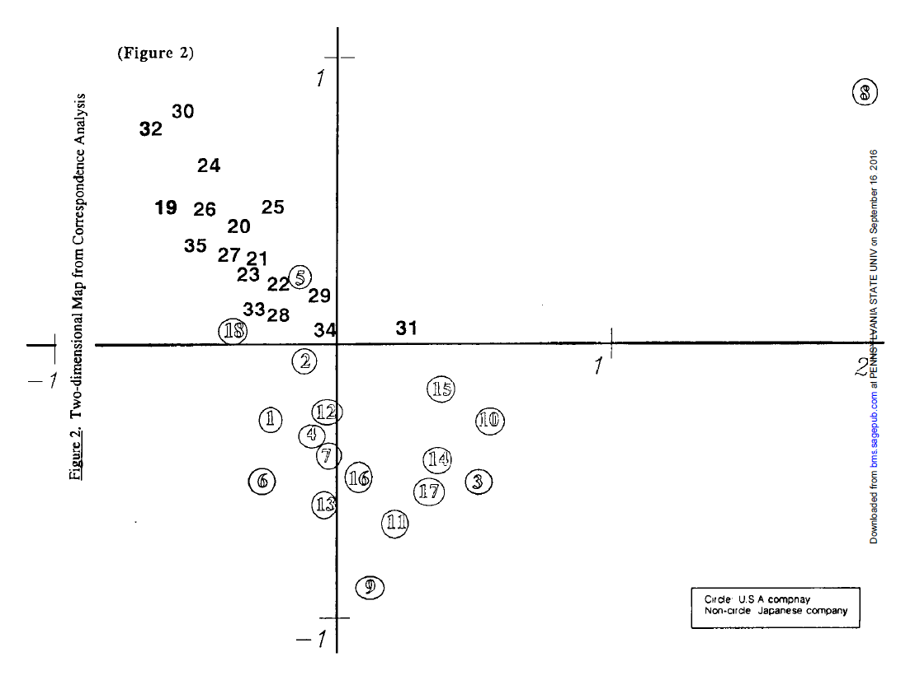

```{r setup, include=FALSE}
knitr::opts_chunk$set(echo = TRUE)
```
# Week 3 Session 1
Topics:  
- Multidimensional scaling  
- Cluster analysis  
- Correspondence analysis  

## Multidimensional scaling 
Multidimensional scaling analysis (MDS) is one of the oldest and most widely used methods for mapping out the relational system of differences in the measurement of meanings. Simply stated, an MDS analysis reads in a square matrix of similarities or differences and produces a transformation of the data that seeks to locate all of the objects in a common (two- or more dimensional) space in such a way that the similarities in the input matrix are transformed into Euclidean distances. An MDS space would thus represent a series of objects in such a way that (generally speaking) if two items are similar to one another (in the input matrix) then they are located near one another in the space. If they are dissimilar, they are located far apart. When analyzed in two (or three) dimensions, the items can then be easily plotted in such a way as to visually convey the relational structure in which they are embedded.  

```{r,message=FALSE}
library(ggpubr)
#install.packages("smacof")
library(smacof)
#install.packages("vegan")
library(vegan)
#install.packages("factoextra")
library(factoextra)
```

To illustrate the use of multidimensional scaling and cluster analysis we first work with a distance matrix that measures the distances between major US cities.

```{r}
cities <- read.csv2("Data/us cities.csv", header = TRUE, row.names = 1)
#we define it as a distance matrix
cities_distance <- as.dist(cities)
#check whether the class has indeed changed
class(cities_distance)
```

We perform metric multidimensionsal scaling. There are different packages in R that can do MDS. They use different algorithms. We use the SmacofSym package. It can do metric (type=ratio) and non-metric MDS (type = ordinal) and gives the stess values. 

```{r}
mds <- smacofSym(cities_distance, type = "ratio", ndim=2)
#plot(mds, plot.type = "confplot")
mds$stress
configuration <- as.data.frame(mds$conf)
print(configuration)
#configuration <- configuration*-1
ggscatter(configuration, x = "D1", y = "D2", 
          label = colnames(cities),
          size = 1,
          repel = TRUE)
```

What you should see is a map of the US but the orientation is wrong. We can solve this by multiplying the coordinates by -1. So uncomment the above line where it says #configuration <- configuration*-1 and run the script again. That should give you the map of the US in a more recognizable form. 

See what the MDS has done here? It has taken as an input matrix with the pairwise distances between cities measured in some unit (kilometers or miles) and has visually positioned the cities vis-a-vis each other so that those pairwise distances are represented in the Euclidian distances between points in a two-dimensional space. 

You can see that the distance between Boston and NY is about the same as the distance between NY and DC. That the distance from DC to Chicago is somewhat larger than the distance between Boston to DC, etc. The fact that we could "flip" the x-and-y axis also tells you that the orientation of the map is arbitrary. The MDS only tries to project the distances between objects in a representative manner. What is up/down, left/right is arbitrary. A high/low value on the x-axis or y-axis does not mean anything in itself. 

The projection of the pairwise distances into a two-dimensional space is quite accurate but it is not perfect. The earth's surface is not a flat surface so the pairwise distances between cities are not be perfectly represented in a 2-dimensional space. The difference between the original distances and the projected distances is captured in the "stress" value of the MDS solution. (Have a look at the stress value). 

## Property fitting  
When interpreting an MDS solution, we try to find whether the placement of points represents some underlying structure. We try to give an interpretation to how the items are positioned vis-a-vis each other. In some cases, we can be helped by collecting additional data on the items and see if and how these correlate with the dimensions of the MDS solution. 

In R, we can then use envfit from the vegan package to do the property fitting. 

```{r}
#we do the metric mds but produce a more basic plot.
mds <- smacofSym(cities_distance, type = "ratio")
mds$stress
configuration <- as.data.frame(mds$conf)
configuration <- configuration*-1
class(configuration)
print(configuration)
plot(configuration)
text(configuration,labels=rownames(configuration),pos=1)
```

We test whether the plot corresponds to two "external" variables: the latitude and longitude position of the cities. If correct, the position in the two-dimensional space should correspond to these two attributes. 

```{r}
cities_coord <- read.csv2("Data/cities_coord.csv", header=TRUE, row.names = 1)
str(cities_coord)
```

The idea would to see how these variablles correlate with the dimensions of the MDS solution. We investigate this by a regression analysis whereby the dimensions are the independent variables that predict the external variable(s). We can then draw an arrow for each external variable as a vector of the two beta-coefficients of the two dimensions (BetaD1 along the first x-dimension and BetaD2 along the second y-dimension.) If the variable correlates positively with the x-axis, but not the y-axis, the arrow is drawn to the right. If the variable correlates positively with the y-axis, but not the x-axis, the arrow will be drawn to the top.  

```{r}
#We now use the envfit function from the vegan library
#ord.fit <- envfit(configuration ~ longitude + latitude, data=cities_coord, perm=999)
#Or do
ord.fit <- envfit(configuration, cities_coord, perm=999)
ord.fit
plot(configuration)
text(configuration,labels=rownames(configuration),pos=1)
plot(ord.fit,choices=c(1,2),axis=TRUE)
```

## Hierarchical clustering
Another way to interpret MDS outputs is to look for clusters of similar items that are positioned close together. This can be done by looking at the map but we can also use a more formal technique: cluster analysis. 

We use the dendogram function from the factoextra package. We do  hierarchical clustering. The method indicates whether we choose single, complete or average. k= indicates how many clusters we want. We select 2 clusters. We can directly do the cluster analysis on the raw distance matrix of cities. 

```{r}
hc <- hclust(cities_distance, method = "single")
fviz_dend(hc,k=2)
hc <- hclust(cities_distance, method = "complete")
fviz_dend(hc,k=2)
hc <- hclust(cities_distance, method = "average")
fviz_dend(hc,k=2)
```

We can also take the MDS output and measure the Euclidian distances in the 2-dimensional space. 

```{r}
distance_mds <- dist(configuration)
distance_mds
```
```{r}
hc <- hclust(distance_mds, method = "single")
fviz_dend(hc,k=2)
hc <- hclust(distance_mds, method = "complete")
fviz_dend(hc,k=2)
hc <- hclust(distance_mds, method = "average")
fviz_dend(hc,k=2)
```


## Holidays data set from pile-sorts

Anthropologists and psychologists have often used MDS to measure the similarity and differences between items based on data gathered through "pilesorting". This measures the "subjective similarity" between items. The idea of pilesorting is very simply to ask respondents to group items in piles of items that they think are similar. The more often respondents group two items together the more similar they are. We can then convert these to distances. 

```{r}
holidays <- read.csv2("Data/holidays.csv", header=TRUE,row.names = 1)
#we need distance measures so subtract from 1. 
holidays_dis <- 1-holidays
```

We apply metric mds

```{r}
mds <- smacofSym(holidays_dis, type = "ratio")
mds$stress
configuration <- as.data.frame(mds$conf)
configuration <- configuration*-1
class(configuration)
print(configuration)
ggscatter(configuration, x = "D1", y = "D2", 
          label = colnames(holidays),
          size = 1,
          repel = TRUE)
```

We would rather apply nonmetric mds since the number of times two items are grouped together is better interpreted as an ordinal measure of similarity/distance. 

```{r}
mds <- smacofSym(holidays_dis, type = "ordinal")
mds$stress
configuration <- as.data.frame(mds$conf)
configuration <- configuration*-1
class(configuration)
print(configuration)
ggscatter(configuration, x = "D1", y = "D2", 
          label = colnames(holidays),
          size = 1,
          repel = TRUE)
```

To illustrate the issues that might occur with isolates we include 28 holidays of which 4 were never included in pile sorts (and therefore were isolates).

```{r}
holidays28 <- read.csv2("Data/holidays28.csv", header=TRUE,row.names=1)
holidays28_dis <- 1-holidays28

mds <- smacofSym(holidays28_dis, type = "ratio")
mds$stress
configuration <- as.data.frame(mds$conf)
configuration <- configuration*-1
class(configuration)
print(configuration)
ggscatter(configuration, x = "D1", y = "D2", 
          label = colnames(holidays28),
          size = 1,
          repel = TRUE)
```

## Correspondence analysis

```{r}
#install.packages("FactoMineR") 
#install.packages("factoextra")
#install.packages("gplots")
#install.packages("corrplot")
library("gplots")
library("FactoMineR")
library("factoextra")
library("corrplot")
```

We use the example data from Applied Correspondence Analysis by Sten-Erik Clausen to illustrate the workings of CA. The data is a simple cross-tabulation for three types of crime over three areas in Norway. 

```{r}
N = matrix(c(395, 147, 694, 2456, 153, 327, 1758, 916, 1347), 
           nrow = 3,
           dimnames = list(
             "Region" = c("Oslo", "Mid Norway", "North Norway"),
             "Crime" = c("Burglary", "Fraud", "Vandalism")))
```

Have a look at the raw frequency table

```{r}
print(N)
```

First we normalize the matrix by dividing all cell entries by the total frequency

```{r}
n = sum(N)
print(n)
P = N / n
print(P)
```

We calculate the average row profile, or i.e. the column masses.

```{r}
column.masses = colSums(P)
print(column.masses)
```

We calculate the average column profile, or i.e. the row masses.

```{r}
row.masses = rowSums(P)
print(row.masses)
```

Using the row and column masses we can calculate the expected frequency in each cell.

```{r}
E = row.masses %o% column.masses
print(E)
```

The residuals are the differences between the observed and expected frequencies.

```{r}
R = P - E
print(R)
```

To standardize the residuals we divide by the square root of the expected values. This gives the chi value per cell.

```{r}
Z = R/sqrt(E)
print(Z)
```

We can see that Oslo in relatively more stongly characterized by Fraud, Mid Norway by Vandalism and North Norway by Burglary. We want to plot this association in a two-dimensional space. To do so, we can make use of Singular Value Decomposition. This decomposes the matrix into three matrices: a matrix of left singular vectors (U), a matrix of singular values (with only values in the diagonal), and a matrix of right singular vectors. Singular vectors are orthogonal to each other, meaning that they are like the x-y dimensions in a space. The basic idea then is to plot the rows (using the left singular vectors) and the columns (using the right singular values) into the same space. 

The first step would then be to submit the chi-values calculated above to SVD.

```{r}
SVD = svd(Z)
#left singular vectors for rows
rownames(SVD$u) = rownames(P) 
#right singular vectors for columns
rownames(SVD$v) = colnames(P)
print(SVD)
```

Eigenvalues are singular values squared.

```{r}
eigenvalues = SVD$d^2
```

We calculate the proportion of the singular values to the total which indicated the explained variance per dimension

```{r}
prop <- prop.table(eigenvalues)
prop
sum(prop[1:2])
```

```{r}
#we unweight the row points by the row masses
standard.coordinates.rows = sweep(SVD$u, 1, sqrt(row.masses), "/")
#we unweight the column points by the column masses
print(standard.coordinates.rows)
standard.coordinates.columns = sweep(SVD$v, 1, sqrt(column.masses), "/")
print(standard.coordinates.columns)
#we multiply the standard coordinates by the singular values
principal.coordinates.rows = sweep(standard.coordinates.rows, 2, SVD$d, "*")
print(principal.coordinates.rows)
#we multiply the standard coordinates by the singular values
principal.coordinates.columns = sweep(standard.coordinates.columns, 2, SVD$d, "*")
print(principal.coordinates.columns)
```

Symmetric plot takes the principal coordinates of rows and columns. 
```{r}
plot(principal.coordinates.columns[,1:2], xlim=c(-0.8,0.8), ylim=c(-0.6,0.6))
points(principal.coordinates.rows[,1:2])
text(principal.coordinates.rows,labels=rownames(principal.coordinates.rows),pos=1)
text(principal.coordinates.columns,labels=rownames(principal.coordinates.columns),pos=1)
```

Compare the result with the "direct" approach using the CA function

```{r}
res.ca <- CA(N, graph = TRUE)
```

Get eigenvalues
```{r}
eig.val <- get_eigenvalue(res.ca)
eig.val
```

Inspect plot of eigenvalues
```{r}
fviz_screeplot(res.ca, addlabels = TRUE, ylim = c(0, 100))
```

## Example by Jang and Barnett of CA on corporate documents 

{width=50%}

Jang & Barnett (1994) examined the impact of national culture on organizational culture by analyzing messages directed to external audiences. For a total of 35 Japanese and American businesses, annual reports for 1992 were analyzed by determining the most frequently used words in all 35 reports. Then, the frequency of each word for each company was determined. 

## Original co-occurence matrix for words and companies 
{width=50%}
{width=50%}

We copied this matrix into a csv file. 

```{r}
#read in matrix csv-file 
matrix <- read.csv2("Data/Jang_Barnett.csv", header=TRUE,row.names = 1)
class(matrix)
head(matrix)
```

We can now apply correspondence analysis to simultaneously plot the words and companies in the same 2-dimensional space.

```{r}
#save as matrix data type 
my_mat <- as.matrix(matrix)   
class(my_mat)

#do chisquare test
chisq <- chisq.test(my_mat)
chisq

#do the Correspondence Analysis
res.ca <- CA(my_mat, graph = FALSE)
print(res.ca)

#get eigenvalues
eig.val <- get_eigenvalue(res.ca)
eig.val

#inspect plot of eigenvalues
fviz_screeplot(res.ca, addlabels = TRUE, ylim = c(0, 80))
```

The original correspondence analysis in the paper only plots the companies.



```{r}
#plot the CA. this is a symmetric plot 
fviz_ca_biplot(res.ca, invisible = "row", repel = TRUE)
```


We can see that our plot is flipped around the x-axes, but matches the coordinate configuration of the original paper. In our case, the US companies are positioned to the left and the Japanese companies more to the right. There are also some Japanese companies that are more US-like in their language than others. Although the plot with the words is somewhat hard to read, we could start analyzing which words seem to define the US-Japanse cultural differences. 

```{r}
fviz_ca_biplot(res.ca, repel = TRUE)
```


