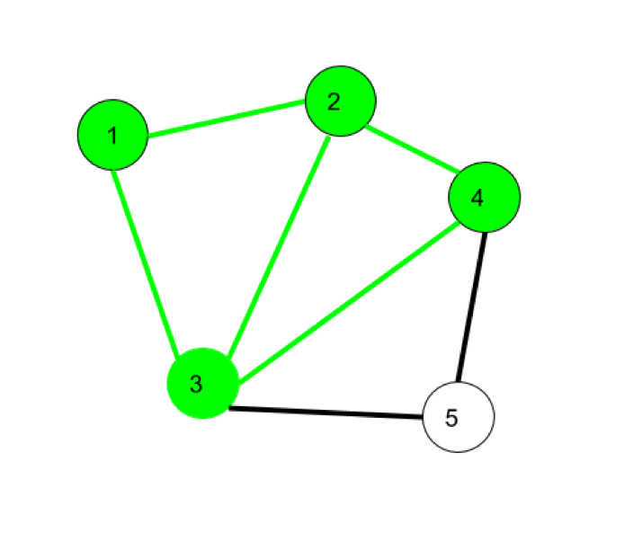
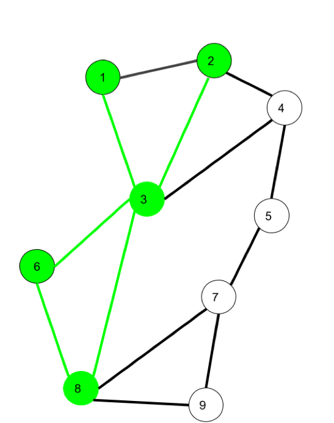
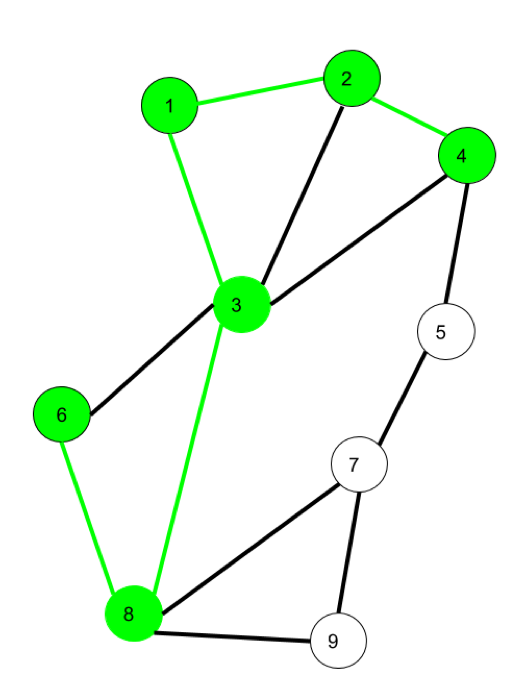

Measuring Meaning in Mixed Methods - Week 1
================

Basic network analysis
----------------------

``` r
#last session we installed igraph so no need to do that again
#install.packages("igraph")
library(igraph)
```

    ## 
    ## Attaching package: 'igraph'

    ## The following objects are masked from 'package:stats':
    ## 
    ##     decompose, spectrum

    ## The following object is masked from 'package:base':
    ## 
    ##     union

``` r
#be sure that the two files are in your R working directory and in the Data folder 
#header = False because we don't have a name to the two columns
campnet <- read.csv2("Data/campnet.csv", header=FALSE)
#the attribute file contains information on the nodes such as their gender, their role. It also already includes a centrality measure (betweenness) but this will be calculated separately later on in the script. 
#import the attribute file
campattr <- read.csv("Data/campattr.txt")
```

We need to transform the data frame format into an igraph object to be able to use igraph's functions. We also add the attributes.

``` r
#as this is a directed network we set directed to TRUE
g <- graph_from_data_frame(campnet, directed = TRUE, vertices = campattr)
#look at the file format
class(g)
```

    ## [1] "igraph"

``` r
#now has become an igraph format
```

### Paths, trails, walks

A key concept in graph theory is the notion of a path. This refers to the "route" that connects two nodes in a network. A path is a particular route, namely one that does not revisit the same node or edge twice. Paths are therefore different from "walks" and "trails". In "walks" both nodes and edges can be repeated.

In the network below, 1-&gt;2-&gt;3-&gt;4-&gt;2-&gt;1-&gt;3 is a walk.



Trails can revisit the same node, but not the same edge. So here, 1-&gt;3-&gt;8-&gt;6-&gt;3-&gt;2 is a trail.



As said, a path never revisits the same nodes or edges. So 6-&gt;8-&gt;3-&gt;1-&gt;2-&gt;4 is a path.



The shortest path between nodes is called a "geodesic".

To get the paths from Holly to the other nodes in the campnet network, we can list all paths from this node to all others. You can verify that, as mentioned by Borgatti (p.16), there is no path in the network from Holly to Brazey.

``` r
all_simple_paths(g, "HOLLY", to = V(g), mode = c("out"))
```

    ## [[1]]
    ## + 2/18 vertices, named, from 377b634:
    ## [1] HOLLY PAM  
    ## 
    ## [[2]]
    ## + 3/18 vertices, named, from 377b634:
    ## [1] HOLLY  PAM    JENNIE
    ## 
    ## [[3]]
    ## + 4/18 vertices, named, from 377b634:
    ## [1] HOLLY  PAM    JENNIE PAT   
    ## 
    ## [[4]]
    ## + 5/18 vertices, named, from 377b634:
    ## [1] HOLLY  PAM    JENNIE PAT    CAROL 
    ## 
    ## [[5]]
    ## + 6/18 vertices, named, from 377b634:
    ## [1] HOLLY   PAM     JENNIE  PAT     CAROL   PAULINE
    ## 
    ## [[6]]
    ## + 4/18 vertices, named, from 377b634:
    ## [1] HOLLY  PAM    JENNIE ANN   
    ## 
    ## [[7]]
    ## + 5/18 vertices, named, from 377b634:
    ## [1] HOLLY   PAM     JENNIE  ANN     PAULINE
    ## 
    ## [[8]]
    ## + 6/18 vertices, named, from 377b634:
    ## [1] HOLLY   PAM     JENNIE  ANN     PAULINE CAROL  
    ## 
    ## [[9]]
    ## + 7/18 vertices, named, from 377b634:
    ## [1] HOLLY   PAM     JENNIE  ANN     PAULINE CAROL   PAT    
    ## 
    ## [[10]]
    ## + 6/18 vertices, named, from 377b634:
    ## [1] HOLLY   PAM     JENNIE  ANN     PAULINE PAT    
    ## 
    ## [[11]]
    ## + 7/18 vertices, named, from 377b634:
    ## [1] HOLLY   PAM     JENNIE  ANN     PAULINE PAT     CAROL  
    ## 
    ## [[12]]
    ## + 3/18 vertices, named, from 377b634:
    ## [1] HOLLY   PAM     PAULINE
    ## 
    ## [[13]]
    ## + 4/18 vertices, named, from 377b634:
    ## [1] HOLLY   PAM     PAULINE CAROL  
    ## 
    ## [[14]]
    ## + 5/18 vertices, named, from 377b634:
    ## [1] HOLLY   PAM     PAULINE CAROL   PAT    
    ## 
    ## [[15]]
    ## + 6/18 vertices, named, from 377b634:
    ## [1] HOLLY   PAM     PAULINE CAROL   PAT     JENNIE 
    ## 
    ## [[16]]
    ## + 7/18 vertices, named, from 377b634:
    ## [1] HOLLY   PAM     PAULINE CAROL   PAT     JENNIE  ANN    
    ## 
    ## [[17]]
    ## + 4/18 vertices, named, from 377b634:
    ## [1] HOLLY   PAM     PAULINE PAT    
    ## 
    ## [[18]]
    ## + 5/18 vertices, named, from 377b634:
    ## [1] HOLLY   PAM     PAULINE PAT     CAROL  
    ## 
    ## [[19]]
    ## + 5/18 vertices, named, from 377b634:
    ## [1] HOLLY   PAM     PAULINE PAT     JENNIE 
    ## 
    ## [[20]]
    ## + 6/18 vertices, named, from 377b634:
    ## [1] HOLLY   PAM     PAULINE PAT     JENNIE  ANN    
    ## 
    ## [[21]]
    ## + 3/18 vertices, named, from 377b634:
    ## [1] HOLLY PAM   ANN  
    ## 
    ## [[22]]
    ## + 4/18 vertices, named, from 377b634:
    ## [1] HOLLY  PAM    ANN    JENNIE
    ## 
    ## [[23]]
    ## + 5/18 vertices, named, from 377b634:
    ## [1] HOLLY  PAM    ANN    JENNIE PAT   
    ## 
    ## [[24]]
    ## + 6/18 vertices, named, from 377b634:
    ## [1] HOLLY  PAM    ANN    JENNIE PAT    CAROL 
    ## 
    ## [[25]]
    ## + 7/18 vertices, named, from 377b634:
    ## [1] HOLLY   PAM     ANN     JENNIE  PAT     CAROL   PAULINE
    ## 
    ## [[26]]
    ## + 4/18 vertices, named, from 377b634:
    ## [1] HOLLY   PAM     ANN     PAULINE
    ## 
    ## [[27]]
    ## + 5/18 vertices, named, from 377b634:
    ## [1] HOLLY   PAM     ANN     PAULINE CAROL  
    ## 
    ## [[28]]
    ## + 6/18 vertices, named, from 377b634:
    ## [1] HOLLY   PAM     ANN     PAULINE CAROL   PAT    
    ## 
    ## [[29]]
    ## + 7/18 vertices, named, from 377b634:
    ## [1] HOLLY   PAM     ANN     PAULINE CAROL   PAT     JENNIE 
    ## 
    ## [[30]]
    ## + 5/18 vertices, named, from 377b634:
    ## [1] HOLLY   PAM     ANN     PAULINE PAT    
    ## 
    ## [[31]]
    ## + 6/18 vertices, named, from 377b634:
    ## [1] HOLLY   PAM     ANN     PAULINE PAT     CAROL  
    ## 
    ## [[32]]
    ## + 6/18 vertices, named, from 377b634:
    ## [1] HOLLY   PAM     ANN     PAULINE PAT     JENNIE 
    ## 
    ## [[33]]
    ## + 2/18 vertices, named, from 377b634:
    ## [1] HOLLY PAT  
    ## 
    ## [[34]]
    ## + 3/18 vertices, named, from 377b634:
    ## [1] HOLLY PAT   CAROL
    ## 
    ## [[35]]
    ## + 4/18 vertices, named, from 377b634:
    ## [1] HOLLY PAT   CAROL PAM  
    ## 
    ## [[36]]
    ## + 5/18 vertices, named, from 377b634:
    ## [1] HOLLY  PAT    CAROL  PAM    JENNIE
    ## 
    ## [[37]]
    ## + 6/18 vertices, named, from 377b634:
    ## [1] HOLLY  PAT    CAROL  PAM    JENNIE ANN   
    ## 
    ## [[38]]
    ## + 7/18 vertices, named, from 377b634:
    ## [1] HOLLY   PAT     CAROL   PAM     JENNIE  ANN     PAULINE
    ## 
    ## [[39]]
    ## + 5/18 vertices, named, from 377b634:
    ## [1] HOLLY   PAT     CAROL   PAM     PAULINE
    ## 
    ## [[40]]
    ## + 5/18 vertices, named, from 377b634:
    ## [1] HOLLY PAT   CAROL PAM   ANN  
    ## 
    ## [[41]]
    ## + 6/18 vertices, named, from 377b634:
    ## [1] HOLLY  PAT    CAROL  PAM    ANN    JENNIE
    ## 
    ## [[42]]
    ## + 6/18 vertices, named, from 377b634:
    ## [1] HOLLY   PAT     CAROL   PAM     ANN     PAULINE
    ## 
    ## [[43]]
    ## + 4/18 vertices, named, from 377b634:
    ## [1] HOLLY   PAT     CAROL   PAULINE
    ## 
    ## [[44]]
    ## + 5/18 vertices, named, from 377b634:
    ## [1] HOLLY   PAT     CAROL   PAULINE PAM    
    ## 
    ## [[45]]
    ## + 6/18 vertices, named, from 377b634:
    ## [1] HOLLY   PAT     CAROL   PAULINE PAM     JENNIE 
    ## 
    ## [[46]]
    ## + 7/18 vertices, named, from 377b634:
    ## [1] HOLLY   PAT     CAROL   PAULINE PAM     JENNIE  ANN    
    ## 
    ## [[47]]
    ## + 6/18 vertices, named, from 377b634:
    ## [1] HOLLY   PAT     CAROL   PAULINE PAM     ANN    
    ## 
    ## [[48]]
    ## + 7/18 vertices, named, from 377b634:
    ## [1] HOLLY   PAT     CAROL   PAULINE PAM     ANN     JENNIE 
    ## 
    ## [[49]]
    ## + 3/18 vertices, named, from 377b634:
    ## [1] HOLLY  PAT    JENNIE
    ## 
    ## [[50]]
    ## + 4/18 vertices, named, from 377b634:
    ## [1] HOLLY  PAT    JENNIE PAM   
    ## 
    ## [[51]]
    ## + 5/18 vertices, named, from 377b634:
    ## [1] HOLLY   PAT     JENNIE  PAM     PAULINE
    ## 
    ## [[52]]
    ## + 6/18 vertices, named, from 377b634:
    ## [1] HOLLY   PAT     JENNIE  PAM     PAULINE CAROL  
    ## 
    ## [[53]]
    ## + 5/18 vertices, named, from 377b634:
    ## [1] HOLLY  PAT    JENNIE PAM    ANN   
    ## 
    ## [[54]]
    ## + 6/18 vertices, named, from 377b634:
    ## [1] HOLLY   PAT     JENNIE  PAM     ANN     PAULINE
    ## 
    ## [[55]]
    ## + 7/18 vertices, named, from 377b634:
    ## [1] HOLLY   PAT     JENNIE  PAM     ANN     PAULINE CAROL  
    ## 
    ## [[56]]
    ## + 4/18 vertices, named, from 377b634:
    ## [1] HOLLY  PAT    JENNIE ANN   
    ## 
    ## [[57]]
    ## + 5/18 vertices, named, from 377b634:
    ## [1] HOLLY  PAT    JENNIE ANN    PAM   
    ## 
    ## [[58]]
    ## + 6/18 vertices, named, from 377b634:
    ## [1] HOLLY   PAT     JENNIE  ANN     PAM     PAULINE
    ## 
    ## [[59]]
    ## + 7/18 vertices, named, from 377b634:
    ## [1] HOLLY   PAT     JENNIE  ANN     PAM     PAULINE CAROL  
    ## 
    ## [[60]]
    ## + 5/18 vertices, named, from 377b634:
    ## [1] HOLLY   PAT     JENNIE  ANN     PAULINE
    ## 
    ## [[61]]
    ## + 6/18 vertices, named, from 377b634:
    ## [1] HOLLY   PAT     JENNIE  ANN     PAULINE CAROL  
    ## 
    ## [[62]]
    ## + 7/18 vertices, named, from 377b634:
    ## [1] HOLLY   PAT     JENNIE  ANN     PAULINE CAROL   PAM    
    ## 
    ## [[63]]
    ## + 6/18 vertices, named, from 377b634:
    ## [1] HOLLY   PAT     JENNIE  ANN     PAULINE PAM    
    ## 
    ## [[64]]
    ## + 2/18 vertices, named, from 377b634:
    ## [1] HOLLY DON  
    ## 
    ## [[65]]
    ## + 3/18 vertices, named, from 377b634:
    ## [1] HOLLY   DON     MICHAEL
    ## 
    ## [[66]]
    ## + 4/18 vertices, named, from 377b634:
    ## [1] HOLLY   DON     MICHAEL HARRY  
    ## 
    ## [[67]]
    ## + 3/18 vertices, named, from 377b634:
    ## [1] HOLLY DON   HARRY
    ## 
    ## [[68]]
    ## + 4/18 vertices, named, from 377b634:
    ## [1] HOLLY   DON     HARRY   MICHAEL

We can get the geodesic distances between pairs of nodes (cf. matrix 2.2 in Borgatti). We take the directed graph and therefore add mode=out and mode=in

``` r
distances(g,mode="out")
```

    ##         HOLLY BRAZEY CAROL PAM PAT JENNIE PAULINE ANN MICHAEL BILL LEE DON JOHN
    ## HOLLY       0    Inf     2   1   1      2       2   2       2  Inf Inf   1  Inf
    ## BRAZEY      5      0     7   6   6      7       7   7       4  Inf   1   5  Inf
    ## CAROL       2    Inf     0   1   1      2       1   2       4  Inf Inf   3  Inf
    ## PAM         3    Inf     2   0   2      1       1   1       5  Inf Inf   4  Inf
    ## PAT         1    Inf     1   2   0      1       2   2       3  Inf Inf   2  Inf
    ## JENNIE      2    Inf     2   1   1      0       2   1       4  Inf Inf   3  Inf
    ## PAULINE     2    Inf     1   1   1      2       0   2       4  Inf Inf   3  Inf
    ## ANN         3    Inf     2   1   2      1       1   0       5  Inf Inf   4  Inf
    ## MICHAEL     1    Inf     3   2   2      3       3   3       0  Inf Inf   1  Inf
    ## BILL        2    Inf     4   3   3      4       4   4       1    0 Inf   1  Inf
    ## LEE         5      1     7   6   6      7       7   7       4  Inf   0   5  Inf
    ## DON         1    Inf     3   2   2      3       3   3       1  Inf Inf   0  Inf
    ## JOHN        3      4     2   2   2      3       1   3       2  Inf   3   3    0
    ## HARRY       1    Inf     3   2   2      3       3   3       1  Inf Inf   1  Inf
    ## GERY        2      3     4   3   3      4       4   4       1  Inf   2   2  Inf
    ## STEVE       4      2     6   5   5      6       6   6       3  Inf   1   4  Inf
    ## BERT        4      2     6   5   5      6       6   6       3  Inf   1   4  Inf
    ## RUSS        3      3     5   4   4      5       5   5       2  Inf   2   3  Inf
    ##         HARRY GERY STEVE BERT RUSS
    ## HOLLY       2  Inf   Inf  Inf  Inf
    ## BRAZEY      5    3     1    1    2
    ## CAROL       4  Inf   Inf  Inf  Inf
    ## PAM         5  Inf   Inf  Inf  Inf
    ## PAT         3  Inf   Inf  Inf  Inf
    ## JENNIE      4  Inf   Inf  Inf  Inf
    ## PAULINE     4  Inf   Inf  Inf  Inf
    ## ANN         5  Inf   Inf  Inf  Inf
    ## MICHAEL     1  Inf   Inf  Inf  Inf
    ## BILL        1  Inf   Inf  Inf  Inf
    ## LEE         5    3     1    1    2
    ## DON         1  Inf   Inf  Inf  Inf
    ## JOHN        3    1     2    2    1
    ## HARRY       0  Inf   Inf  Inf  Inf
    ## GERY        2    0     1    2    1
    ## STEVE       4    2     0    1    1
    ## BERT        4    2     1    0    1
    ## RUSS        3    1     1    1    0

``` r
distances(g,mode="in")
```

    ##         HOLLY BRAZEY CAROL PAM PAT JENNIE PAULINE ANN MICHAEL BILL LEE DON JOHN
    ## HOLLY       0      5     2   3   1      2       2   3       1    2   5   1    3
    ## BRAZEY    Inf      0   Inf Inf Inf    Inf     Inf Inf     Inf  Inf   1 Inf    4
    ## CAROL       2      7     0   2   1      2       1   2       3    4   7   3    2
    ## PAM         1      6     1   0   2      1       1   1       2    3   6   2    2
    ## PAT         1      6     1   2   0      1       1   2       2    3   6   2    2
    ## JENNIE      2      7     2   1   1      0       2   1       3    4   7   3    3
    ## PAULINE     2      7     1   1   2      2       0   1       3    4   7   3    1
    ## ANN         2      7     2   1   2      1       2   0       3    4   7   3    3
    ## MICHAEL     2      4     4   5   3      4       4   5       0    1   4   1    2
    ## BILL      Inf    Inf   Inf Inf Inf    Inf     Inf Inf     Inf    0 Inf Inf  Inf
    ## LEE       Inf      1   Inf Inf Inf    Inf     Inf Inf     Inf  Inf   0 Inf    3
    ## DON         1      5     3   4   2      3       3   4       1    1   5   0    3
    ## JOHN      Inf    Inf   Inf Inf Inf    Inf     Inf Inf     Inf  Inf Inf Inf    0
    ## HARRY       2      5     4   5   3      4       4   5       1    1   5   1    3
    ## GERY      Inf      3   Inf Inf Inf    Inf     Inf Inf     Inf  Inf   3 Inf    1
    ## STEVE     Inf      1   Inf Inf Inf    Inf     Inf Inf     Inf  Inf   1 Inf    2
    ## BERT      Inf      1   Inf Inf Inf    Inf     Inf Inf     Inf  Inf   1 Inf    2
    ## RUSS      Inf      2   Inf Inf Inf    Inf     Inf Inf     Inf  Inf   2 Inf    1
    ##         HARRY GERY STEVE BERT RUSS
    ## HOLLY       1    2     4    4    3
    ## BRAZEY    Inf    3     2    2    3
    ## CAROL       3    4     6    6    5
    ## PAM         2    3     5    5    4
    ## PAT         2    3     5    5    4
    ## JENNIE      3    4     6    6    5
    ## PAULINE     3    4     6    6    5
    ## ANN         3    4     6    6    5
    ## MICHAEL     1    1     3    3    2
    ## BILL      Inf  Inf   Inf  Inf  Inf
    ## LEE       Inf    2     1    1    2
    ## DON         1    2     4    4    3
    ## JOHN      Inf  Inf   Inf  Inf  Inf
    ## HARRY       0    2     4    4    3
    ## GERY      Inf    0     2    2    1
    ## STEVE     Inf    1     0    1    1
    ## BERT      Inf    2     1    0    1
    ## RUSS      Inf    1     1    1    0

### Components

The concept of paths is important for defining another key concept in describing networks: components. A component is defined as the maximal set of nodes in which every node can reach every other node by some path. A strong component takes the directionality into account. Weak components ignore directionality.

``` r
#find the number of strong components.
g.components <- components(g, mode = "strong")
print(g.components)
```

    ## $membership
    ##   HOLLY  BRAZEY   CAROL     PAM     PAT  JENNIE PAULINE     ANN MICHAEL    BILL 
    ##       4       3       4       4       4       4       4       4       4       2 
    ##     LEE     DON    JOHN   HARRY    GERY   STEVE    BERT    RUSS 
    ##       3       4       1       4       3       3       3       3 
    ## 
    ## $csize
    ## [1]  1  1  6 10
    ## 
    ## $no
    ## [1] 4

``` r
#the following line does the same thing but now just returns the number
count_components(g, mode = c("strong"))
```

    ## [1] 4

``` r
#add attributes of component membership
V(g)$components <- g.components$membership

#examine attributes to check if it was added
vertex_attr(g)
```

    ## $name
    ##  [1] "HOLLY"   "BRAZEY"  "CAROL"   "PAM"     "PAT"     "JENNIE"  "PAULINE"
    ##  [8] "ANN"     "MICHAEL" "BILL"    "LEE"     "DON"     "JOHN"    "HARRY"  
    ## [15] "GERY"    "STEVE"   "BERT"    "RUSS"   
    ## 
    ## $Gender
    ##  [1] 1 1 1 1 1 1 1 1 2 2 2 2 2 2 2 2 2 2
    ## 
    ## $Role
    ##  [1] 1 1 1 1 1 1 1 1 1 1 1 1 1 1 2 2 2 2
    ## 
    ## $Betweenness
    ##  [1] 78  0  1 33 40  6 13  1 59  0  5 16  0  2 55 17 14 47
    ## 
    ## $components
    ##  [1] 4 3 4 4 4 4 4 4 4 2 3 4 1 4 3 3 3 3

``` r
#plot the graph with components
plot(g,edge.arrow.size=.4,layout=layout_with_kk,main="campnet dataset with components",vertex.color=vertex_attr(g)$components)
```


Check what happens when you choose "weak" components. How many components do you get?
