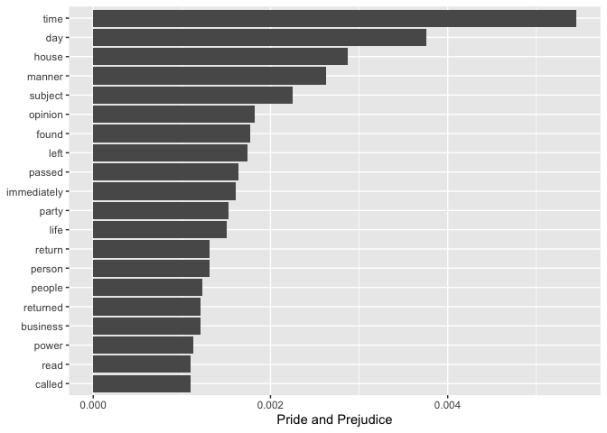
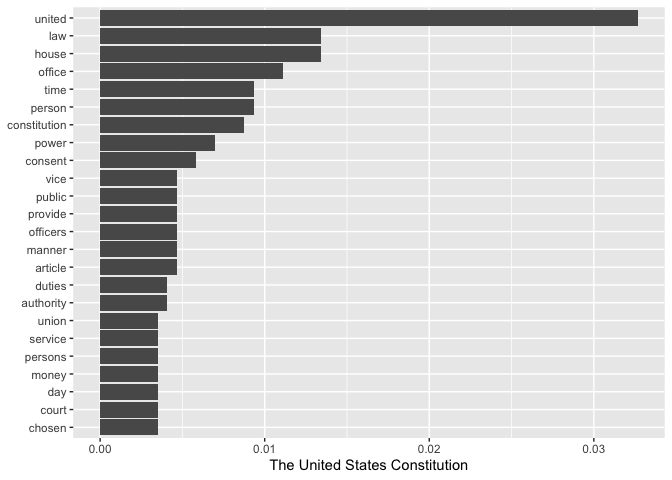
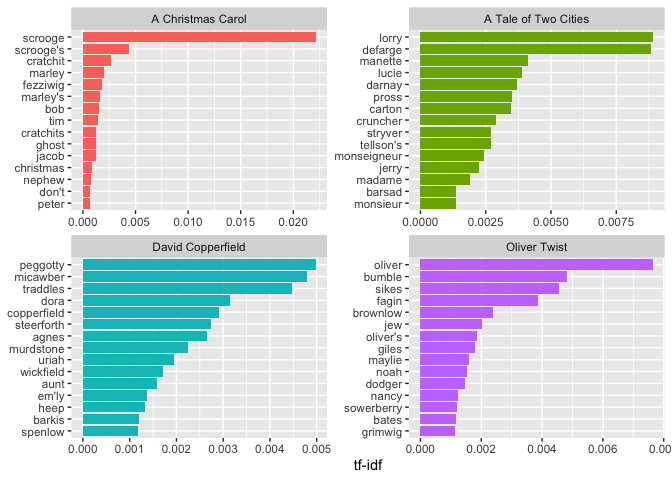
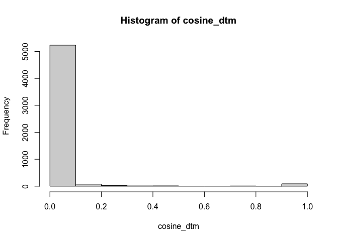
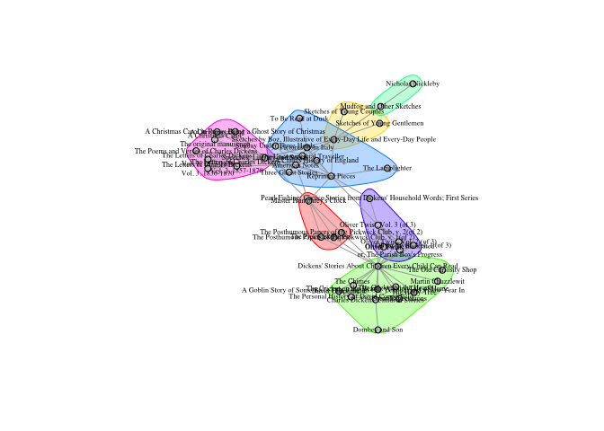
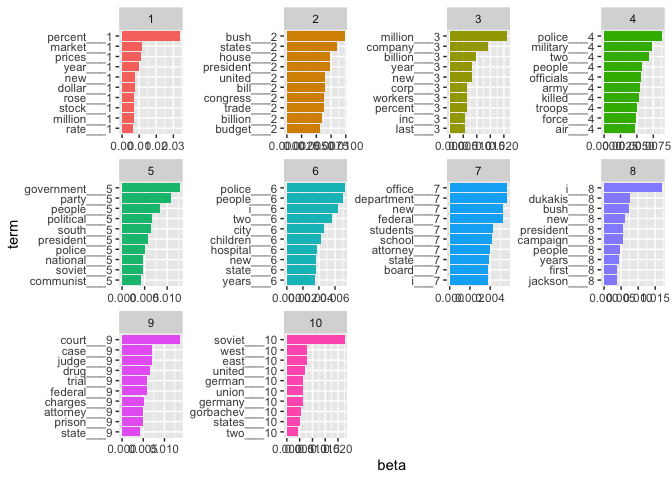

Measuring Meaning in Mixed Methods - Week 3
================

# Week 3 Session 2

Topics: - Working with unstructured text - Topic modeling

## Text as data

The studies that we’ve read in this course so far mostly relied on some
form of manual coding of text. This coding generally proceeded by
looking at the formal structure of the texts, whether they contained
some “format” which could be used to extract units in a meaningful way.
So in the directories of welfare organizations, the author discovered
that most texts contained two types of elements (identities and
practices); in the analysis of the Nazi biography, the authors looked to
the text as a sequence of (types of) events; and in the analysis of
music reviews, these texts seemed to almost always contain a statement
about genre classification and the use of evaluative criteria. After the
identification of this “format”, the coding could proceed in an
inductive way and at a low level of abstraction. It allowed for a very
fine-grained reading of texts. Yet although the coding stayed as close
as possible to the actual text, in most cases the projects still
required quite intensive manual coding and were quite time-consuming. We
have therefore been working with the end-products of those coding
efforts – the matrices – and looked at techniques that can analyze those
matrices.

In this session, I want to focus on the *construction* of those
matrices, but in cases when you do not have the time to do any manual
coding, and/or when your data comes in the form of unstructured text but
is just too large to code manually. Our aim will be to look at how to
transform that unstructured text into a matrix that could subsequently
be analyzed with the techniques that we have already discussed. Although
(semi-)automatic coding of textual material is a theme that far extends
what we can discuss in one session, we will focus on some basic tools in
R that can help you work with large corpora of unstructured text and
would enable you to apply some of the techniques for measuring meaning
(such as network analysis, multidimensional scaling and correspondence
analysis) to your own textual data.

### Get the text

There has been an enormous growth in the number of documents available
in archives and repositories in recent years. I have already pointed you
to some of the digitized sources that were used by some of the authors
that we read in this course. The documents used by Mohr are for example
available on Hathitrust
(<https://catalog.hathitrust.org/Record/008955610>). The Nazi
biographies analyzed by Bearman and Stovel at the Hoover institute:
<https://digitalcollections.hoover.org/objects/58492> Other large
textual archives are Lexis-Nexis, Proquest, Jstor and many others. Of
course, the internet itself also is a giant repository of text, as well
as social media such as Twitter.

Depending on where your data is located, you would generally have to
learn the appropriate technique to access the data you’re interested in.
This can involve screenscraping, working with an API, or in the case of
historical documents that come in the form of PDF documents, how to do
make them machine-readable using optical character recognition. We will
not discuss these techniques here. There are many sources out there that
you could consult. For the purpose of this tutorial, we will use some
existing data from the Gutenberg project, an online library of more than
60,000 public domain books.

So the first step is to install the gutenbergr package:

``` r
#install.packages("gutenbergr")
library(gutenbergr)
```

The package comes with the metadata of each of the texts in the Project
Gutenberg library preloaded in. You can use the View() function to look
at all of the data.

``` r
View(gutenberg_metadata)
```

Let’s start with two texts: the US Constitution and add Pride and
Prejudice by Jane Austin. These two texts have id number 5 and 1342 in
the Gutenberg collection. Using these ids, we can download these books
into R. This might take some time depending on the speed of your
internet connection.

``` r
familiar_texts <- gutenberg_download(c(5, 1342), meta_fields = "title", mirror = "http://gutenberg.readingroo.ms/")
```

### Tidy text

To work with text in R it is worth installing tidytext, a package
specifically useful for analyzing text data. It handles data using the
“tidy data” principles. In the case of text, it will store text as a
table with one-token-per-row. A token is a meaningful unit of text, such
as a word, that we are interested in using for analysis, and
tokenization is the process of splitting text into tokens. This
one-token-per-row structure is in contrast to the ways text is often
stored in current analyses, perhaps as strings. For tidy text mining,
the token that is stored in each row is most often a single word, but
can also be an n-gram, sentence, or paragraph. For more information on
Tidytext, and a very useful handbook: <https://www.tidytextmining.com>

``` r
#install.packages("tidytext")
#install.packages("tidyverse")
```

Load the packages into R. Tidyverse is a more general package for using
“tidy” data.

``` r
library(tidytext)
library(tidyverse)
```

    ## ── Attaching packages ─────────────────────────────────────── tidyverse 1.3.1 ──

    ## ✓ ggplot2 3.3.5     ✓ purrr   0.3.4
    ## ✓ tibble  3.1.6     ✓ dplyr   1.0.7
    ## ✓ tidyr   1.1.4     ✓ stringr 1.4.0
    ## ✓ readr   2.1.1     ✓ forcats 0.5.1

    ## ── Conflicts ────────────────────────────────────────── tidyverse_conflicts() ──
    ## x dplyr::filter() masks stats::filter()
    ## x dplyr::lag()    masks stats::lag()

### Tokenizing

The first step is tokenizing the texts - which means breaking sentences
and paragraphs down into their respective words. Tidy text has a useful
function called unnest_tokens() which does just that. The function has
three arguments: first we select the corpus we want to analyze
(familiar_texts in this case), second we give a name to the column in
which we’ll place our tokens (word in this case), third we name the
input column that the text comes from (text in this case). After using
unnest_tokens, we have split each row so that there is one token (word)
in each row of the new data frame; the default tokenization in
unnest_tokens() is for single words.

``` r
tokenized_words <- unnest_tokens(familiar_texts, word, text)
```

When we print out the data it will be in the format of a “tibble”.

``` r
tokenized_words
```

    ## # A tibble: 126,928 × 3
    ##    gutenberg_id title                          word     
    ##           <int> <chr>                          <chr>    
    ##  1            5 The United States Constitution these    
    ##  2            5 The United States Constitution original 
    ##  3            5 The United States Constitution project  
    ##  4            5 The United States Constitution gutenberg
    ##  5            5 The United States Constitution etexts   
    ##  6            5 The United States Constitution will     
    ##  7            5 The United States Constitution be       
    ##  8            5 The United States Constitution compiled 
    ##  9            5 The United States Constitution into     
    ## 10            5 The United States Constitution a        
    ## # … with 126,918 more rows

What you’ll see is that it has more than 120.000 rows. To avoid printing
out a tibble that large, we’ll do head() instead, which will only print
out the first few rows.

``` r
head(tokenized_words)
```

    ## # A tibble: 6 × 3
    ##   gutenberg_id title                          word     
    ##          <int> <chr>                          <chr>    
    ## 1            5 The United States Constitution these    
    ## 2            5 The United States Constitution original 
    ## 3            5 The United States Constitution project  
    ## 4            5 The United States Constitution gutenberg
    ## 5            5 The United States Constitution etexts   
    ## 6            5 The United States Constitution will

### Remove stopwords

Next, we need to do some cleaning or pre-processing. We can, for
example, remove common and therefore uninformative words in the texts -
such as “but”, “and”, “about”, “he”, “she”, etc. These are called
stopwords and tidy already has some predefined stopwords for us to use.
We can use the data() function to read them into our R.

``` r
data(stop_words)
head(stop_words)
```

    ## # A tibble: 6 × 2
    ##   word      lexicon
    ##   <chr>     <chr>  
    ## 1 a         SMART  
    ## 2 a's       SMART  
    ## 3 able      SMART  
    ## 4 about     SMART  
    ## 5 above     SMART  
    ## 6 according SMART

We can remove the stop words using the anti_join() function. This
matches the two two data sets and removes the ones that are in the
stopwords list. We can also remove numbers and punctuation with
str_extract and mutate. The regex expression \[a-z’\] selects only
characters. We then count up how often each word appears in each of the
books using count(). Other pre-processing steps could include “stemming”
which means reducing words to their stem, such as “walking” to “walk”.
We don’t do that here.

``` r
word_counts <- anti_join(tokenized_words, stop_words, by = "word")
word_counts <- mutate(word_counts, word = str_extract(word, "[a-z']+"))
word_counts <- count(word_counts, title, word, sort = TRUE)
head(word_counts)
```

    ## # A tibble: 6 × 3
    ##   title               word          n
    ##   <chr>               <chr>     <int>
    ## 1 Pride and Prejudice elizabeth   597
    ## 2 Pride and Prejudice darcy       374
    ## 3 Pride and Prejudice bennet      294
    ## 4 Pride and Prejudice miss        283
    ## 5 Pride and Prejudice jane        264
    ## 6 Pride and Prejudice bingley     257

Raw counts are useful when we look at just one book, but when our goal
is to compare many texts, they may be biased if one of our texts is much
longer than another, and therefore has higher counts across every word.
A common solution to this problem is to normalize counts by the total
number of words in each text. Here we group the data by title, divide
each count by the sum of the counts of all the words in each title and
save the result as the variable proportion, remove the count variable
keeping the proportions instead, and finally dropping any row in the
data which has a missing value with drop_na().

Btw, below you also see a new symbol %>% which is called “piping”. It is
a useful way to string together a bunch of function calls, in a clear
and informative manner, without having to reassign them to a new object
each time.

``` r
word_proportions <- word_counts %>%  
  group_by(title) %>%
  mutate(proportion = n / sum(n)) %>% 
  select(-n) %>% 
  spread(title, proportion) %>%
  drop_na
head(word_proportions)
```

    ## # A tibble: 6 × 3
    ##   word       `Pride and Prejudice` `The United States Constitution`
    ##   <chr>                      <dbl>                            <dbl>
    ## 1 absence                 0.000725                         0.000583
    ## 2 absent                  0.000107                         0.000583
    ## 3 absolutely              0.000483                         0.000583
    ## 4 accept                  0.000456                         0.000583
    ## 5 acceptance              0.000107                         0.000583
    ## 6 account                 0.00102                          0.000583

Now that we have the frequency with which each word occurs in each text,
let’s visualize their differences.

Let’s focus on *Pride and Prejudice* first. We use the top_n() function
to select only the top 20 words with respect to proportion. We reorder
the dataset according to proportion. We then plot the results as a bar
plot using geom_col(). To make the result go horizontally we also use
coord_flip(), which flips the coordinates of the plot.

``` r
top_words_pandp <- word_proportions %>% 
  top_n(20, `Pride and Prejudice`) %>%
  mutate(word = reorder(word, `Pride and Prejudice`))
ggplot(top_words_pandp, aes(word, `Pride and Prejudice`)) +
  geom_col() +
  xlab(NULL) +
  coord_flip()
```

<!-- -->

We do the same for *The United States Constitution*.

``` r
top_words_const <- word_proportions %>% 
  top_n(20, `The United States Constitution`) %>%
  mutate(word = reorder(word, `The United States Constitution`))
ggplot(top_words_const, aes(word, `The United States Constitution`)) +
  geom_col() +
  xlab(NULL) +
  coord_flip()
```

<!-- -->

### From counts to a document-to-term matrix

Besides just counting the number of words in two texts, we often wanted
to compare a whole bunch of texts with each other. And to do this we
have to build a matrix of documents by terms, i.e. a document-to-term
matrix.

To illustrate this process, we take all of Charles’ Dickens works and
create a document-term matrix.

Again, we download Dickens’ texts with gutenberg_download(), just like
before. This might take a while. If it does not work, you can also open
the “dickens_texts.RDS” file below.

``` r
#dickens_books <- gutenberg_works(author == "Dickens, Charles")
#dickens_texts <- gutenberg_download(dickens_books$gutenberg_id, meta_fields = "title", mirror = "http://gutenberg.readingroo.ms/")
```

Next we tokenize them and count how often each word occurs in each text.

``` r
dickens_words <- dickens_texts %>%
  unnest_tokens(word, text) %>%
  count(title, word, sort = TRUE)
```

There should be around 500.000 words in this file.

Let’s evaluate the number of words in each book. We add the result to
the original data with left_join().

``` r
total_words <- dickens_words %>% 
  group_by(title) %>% 
  summarize(total = sum(n))
dickens_words <- left_join(dickens_words, total_words)
```

    ## Joining, by = "title"

``` r
head(dickens_words)
```

    ## # A tibble: 6 × 4
    ##   title                                                       word      n  total
    ##   <chr>                                                       <chr> <int>  <int>
    ## 1 The Pickwick Papers                                         the   18347 305070
    ## 2 Sketches by Boz, Illustrative of Every-Day Life and Every-… the   17582 258897
    ## 3 Dombey and Son                                              the   17065 359055
    ## 4 Little Dorrit                                               the   15731 341737
    ## 5 Martin Chuzzlewit                                           the   15290 340421
    ## 6 Nicholas Nickleby                                           the   15003 326369

In constructing a document-term matrix, it is common to convert the raw
counts into tf-idfs. TF and IDF stand for Term-Frequency and Inverse
Document Frequency. The idea with tf-idf is that we want to weight words
in each text depending on how special or specific they are to a given
text, emphasizing those words that are important to each text. TF gives
stronger weight to words in a document that more frequently occur in a
particular document. While IDF decreases the weight of words that occur
often in all the documents. TF is calculated by dividing the number of
times a word appears in a document by the total number of words in that
document. So TF increases the more important that word is for that
document. IDF is calculated by taking the log of the total number of
document in a corpus divided by the number of documents in which a word
appears. IDF becomes larger the less often the word appears in the
corpus. We then multiply TF\*IDF. This means that we have given greater
weight to words that are highly characteristic for that document.

Tidy text has a convenient function, bind_tf_idf, for calculating it. We
just have to tell it the name of our word column, the column which
identifies which texts we are referring to, and the word counts column.

``` r
dickens_words <- dickens_words %>%
  bind_tf_idf(word, title, n)
```

What do the results look like?

``` r
dickens_words %>%
  select(-total) %>%
  arrange(desc(tf_idf)) %>% 
  head()
```

    ## # A tibble: 6 × 6
    ##   title                                      word         n      tf   idf tf_idf
    ##   <chr>                                      <chr>    <int>   <dbl> <dbl>  <dbl>
    ## 1 "Captain Boldheart & the Latin-Grammar Ma… boldhea…    51 0.0126  3.21  0.0405
    ## 2 "The Magic Fishbone\nA Holiday Romance fr… alicia      33 0.00838 3.21  0.0268
    ## 3 "Scenes and Characters from the Works of … chap       773 0.0384  0.666 0.0256
    ## 4 "Scenes and Characters from the Works of … illustr…   868 0.0431  0.566 0.0244
    ## 5 "A Christmas Carol"                        scrooge    327 0.0110  2.00  0.0221
    ## 6 "A Christmas Carol in Prose; Being a Ghos… scrooge    314 0.0109  2.00  0.0218

Let’s plot the top fifteen words, by tf-idf, for four Dickens classics

``` r
dickens_words %>%
  filter(title %in% c("A Christmas Carol", 
                      "Oliver Twist", 
                      "A Tale of Two Cities",
                      "David Copperfield")) %>%
  arrange(desc(tf_idf)) %>%
  mutate(word = factor(word, levels = rev(unique(word)))) %>% 
  group_by(title) %>% 
  top_n(15) %>% 
  ungroup() %>%
  ggplot(aes(word, tf_idf, fill = title)) +
  geom_col(show.legend = FALSE) +
  labs(x = NULL, y = "tf-idf") +
  facet_wrap(~title, ncol = 2, scales = "free") +
  coord_flip()
```

    ## Selecting by tf_idf

<!-- -->

Now to turn it into a matrix all we have to do is use the cast_sparse
function, specify which variables should be on the rows and columns, and
how we want to fill the matrix.

``` r
dickens_dtm <- cast_sparse(dickens_words, row = title, col = word, value = tf_idf)
class(dickens_dtm)
```

    ## [1] "dgCMatrix"
    ## attr(,"package")
    ## [1] "Matrix"

``` r
dim(dickens_dtm)
```

    ## [1]    74 53611

The file type is called a “sparse matrix”, meaning that it is very
large, contains many zero’s and therefore would be very difficult to
hold into memory on your computer. Luckily, R can handle these types of
sparse matrices as a particular type of object. The dimensions of this
matrix are 74 rows by 53611 columns.

### Comparing texts with cosine

We would now have a matrix that we could possibly analyse in a number of
ways. I’ll illustrate here how to convert this matrix to a book-by-book
matrix, which then can be further analysed using, for example, the
igraph package. One of the issues with large matrices such as these is
that it is difficult to use standard similarity measures since it would
require holding the full matrix in memory. That was also the reason why
we created a Sparse matrix. But luckily there are packages in R that can
do calculations on these Sparse matrices and calculate similarity
measures.

To do this, we treat each text or word’s distribution of words as a
vector in multidimensional space (where the number of dimensions are the
number of words in the data) and then use cosine similarity to take the
angle of every pair of vectors. This is an intuitive measure of
similarity - where values close to 1 signify that two vectors (i.e. the
word distributions of two texts) are going in precisely the same
direction, and values close to 0 signal that they are going in
orthogonal directions (i.e. they are not similar at all).

We will use the proxyC package to calculate cosine similarity.

``` r
#install.packages("proxyC")
```

``` r
library(proxyC)
```

    ## 
    ## Attaching package: 'proxyC'

    ## The following object is masked from 'package:stats':
    ## 
    ##     dist

ProxyC has a useful function - simil() - which calculates similarity for
you. All you have to do is specify your data and the method you want to
use for measuring similarity. It has a lot of different methods, but we
will use cosine, which is often used in text analysis.

Cosine measures the angle between the texts where the words are the
different dimensions. Below is an example for two dimensions. This is an
intuitive measure of similarity - where values close to 1 signify that
two vectors (i.e. the word distributions of two texts) are going in
precisely the same direction, and values close to 0 signal that they are
going in orthogonal directions (i.e. they are not similar at all).

<figure>
<figcaption aria-hidden="true">Cosine similarity</figcaption>
</figure>

``` r
# For the document-to-term matrix
#margin =1 indicates that similarity is between rows
cosine_dtm <- simil(dickens_dtm, margin=1, method = "cosine")
cosine_dtm <- as.matrix(cosine_dtm)
```

We now have a book-by-book matrix (74x74) and the values in the cells
give the cosine similarity. If you’d like to analyse this further, you
can import it into igraph and analyse it as a network. You can apply
multidimensional scaling (if you first transform it to a distance
matrix). You can cluster it with hierarchical cluster analysis, etc. The
point is that we have been able – in only a few lines of code – to
transform a relatively large corpus of 500.000 words to a
manageable-sized matrix that indicates which books are similar to which
books using their whole content.

### Network analysis of Dicken’s corpus

Just to round off this part, let’s plot the results as networks. To do
so, we need igraph.

``` r
#install.packages("igraph")
library(igraph)
```

    ## 
    ## Attaching package: 'igraph'

    ## The following objects are masked from 'package:dplyr':
    ## 
    ##     as_data_frame, groups, union

    ## The following objects are masked from 'package:purrr':
    ## 
    ##     compose, simplify

    ## The following object is masked from 'package:tidyr':
    ## 
    ##     crossing

    ## The following object is masked from 'package:tibble':
    ## 
    ##     as_data_frame

    ## The following objects are masked from 'package:stats':
    ## 
    ##     decompose, spectrum

    ## The following object is masked from 'package:base':
    ## 
    ##     union

To make the network somewhat clearer, we will filter the similarity
matrix so that it only contains values which are in the top 5% of the
cosine distribution, and use that as a cut-off point. For reference,
here is the distribution for the document-to-term matrix.

``` r
hist(cosine_dtm)
```

<!-- -->

We use indexing to filter the matrix. First, we identify values which
are less than the 0.95 percentile of the distribution. Then we use that
logical value to index the matrix and set those values to zero. We set
all other values to 1. Finally, we set the diagonal to zero too. In many
cases, it may be necessary to set an even more stringent cut-off.

``` r
low_values_dtm <- cosine_dtm < quantile(cosine_dtm, 0.95, na.rm = T)
cosine_dtm[low_values_dtm] <- 0
cosine_dtm[cosine_dtm>0] <- 1
diag(cosine_dtm) <- 0
```

Now let’s use igraph to graph the resulting matrices as a network. We
use graph.adjacency to graph the matrix. We set the mode to undirected
since the matrix is symmetrical.

``` r
cosine_net_dtm <- graph_from_adjacency_matrix(cosine_dtm, mode = "undirected")
cosine_net_dtm
```

    ## IGRAPH 646f5f1 UN-- 74 100 -- 
    ## + attr: name (v/c)
    ## + edges from 646f5f1 (vertex names):
    ## [1] The Pickwick Papers--The Posthumous Papers of the Pickwick Club, v. 1(of 2)
    ## [2] The Pickwick Papers--The Posthumous Papers of the Pickwick Club, v. 2(of 2)
    ## [3] The Pickwick Papers--Dickens' Stories About Children Every Child Can Read  
    ## [4] The Pickwick Papers--Master Humphrey's Clock                               
    ## + ... omitted several edges

We drop nodes which are disconnected from the main graph.

``` r
comps <- components(cosine_net_dtm)$membership
largest_component <- which.max(table(comps))
cosine_net_dtm <- delete.vertices(cosine_net_dtm, which(comps != largest_component))
cosine_net_dtm
```

    ## IGRAPH f0aec7e UN-- 44 96 -- 
    ## + attr: name (v/c)
    ## + edges from f0aec7e (vertex names):
    ## [1] The Pickwick Papers--The Posthumous Papers of the Pickwick Club, v. 1(of 2)
    ## [2] The Pickwick Papers--The Posthumous Papers of the Pickwick Club, v. 2(of 2)
    ## [3] The Pickwick Papers--Dickens' Stories About Children Every Child Can Read  
    ## [4] The Pickwick Papers--Master Humphrey's Clock                               
    ## + ... omitted several edges

To detect communities we can use the Girvan-Newman algorithm of week 2.

``` r
community <- cluster_edge_betweenness(cosine_net_dtm)
```

And plot the network.

``` r
plot(cosine_net_dtm, 
     vertex.size = 5,
     mark.groups = cluster_edge_betweenness(cosine_net_dtm), 
     vertex.color = "grey80",
     vertex.border.color = "grey60",
     vertex.label.cex = 0.5,
     vertex.label.color = "black")
```

<!-- -->

## Topic Modeling

The process described above basically compared a set of documents on
their whole row profile of words used in those texts. Using topic
modeling, we could potentially transform our document-to-term matrix
into a matrix of documents-to-topics wherein the terms have been
aggregated into higher-level topics (just as in manual coding). This
could be achieved using topic modeling.

Latent Dirichlet Allocation is one of the most common algorithms for
topic modeling. Without diving into the math behind the model, we can
understand it as being guided by two principles.

First, every document is a mixture of topics. We imagine that each
document may contain words from several topics in particular
proportions. For example, in a two-topic model we could say “Document 1
is 90% topic A and 10% topic B, while Document 2 is 30% topic A and 70%
topic B.”

Second, every topic is a mixture of words. For example, we could imagine
a two-topic model of American news, with one topic for “politics” and
one for “entertainment.” The most common words in the politics topic
might be “President”, “Congress”, and “government”, while the
entertainment topic may be made up of words such as “movies”,
“television”, and “actor”. Importantly, words can be shared between
topics; a word like “budget” might appear in both equally.

LDA is a mathematical method for estimating both of these at the same
time: finding the mixture of words that is associated with each topic,
while also determining the mixture of topics that describes each
document.

In R we can use the topicmodels package to do LDA topic modeling.
Quanteda is a general package for quantitative text analysis. The
topicmodels package contains a dataset of Associated Press articles.
This is a collection of 2246 news articles from an American news agency,
mostly published around 1988.

``` r
#install.packages("topicmodels")
#install.packages("quanteda")
library(topicmodels)
library(quanteda)
```

    ## Package version: 3.2.0
    ## Unicode version: 13.0
    ## ICU version: 67.1

    ## Parallel computing: 8 of 8 threads used.

    ## See https://quanteda.io for tutorials and examples.

``` r
#the package contains a dataset of Associated Press articles
data("AssociatedPress")
AssociatedPress
```

    ## <<DocumentTermMatrix (documents: 2246, terms: 10473)>>
    ## Non-/sparse entries: 302031/23220327
    ## Sparsity           : 99%
    ## Maximal term length: 18
    ## Weighting          : term frequency (tf)

We have to set k to the requested number of topics. This is mostly a
judgement call and people generally experiment with multiple options. We
set a seed so that the output of the model is predictable.

``` r
AP_topic_model <- LDA(AssociatedPress, k = 10, control = list(seed = 1234))
AP_topic_model
```

    ## A LDA_VEM topic model with 10 topics.

``` r
#get the 20 terms that are most associated with the topics
terms(AP_topic_model, 20)
```

    ##       Topic 1   Topic 2          Topic 3     Topic 4      Topic 5     
    ##  [1,] "percent" "bush"           "million"   "police"     "government"
    ##  [2,] "market"  "states"         "company"   "military"   "party"     
    ##  [3,] "prices"  "house"          "billion"   "two"        "people"    
    ##  [4,] "year"    "president"      "year"      "people"     "political" 
    ##  [5,] "new"     "united"         "new"       "officials"  "south"     
    ##  [6,] "dollar"  "bill"           "corp"      "army"       "president" 
    ##  [7,] "rose"    "congress"       "workers"   "killed"     "police"    
    ##  [8,] "stock"   "trade"          "percent"   "troops"     "national"  
    ##  [9,] "million" "billion"        "inc"       "force"      "soviet"    
    ## [10,] "rate"    "budget"         "last"      "air"        "communist" 
    ## [11,] "cents"   "administration" "co"        "iraq"       "leader"    
    ## [12,] "rates"   "year"           "president" "war"        "years"     
    ## [13,] "higher"  "new"            "stock"     "government" "minister"  
    ## [14,] "oil"     "committee"      "first"     "forces"     "opposition"
    ## [15,] "trading" "senate"         "bank"      "today"      "africa"    
    ## [16,] "lower"   "government"     "share"     "soldiers"   "new"       
    ## [17,] "index"   "aid"            "union"     "spokesman"  "elections" 
    ## [18,] "price"   "tax"            "business"  "three"      "two"       
    ## [19,] "late"    "defense"        "offer"     "iraqi"      "african"   
    ## [20,] "average" "agreement"      "companies" "american"   "rights"    
    ##       Topic 6     Topic 7         Topic 8      Topic 9     Topic 10   
    ##  [1,] "police"    "office"        "i"          "court"     "soviet"   
    ##  [2,] "people"    "department"    "dukakis"    "case"      "west"     
    ##  [3,] "i"         "new"           "bush"       "judge"     "east"     
    ##  [4,] "two"       "federal"       "new"        "drug"      "united"   
    ##  [5,] "city"      "students"      "president"  "trial"     "german"   
    ##  [6,] "children"  "school"        "campaign"   "federal"   "union"    
    ##  [7,] "hospital"  "attorney"      "people"     "charges"   "germany"  
    ##  [8,] "new"       "state"         "years"      "attorney"  "gorbachev"
    ##  [9,] "state"     "board"         "first"      "prison"    "states"   
    ## [10,] "years"     "i"             "jackson"    "state"     "two"      
    ## [11,] "water"     "public"        "going"      "law"       "israel"   
    ## [12,] "found"     "general"       "dont"       "years"     "officials"
    ## [13,] "yearold"   "university"    "think"      "two"       "soviets"  
    ## [14,] "area"      "years"         "just"       "last"      "space"    
    ## [15,] "day"       "last"          "democratic" "i"         "meeting"  
    ## [16,] "miles"     "investigation" "republican" "convicted" "president"
    ## [17,] "fire"      "information"   "time"       "jury"      "foreign"  
    ## [18,] "three"     "director"      "like"       "district"  "first"    
    ## [19,] "home"      "government"    "year"       "guilty"    "moscow"   
    ## [20,] "officials" "house"         "last"       "told"      "new"

``` r
#get the most likely topics for the first 5 documents
t(topics(AP_topic_model,2))[1:5,]
```

    ##      [,1] [,2]
    ## [1,]    6    7
    ## [2,]    7   10
    ## [3,]    6    9
    ## [4,]    8    4
    ## [5,]    8    3

### Word-topic probabilities

We can use the tidy data to produce nicer graphics. We will extract the
matrix which lists the word probabilities (“beta) per topic.

``` r
library(tidytext)
AP_topics <- tidy(AP_topic_model, matrix = "beta")
head(AP_topics,20)#each word has 10 entries (1 per topic) and beta indicates its probability that it belongs to that topic.
```

    ## # A tibble: 20 × 3
    ##    topic term         beta
    ##    <int> <chr>       <dbl>
    ##  1     1 aaron   1.13e- 28
    ##  2     2 aaron   3.90e-  5
    ##  3     3 aaron   1.35e- 20
    ##  4     4 aaron   4.48e- 18
    ##  5     5 aaron   6.38e-  7
    ##  6     6 aaron   5.78e- 21
    ##  7     7 aaron   7.73e-  5
    ##  8     8 aaron   8.08e-  5
    ##  9     9 aaron   1.60e-175
    ## 10    10 aaron   2.88e-  5
    ## 11     1 abandon 3.56e-  5
    ## 12     2 abandon 1.41e-  4
    ## 13     3 abandon 5.58e-  5
    ## 14     4 abandon 9.24e- 94
    ## 15     5 abandon 7.69e-  5
    ## 16     6 abandon 1.07e- 19
    ## 17     7 abandon 4.72e- 11
    ## 18     8 abandon 1.67e- 11
    ## 19     9 abandon 8.85e- 21
    ## 20    10 abandon 2.73e-  5

``` r
ap_top_terms <- 
  AP_topics %>%
  group_by(topic) %>%
  slice_max(beta, n=10) %>%
  ungroup() %>%
  arrange(topic, -beta)

ap_top_terms %>%
  mutate(term = reorder_within(term, beta, topic)) %>%
  ggplot(aes(term, beta, fill = factor(topic))) +
  geom_col(show.legend = FALSE) +
  facet_wrap(~ topic, scales = "free") +
  coord_flip()
```

<!-- -->

### Document-topic probabilities

We can also examine the topic probabilities per document (which is
called “gamma”).

``` r
ap_documents <- tidy(AP_topic_model, matrix = "gamma")
head(ap_documents,20)
```

    ## # A tibble: 20 × 3
    ##    document topic     gamma
    ##       <int> <int>     <dbl>
    ##  1        1     1 0.000158 
    ##  2        2     1 0.000154 
    ##  3        3     1 0.000163 
    ##  4        4     1 0.0978   
    ##  5        5     1 0.000627 
    ##  6        6     1 0.0000989
    ##  7        7     1 0.213    
    ##  8        8     1 0.000752 
    ##  9        9     1 0.00562  
    ## 10       10     1 0.0542   
    ## 11       11     1 0.000843 
    ## 12       12     1 0.0640   
    ## 13       13     1 0.000252 
    ## 14       14     1 0.00147  
    ## 15       15     1 0.999    
    ## 16       16     1 0.112    
    ## 17       17     1 0.000228 
    ## 18       18     1 0.000122 
    ## 19       19     1 0.601    
    ## 20       20     1 0.000116

We can have a look at a particular document. Let’s say 6.

``` r
ap_documents %>% filter(document == 6)
```

    ## # A tibble: 10 × 3
    ##    document topic     gamma
    ##       <int> <int>     <dbl>
    ##  1        6     1 0.0000989
    ##  2        6     2 0.632    
    ##  3        6     3 0.0000989
    ##  4        6     4 0.272    
    ##  5        6     5 0.0000989
    ##  6        6     6 0.0000989
    ##  7        6     7 0.0000989
    ##  8        6     8 0.0957   
    ##  9        6     9 0.0000989
    ## 10        6    10 0.0000989

It seems to have the highest probability (63%) to belong to topic 2.
Which seemed to be a political topic. We can go back to the original
text and have a look at the most used terms in this document.

``` r
tidy(AssociatedPress) %>%
  filter(document == 6) %>%
  arrange(desc(count))
```

    ## # A tibble: 287 × 3
    ##    document term           count
    ##       <int> <chr>          <dbl>
    ##  1        6 noriega           16
    ##  2        6 panama            12
    ##  3        6 jackson            6
    ##  4        6 powell             6
    ##  5        6 administration     5
    ##  6        6 economic           5
    ##  7        6 general            5
    ##  8        6 i                  5
    ##  9        6 panamanian         5
    ## 10        6 american           4
    ## # … with 277 more rows

Based on the most common words, this appears to be an article about the
relationship between the American government and Panamanian dictator
Manuel Noriega, which means the algorithm was right to place it in topic
2 (as political/national news).

### Making a document-to-topic matrix

So let’s say that we have found a topic solution that makes sense. Per
document we would then have a probability distribution over those
topics. You can again think of this as a two-mode matrix, whereby the
rows are the documents and the columns are the topics, and the values in
the cells are the probability distributions of the topics over that
document. It is quite easy to make this into a matrix using the spread
function.

``` r
dtt_documents_wide <- tidyr::spread(ap_documents,topic,gamma)
head(dtt_documents_wide)
```

    ## # A tibble: 6 × 11
    ##   document       `1`      `2`       `3`      `4`     `5`     `6`     `7`     `8`
    ##      <int>     <dbl>    <dbl>     <dbl>    <dbl>   <dbl>   <dbl>   <dbl>   <dbl>
    ## 1        1 0.000158  0.000158 0.000158  0.000158 1.58e-4 9.99e-1 1.58e-4 1.58e-4
    ## 2        2 0.000154  0.000154 0.124     0.0862   1.54e-4 1.54e-4 4.39e-1 1.54e-4
    ## 3        3 0.000163  0.000163 0.000163  0.000163 1.63e-4 9.99e-1 1.63e-4 1.63e-4
    ## 4        4 0.0978    0.000201 0.000201  0.288    2.01e-4 2.01e-4 2.01e-4 4.64e-1
    ## 5        5 0.000627  0.000627 0.000627  0.000627 6.27e-4 6.27e-4 6.27e-4 9.94e-1
    ## 6        6 0.0000989 0.632    0.0000989 0.272    9.89e-5 9.89e-5 9.89e-5 9.57e-2
    ## # … with 2 more variables: 9 <dbl>, 10 <dbl>

We will try to see how this might be useful…
