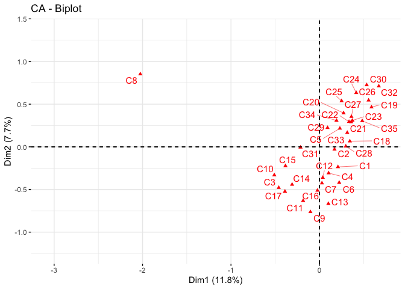

Measuring Meaning in Mixed Methods - Week 3
================

Week 3 Session 1
================

Topics:
- Multidimensional scaling
- Cluster analysis
- Correspondence analysis

Multidimensional scaling
------------------------

Multidimensional scaling analysis (MDS) is one of the oldest and most widely used methods for mapping out the relational system of differences in the measurement of meanings. Simply stated, an MDS analysis reads in a square matrix of similarities or differences and produces a transformation of the data that seeks to locate all of the objects in a common (two- or more dimensional) space in such a way that the similarities in the input matrix are transformed into Euclidean distances. An MDS space would thus represent a series of objects in such a way that (generally speaking) if two items are similar to one another (in the input matrix) then they are located near one another in the space. If they are dissimilar, they are located far apart. When analyzed in two (or three) dimensions, the items can then be easily plotted in such a way as to visually convey the relational structure in which they are embedded.

``` r
library(ggpubr)
#install.packages("smacof")
library(smacof)
#install.packages("vegan")
library(vegan)
#install.packages("factoextra")
library(factoextra)
```

To illustrate the use of multidimensional scaling and cluster analysis we first work with a distance matrix that measures the distances between major US cities.

``` r
cities <- read.csv2("Data/us cities.csv", header = TRUE, row.names = 1)
#we define it as a distance matrix
cities_distance <- as.dist(cities)
#check whether the class has indeed changed
class(cities_distance)
```

    ## [1] "dist"

We perform metric multidimensionsal scaling. There are different packages in R that can do MDS. They use different algorithms. We use the SmacofSym package. It can do metric (type=ratio) and non-metric MDS (type = ordinal) and gives the stess values.

``` r
mds <- smacofSym(cities_distance, type = "ratio", ndim=2)
#plot(mds, plot.type = "confplot")
mds$stress
```

    ## [1] 0.01410175

``` r
configuration <- as.data.frame(mds$conf)
print(configuration)
```

    ##                 D1          D2
    ## BOSTON  -0.6740040 -0.23722686
    ## NY      -0.6025551 -0.15791058
    ## DC      -0.5418110 -0.05547398
    ## MIAMI   -0.6093672  0.49366766
    ## CHICAGO -0.2154022 -0.07597718
    ## SEATTLE  0.7953302 -0.31743077
    ## SF       0.8510109  0.08612427
    ## LA       0.7351358  0.25052795
    ## DENVER   0.2616624  0.01369949

``` r
#configuration <- configuration*-1
ggscatter(configuration, x = "D1", y = "D2", 
          label = colnames(cities),
          size = 1,
          repel = TRUE)
```


What you should see is a map of the US but the orientation is wrong. We can solve this by multiplying the coordinates by -1. So uncomment the above line where it says \#configuration &lt;- configuration\*-1 and run the script again. That should give you the map of the US in a more recognizable form.

See what the MDS has done here? It has taken as an input matrix with the pairwise distances between cities measured in some unit (kilometers or miles) and has visually positioned the cities vis-a-vis each other so that those pairwise distances are represented in the Euclidian distances between points in a two-dimensional space.

You can see that the distance between Boston and NY is about the same as the distance between NY and DC. That the distance from DC to Chicago is somewhat larger than the distance between Boston to DC, etc. The fact that we could "flip" the x-and-y axis also tells you that the orientation of the map is arbitrary. The MDS only tries to project the distances between objects in a representative manner. What is up/down, left/right is arbitrary. A high/low value on the x-axis or y-axis does not mean anything in itself.

The projection of the pairwise distances into a two-dimensional space is quite accurate but it is not perfect. The earth's surface is not a flat surface so the pairwise distances between cities are not be perfectly represented in a 2-dimensional space. The difference between the original distances and the projected distances is captured in the "stress" value of the MDS solution. (Have a look at the stress value).

Property fitting
----------------

When interpreting an MDS solution, we try to find whether the placement of points represents some underlying structure. We try to give an interpretation to how the items are positioned vis-a-vis each other. In some cases, we can be helped by collecting additional data on the items and see if and how these correlate with the dimensions of the MDS solution.

In R, we can then use envfit from the vegan package to do the property fitting.

``` r
#we do the metric mds but produce a more basic plot.
mds <- smacofSym(cities_distance, type = "ratio")
mds$stress
```

    ## [1] 0.01410175

``` r
configuration <- as.data.frame(mds$conf)
configuration <- configuration*-1
class(configuration)
```

    ## [1] "data.frame"

``` r
print(configuration)
```

    ##                 D1          D2
    ## BOSTON   0.6740040  0.23722686
    ## NY       0.6025551  0.15791058
    ## DC       0.5418110  0.05547398
    ## MIAMI    0.6093672 -0.49366766
    ## CHICAGO  0.2154022  0.07597718
    ## SEATTLE -0.7953302  0.31743077
    ## SF      -0.8510109 -0.08612427
    ## LA      -0.7351358 -0.25052795
    ## DENVER  -0.2616624 -0.01369949

``` r
plot(configuration)
text(configuration,labels=rownames(configuration),pos=1)
```


We test whether the plot corresponds to two "external" variables: the latitude and longitude position of the cities. If correct, the position in the two-dimensional space should correspond to these two attributes.

``` r
cities_coord <- read.csv2("Data/cities_coord.csv", header=TRUE, row.names = 1)
str(cities_coord)
```

    ## 'data.frame':    9 obs. of  2 variables:
    ##  $ latitude : int  42 41 38 25 41 47 37 34 39
    ##  $ longitude: int  -71 -74 -77 -80 -87 -122 -122 -118 -104

The idea would to see how these variablles correlate with the dimensions of the MDS solution. We investigate this by a regression analysis whereby the dimensions are the independent variables that predict the external variable(s). We can then draw an arrow for each external variable as a vector of the two beta-coefficients of the two dimensions (BetaD1 along the first x-dimension and BetaD2 along the second y-dimension.) If the variable correlates positively with the x-axis, but not the y-axis, the arrow is drawn to the right. If the variable correlates positively with the y-axis, but not the x-axis, the arrow will be drawn to the top.

``` r
#We now use the envfit function from the vegan library
#ord.fit <- envfit(configuration ~ longitude + latitude, data=cities_coord, perm=999)
#Or do
ord.fit <- envfit(configuration, cities_coord, perm=999)
ord.fit
```

    ## 
    ## ***VECTORS
    ## 
    ##                 D1       D2     r2 Pr(>r)    
    ## latitude  -0.07934  0.99685 0.9873  0.001 ***
    ## longitude  0.98802  0.15430 0.9945  0.001 ***
    ## ---
    ## Signif. codes:  0 '***' 0.001 '**' 0.01 '*' 0.05 '.' 0.1 ' ' 1
    ## Permutation: free
    ## Number of permutations: 999

``` r
plot(configuration)
text(configuration,labels=rownames(configuration),pos=1)
plot(ord.fit,choices=c(1,2),axis=TRUE)
```


Hierarchical clustering
-----------------------

Another way to interpret MDS outputs is to look for clusters of similar items that are positioned close together. This can be done by looking at the map but we can also use a more formal technique: cluster analysis.

We use the dendogram function from the factoextra package. We do hierarchical clustering. The method indicates whether we choose single, complete or average. k= indicates how many clusters we want. We select 2 clusters. We can directly do the cluster analysis on the raw distance matrix of cities.

``` r
hc <- hclust(cities_distance, method = "single")
fviz_dend(hc,k=2)
```


``` r
hc <- hclust(cities_distance, method = "complete")
fviz_dend(hc,k=2)
```


``` r
hc <- hclust(cities_distance, method = "average")
fviz_dend(hc,k=2)
```


We can also take the MDS output and measure the Euclidian distances in the 2-dimensional space.

``` r
distance_mds <- dist(configuration)
distance_mds
```

    ##            BOSTON        NY        DC     MIAMI   CHICAGO   SEATTLE        SF
    ## NY      0.1067521                                                            
    ## DC      0.2247423 0.1190928                                                  
    ## MIAMI   0.7337470 0.6516138 0.5532815                                        
    ## CHICAGO 0.4861245 0.3957278 0.3270522 0.6926064                              
    ## SEATTLE 1.4715215 1.4069577 1.3625593 1.6220528 1.0391726                    
    ## SF      1.5589183 1.4739089 1.4000011 1.5161780 1.0786629 0.4073782          
    ## LA      1.4911672 1.3986562 1.3130995 1.3663108 1.0050513 0.5711396 0.2011358
    ## DENVER  0.9687289 0.8810914 0.8064456 0.9945160 0.4854200 0.6280514 0.5937819
    ##                LA
    ## NY               
    ## DC               
    ## MIAMI            
    ## CHICAGO          
    ## SEATTLE          
    ## SF               
    ## LA               
    ## DENVER  0.5294004

``` r
hc <- hclust(distance_mds, method = "single")
fviz_dend(hc,k=2)
```


``` r
hc <- hclust(distance_mds, method = "complete")
fviz_dend(hc,k=2)
```


``` r
hc <- hclust(distance_mds, method = "average")
fviz_dend(hc,k=2)
```


Holidays data set from pile-sorts
---------------------------------

Anthropologists and psychologists have often used MDS to measure the similarity and differences between items based on data gathered through "pilesorting". This measures the "subjective similarity" between items. The idea of pilesorting is very simply to ask respondents to group items in piles of items that they think are similar. The more often respondents group two items together the more similar they are. We can then convert these to distances.

``` r
holidays <- read.csv2("Data/holidays.csv", header=TRUE,row.names = 1)
#we need distance measures so subtract from 1. 
holidays_dis <- 1-holidays
```

We apply metric mds

``` r
mds <- smacofSym(holidays_dis, type = "ratio")
mds$stress
```

    ## [1] 0.2428592

``` r
configuration <- as.data.frame(mds$conf)
configuration <- configuration*-1
class(configuration)
```

    ## [1] "data.frame"

``` r
print(configuration)
```

    ##                          D1          D2
    ## April_Fools    0.3093738827 -0.50946518
    ## Christmas     -0.7496863712  0.07100640
    ## Columbus       0.4016624489  0.14305012
    ## Easter        -0.6624874744  0.14561187
    ## Fathers       -0.0095752965 -0.75876761
    ## Flag           0.6658304564  0.18472257
    ## 4th_Of_July    0.1530246735  0.66138877
    ## Groundhog      0.4169416470 -0.59016911
    ## Halloween     -0.5155261798 -0.37383516
    ## Hanukkah      -0.7220564882  0.33028413
    ## Labor          0.3576714286  0.52928508
    ## MLK            0.6464518346 -0.16242386
    ## Memorial       0.3654439625  0.39579869
    ## Mothers        0.0002402743 -0.72439228
    ## New_Years     -0.7027301509 -0.38843210
    ## Passover      -0.6605572536  0.42493415
    ## Presidents     0.5568927912  0.04959181
    ## St_Patrick    -0.1702570826 -0.20623403
    ## St_Valentines -0.4312018239 -0.52865883
    ## Thanksgiving  -0.2756938840  0.60309028
    ## Veterans       0.5424199508  0.35312903
    ## Yom_Kippur    -0.6023226966  0.53998608
    ## Patriots       0.5984330526  0.27931716
    ## Secretaries    0.4877082987 -0.46881799

``` r
ggscatter(configuration, x = "D1", y = "D2", 
          label = colnames(holidays),
          size = 1,
          repel = TRUE)
```


We would rather apply nonmetric mds since the number of times two items are grouped together is better interpreted as an ordinal measure of similarity/distance.

``` r
mds <- smacofSym(holidays_dis, type = "ordinal")
mds$stress
```

    ## [1] 0.1463946

``` r
configuration <- as.data.frame(mds$conf)
configuration <- configuration*-1
class(configuration)
```

    ## [1] "data.frame"

``` r
print(configuration)
```

    ##                        D1         D2
    ## April_Fools    0.34367091 -0.4525871
    ## Christmas     -0.80501071  0.1431924
    ## Columbus       0.48144558  0.1566296
    ## Easter        -0.74754847  0.1536023
    ## Fathers        0.11601525 -0.8192149
    ## Flag           0.65542435  0.1608620
    ## 4th_Of_July    0.30657922  0.5737523
    ## Groundhog      0.39811411 -0.4324665
    ## Halloween     -0.52296505 -0.4723717
    ## Hanukkah      -0.80454226  0.3258610
    ## Labor          0.43996139  0.3529334
    ## MLK            0.60302606 -0.1006316
    ## Memorial       0.44522950  0.2808173
    ## Mothers        0.08697998 -0.7376796
    ## New_Years     -0.72685461 -0.3436727
    ## Passover      -0.77100944  0.4631868
    ## Presidents     0.55479161  0.1020116
    ## St_Patrick    -0.17341325 -0.1798682
    ## St_Valentines -0.43306118 -0.4061411
    ## Thanksgiving  -0.36571540  0.4862805
    ## Veterans       0.56077518  0.3174281
    ## Yom_Kippur    -0.73867574  0.6156207
    ## Patriots       0.59878397  0.2386369
    ## Secretaries    0.49799898 -0.4261816

``` r
ggscatter(configuration, x = "D1", y = "D2", 
          label = colnames(holidays),
          size = 1,
          repel = TRUE)
```


To illustrate the issues that might occur with isolates we include 28 holidays of which 4 were never included in pile sorts (and therefore were isolates).

``` r
holidays28 <- read.csv2("Data/holidays28.csv", header=TRUE,row.names=1)
holidays28_dis <- 1-holidays28

mds <- smacofSym(holidays28_dis, type = "ratio")
mds$stress
```

    ## [1] 0.298177

``` r
configuration <- as.data.frame(mds$conf)
configuration <- configuration*-1
class(configuration)
```

    ## [1] "data.frame"

``` r
print(configuration)
```

    ##                        D1          D2
    ## April_Fools    0.31224468 -0.42380874
    ## Christmas     -0.58443152  0.41512622
    ## Columbus       0.45357095  0.08264636
    ## Easter        -0.47622469  0.44571698
    ## Fathers        0.08939454 -0.63694871
    ## Flag           0.68117843  0.05850539
    ## 4th_Of_July    0.33598843  0.56585869
    ## Groundhog      0.39217225 -0.52413081
    ## Halloween     -0.44598044  0.07424219
    ## Hanukkah      -0.48352268  0.59519441
    ## Kwanza        -0.60372398 -0.62647912
    ## Labor          0.49404332  0.41524879
    ## MLK            0.61223440 -0.21292287
    ## Memorial       0.47017261  0.30330993
    ## Mothers        0.08304242 -0.59598419
    ## New_Years     -0.66992895  0.08051378
    ## Passover      -0.39468520  0.64594752
    ## Presidents     0.55974239 -0.01895619
    ## Ramadan       -0.60372398 -0.62647912
    ## Rosh_Hashanah -0.60372398 -0.62647912
    ## St_Patrick    -0.06450950  0.02377065
    ## St_Valentines -0.33206465 -0.04634464
    ## Thanksgiving  -0.02852002  0.65001495
    ## Veterans       0.60207660  0.22466987
    ## Yom_Kippur    -0.31650629  0.71043527
    ## Patriots       0.64207444  0.15032602
    ## Cinco_de_Mayo -0.60372398 -0.62647912
    ## Secretaries    0.48333438 -0.47651442

``` r
ggscatter(configuration, x = "D1", y = "D2", 
          label = colnames(holidays28),
          size = 1,
          repel = TRUE)
```


Correspondence analysis
-----------------------

``` r
#install.packages("FactoMineR") 
#install.packages("factoextra")
#install.packages("gplots")
#install.packages("corrplot")
library("gplots")
```

    ## 
    ## Attaching package: 'gplots'

    ## The following object is masked from 'package:plotrix':
    ## 
    ##     plotCI

    ## The following object is masked from 'package:stats':
    ## 
    ##     lowess

``` r
library("FactoMineR")
library("factoextra")
library("corrplot")
```

    ## corrplot 0.84 loaded

We use the example data from Applied Correspondence Analysis by Sten-Erik Clausen to illustrate the workings of CA. The data is a simple cross-tabulation for three types of crime over three areas in Norway.

``` r
N = matrix(c(395, 147, 694, 2456, 153, 327, 1758, 916, 1347), 
           nrow = 3,
           dimnames = list(
             "Region" = c("Oslo", "Mid Norway", "North Norway"),
             "Crime" = c("Burglary", "Fraud", "Vandalism")))
```

Have a look at the raw frequency table

``` r
print(N)
```

    ##               Crime
    ## Region         Burglary Fraud Vandalism
    ##   Oslo              395  2456      1758
    ##   Mid Norway        147   153       916
    ##   North Norway      694   327      1347

First we normalize the matrix by dividing all cell entries by the total frequency

``` r
n = sum(N)
print(n)
```

    ## [1] 8193

``` r
P = N / n
print(P)
```

    ##               Crime
    ## Region           Burglary      Fraud Vandalism
    ##   Oslo         0.04821189 0.29976809 0.2145734
    ##   Mid Norway   0.01794215 0.01867448 0.1118028
    ##   North Norway 0.08470646 0.03991212 0.1644086

We calculate the average row profile, or i.e. the column masses.

``` r
column.masses = colSums(P)
print(column.masses)
```

    ##  Burglary     Fraud Vandalism 
    ## 0.1508605 0.3583547 0.4907848

We calculate the average column profile, or i.e. the row masses.

``` r
row.masses = rowSums(P)
print(row.masses)
```

    ##         Oslo   Mid Norway North Norway 
    ##    0.5625534    0.1484194    0.2890272

Using the row and column masses we can calculate the expected frequency in each cell.

``` r
E = row.masses %o% column.masses
print(E)
```

    ##                Burglary      Fraud  Vandalism
    ## Oslo         0.08486708 0.20159365 0.27609267
    ## Mid Norway   0.02239062 0.05318678 0.07284198
    ## North Norway 0.04360279 0.10357426 0.14185017

The residuals are the differences between the observed and expected frequencies.

``` r
R = P - E
print(R)
```

    ##               Crime
    ## Region             Burglary       Fraud   Vandalism
    ##   Oslo         -0.036655194  0.09817444 -0.06151925
    ##   Mid Norway   -0.004448475 -0.03451230  0.03896078
    ##   North Norway  0.041103669 -0.06366214  0.02255847

To standardize the residuals we divide by the square root of the expected values. This gives the chi value per cell.

``` r
Z = R/sqrt(E)
print(Z)
```

    ##               Crime
    ## Region            Burglary      Fraud   Vandalism
    ##   Oslo         -0.12582469  0.2186553 -0.11708024
    ##   Mid Norway   -0.02972885 -0.1496484  0.14435664
    ##   North Norway  0.19684458 -0.1978132  0.05989557

We can see that Oslo in relatively more stongly characterized by Fraud, Mid Norway by Vandalism and North Norway by Burglary. We want to plot this association in a two-dimensional space. To do so, we can make use of Singular Value Decomposition. This decomposes the matrix into three matrices: a matrix of left singular vectors (U), a matrix of singular values (with only values in the diagonal), and a matrix of right singular vectors. Singular vectors are orthogonal to each other, meaning that they are like the x-y dimensions in a space. The basic idea then is to plot the rows (using the left singular vectors) and the columns (using the right singular values) into the same space.

The first step would then be to submit the chi-values calculated above to SVD.

``` r
SVD = svd(Z)
#left singular vectors for rows
rownames(SVD$u) = rownames(P) 
#right singular vectors for columns
rownames(SVD$v) = colnames(P)
print(SVD)
```

    ## $d
    ## [1] 4.212385e-01 1.596575e-01 1.793343e-17
    ## 
    ## $u
    ##                    [,1]        [,2]      [,3]
    ## Oslo         -0.6600450  0.04227544 0.7500356
    ## Mid Norway    0.3840335 -0.83910599 0.3852524
    ## North Norway  0.6456461  0.54232272 0.5376125
    ## 
    ## $v
    ##                 [,1]       [,2]       [,3]
    ## Burglary   0.4717636  0.7915672 -0.3884076
    ## Fraud     -0.7822401  0.1724693 -0.5986273
    ## Vandalism  0.4068654 -0.5862387 -0.7005604

Eigenvalues are singular values squared.

``` r
eigenvalues = SVD$d^2
```

We calculate the proportion of the singular values to the total which indicated the explained variance per dimension

``` r
prop <- prop.table(eigenvalues)
prop
```

    ## [1] 8.743891e-01 1.256109e-01 1.584802e-33

``` r
sum(prop[1:2])
```

    ## [1] 1

``` r
#we unweight the row points by the row masses
standard.coordinates.rows = sweep(SVD$u, 1, sqrt(row.masses), "/")
#we unweight the column points by the column masses
print(standard.coordinates.rows)
```

    ##                    [,1]        [,2] [,3]
    ## Oslo         -0.8800182  0.05636457    1
    ## Mid Norway    0.9968363 -2.17806838    1
    ## North Norway  1.2009506  1.00876133    1

``` r
standard.coordinates.columns = sweep(SVD$v, 1, sqrt(column.masses), "/")
print(standard.coordinates.columns)
```

    ##                 [,1]       [,2] [,3]
    ## Burglary   1.2146096  2.0379805   -1
    ## Fraud     -1.3067231  0.2881079   -1
    ## Vandalism  0.5807713 -0.8368139   -1

``` r
#we multiply the standard coordinates by the singular values
principal.coordinates.rows = sweep(standard.coordinates.rows, 2, SVD$d, "*")
print(principal.coordinates.rows)
```

    ##                    [,1]         [,2]         [,3]
    ## Oslo         -0.3706976  0.008999028 1.793343e-17
    ## Mid Norway    0.4199058 -0.347744988 1.793343e-17
    ## North Norway  0.5058866  0.161056329 1.793343e-17

``` r
#we multiply the standard coordinates by the singular values
principal.coordinates.columns = sweep(standard.coordinates.columns, 2, SVD$d, "*")
print(principal.coordinates.columns)
```

    ##                 [,1]       [,2]          [,3]
    ## Burglary   0.5116403  0.3253789 -1.793343e-17
    ## Fraud     -0.5504421  0.0459986 -1.793343e-17
    ## Vandalism  0.2446432 -0.1336036 -1.793343e-17

Symmetric plot takes the principal coordinates of rows and columns.

``` r
plot(principal.coordinates.columns[,1:2], xlim=c(-0.8,0.8), ylim=c(-0.6,0.6))
points(principal.coordinates.rows[,1:2])
text(principal.coordinates.rows,labels=rownames(principal.coordinates.rows),pos=1)
text(principal.coordinates.columns,labels=rownames(principal.coordinates.columns),pos=1)
```


Compare the result with the "direct" approach using the CA function

``` r
res.ca <- CA(N, graph = TRUE)
```


Get eigenvalues

``` r
eig.val <- get_eigenvalue(res.ca)
eig.val
```

    ##       eigenvalue variance.percent cumulative.variance.percent
    ## Dim.1 0.17744188         87.43891                    87.43891
    ## Dim.2 0.02549052         12.56109                   100.00000

Inspect plot of eigenvalues

``` r
fviz_screeplot(res.ca, addlabels = TRUE, ylim = c(0, 100))
```


Example by Jang and Barnett of CA on corporate documents
--------------------------------------------------------


Jang & Barnett (1994) examined the impact of national culture on organizational culture by analyzing messages directed to external audiences. For a total of 35 Japanese and American businesses, annual reports for 1992 were analyzed by determining the most frequently used words in all 35 reports. Then, the frequency of each word for each company was determined.

Original co-occurence matrix for words and companies
----------------------------------------------------

 

We copied this matrix into a csv file.

``` r
#read in matrix csv-file 
matrix <- read.csv2("Data/Jang_Barnett.csv", header=TRUE,row.names = 1)
class(matrix)
```

    ## [1] "data.frame"

``` r
head(matrix)
```

    ##         C1 C2 C3 C4 C5 C6 C7 C8 C9 C10 C11 C12 C13 C14 C15 C16 C17 C18 C19 C20
    ## BEST     0  0  0  0  0  7  3  0  0   0   3   0   0   0   0   0   0   2   0   0
    ## BIG      0  0  0  0  0  0  0 17  0   0   0   0   0   4   0   0   0   0   0   0
    ## BOARD    2  7  0  0  0  0  9  0  2   4   0   4   0   4   4   0   0   0   0   0
    ## CAPITAL  2  3  0  4  0  4  0  0  0   0   0   0   0   0   0   0   0   0   0   0
    ## CHANGE   0  0  0  0  0  0  0  5  0   0   4   0   0   2   3   0   0   0   0   0
    ## CHIEF    0  0  0  0  0  3  3  0  3   0   3   2   0   3   0   0   0   0   0   0
    ##         C21 C22 C23 C24 C25 C26 C27 C28 C29 C30 C31 C32 C33 C34 C35
    ## BEST      0   0   0   0   0   0   0   0   0   0   2   0   0   0   0
    ## BIG       0   0   0   0   0   0   0   0   0   0   0   0   0   0   0
    ## BOARD     2   0   0   0   0   0   0   0   0   0   0   0   0   0   0
    ## CAPITAL   0   0   4   0   0   5   0  14   0   0   0   5   0   0   0
    ## CHANGE    3   0   0   0   0   0   0   0   0   0   0   0   0   5   0
    ## CHIEF     0   0   0   0   0   0   0   0   0   0   0   0   0   0   0

We can now apply correspondence analysis to simultaneously plot the words and companies in the same 2-dimensional space.

``` r
#save as matrix data type 
my_mat <- as.matrix(matrix)   
class(my_mat)
```

    ## [1] "matrix"

``` r
#do chisquare test
chisq <- chisq.test(my_mat)
```

    ## Warning in chisq.test(my_mat): Chi-squared approximation may be incorrect

``` r
chisq
```

    ## 
    ##  Pearson's Chi-squared test
    ## 
    ## data:  my_mat
    ## X-squared = 10906, df = 3162, p-value < 2.2e-16

``` r
#do the Correspondence Analysis
res.ca <- CA(my_mat, graph = FALSE)
print(res.ca)
```

    ## **Results of the Correspondence Analysis (CA)**
    ## The row variable has  94  categories; the column variable has 35 categories
    ## The chi square of independence between the two variables is equal to 10906.43 (p-value =  0 ).
    ## *The results are available in the following objects:
    ## 
    ##    name              description                   
    ## 1  "$eig"            "eigenvalues"                 
    ## 2  "$col"            "results for the columns"     
    ## 3  "$col$coord"      "coord. for the columns"      
    ## 4  "$col$cos2"       "cos2 for the columns"        
    ## 5  "$col$contrib"    "contributions of the columns"
    ## 6  "$row"            "results for the rows"        
    ## 7  "$row$coord"      "coord. for the rows"         
    ## 8  "$row$cos2"       "cos2 for the rows"           
    ## 9  "$row$contrib"    "contributions of the rows"   
    ## 10 "$call"           "summary called parameters"   
    ## 11 "$call$marge.col" "weights of the columns"      
    ## 12 "$call$marge.row" "weights of the rows"

``` r
#get eigenvalues
eig.val <- get_eigenvalue(res.ca)
eig.val
```

    ##        eigenvalue variance.percent cumulative.variance.percent
    ## Dim.1  0.31959863       11.7566404                    11.75664
    ## Dim.2  0.20888348        7.6839126                    19.44055
    ## Dim.3  0.16785768        6.1747523                    25.61531
    ## Dim.4  0.16335945        6.0092821                    31.62459
    ## Dim.5  0.15532532        5.7137416                    37.33833
    ## Dim.6  0.13845497        5.0931546                    42.43148
    ## Dim.7  0.12932277        4.7572211                    47.18870
    ## Dim.8  0.11583476        4.2610558                    51.44976
    ## Dim.9  0.11124531        4.0922302                    55.54199
    ## Dim.10 0.10073999        3.7057849                    59.24778
    ## Dim.11 0.09615010        3.5369430                    62.78472
    ## Dim.12 0.08573763        3.1539137                    65.93863
    ## Dim.13 0.08372286        3.0797990                    69.01843
    ## Dim.14 0.07772799        2.8592740                    71.87771
    ## Dim.15 0.07306201        2.6876329                    74.56534
    ## Dim.16 0.06921728        2.5462020                    77.11154
    ## Dim.17 0.06535045        2.4039582                    79.51550
    ## Dim.18 0.06140810        2.2589363                    81.77443
    ## Dim.19 0.05809228        2.1369617                    83.91140
    ## Dim.20 0.05320436        1.9571565                    85.86855
    ## Dim.21 0.04548212        1.6730888                    87.54164
    ## Dim.22 0.04161141        1.5307024                    89.07234
    ## Dim.23 0.03918895        1.4415908                    90.51393
    ## Dim.24 0.03727565        1.3712088                    91.88514
    ## Dim.25 0.03384176        1.2448909                    93.13003
    ## Dim.26 0.03168782        1.1656569                    94.29569
    ## Dim.27 0.02859646        1.0519391                    95.34763
    ## Dim.28 0.02675244        0.9841056                    96.33174
    ## Dim.29 0.02321833        0.8541013                    97.18584
    ## Dim.30 0.01967662        0.7238170                    97.90965
    ## Dim.31 0.01781218        0.6552326                    98.56489
    ## Dim.32 0.01449216        0.5331033                    99.09799
    ## Dim.33 0.01373198        0.5051398                    99.60313
    ## Dim.34 0.01078872        0.3968699                   100.00000

``` r
#inspect plot of eigenvalues
fviz_screeplot(res.ca, addlabels = TRUE, ylim = c(0, 80))
```


The original correspondence analysis in the paper only plots the companies.


``` r
#plot the CA. this is a symmetric plot 
fviz_ca_biplot(res.ca, invisible = "row", repel = TRUE)
```



We can see that our plot is flipped around the x-axes, but matches the coordinate configuration of the original paper. In our case, the US companies are positioned to the left and the Japanese companies more to the right. There are also some Japanese companies that are more US-like in their language than others. Although the plot with the words is somewhat hard to read, we could start analyzing which words seem to define the US-Japanse cultural differences.

``` r
fviz_ca_biplot(res.ca, repel = TRUE)
```


